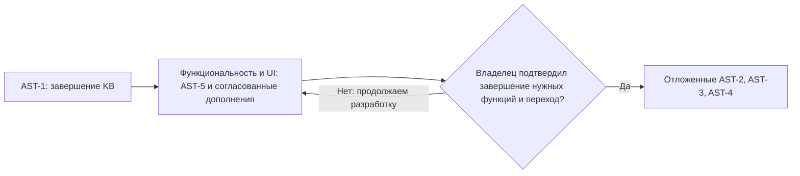

# EVO — план продолжения для GPT-6 Astra

Дата: 20 сентября 2026. Статус: активная разработка функциональности и интерфейса; окончательный состав продукта ещё не определён. Исполнение ведёт GPT-6 Astra. Уточнение владельца после #920 заменяет прежний порядок: общий итоговый E2E, контентная волна 2 и App Store readiness отложены до его явного решения о завершённости нужного состава функций. Историческая основа документа — origin/main `49f071488972445b2c4fded63a1e6cba7d8ab0bb` (PR #917–#919); снимки реализации и production ниже относятся к 2026-09-20 00:27 UTC и не обновляются этой правкой приоритетов.

## 1. Задание

Продолжи работу над продуктом EVO после закрытия портального плана. Портальная поставка завершена и передана: финальная ведомость — `docs/EVO_PORTAL_FINAL_LEDGER_2026-09-20.md`, handover-пакет — `docs/EVO_PORTAL_HANDOVER_2026-09-20.md`. Приняты 9 управляемых портальных релизов, последний портальный — `v3-r35473599531-a1-fd25b1ac`; после него приняты knowledge-релизы #915 (`35474499486`) и #916 (`v3-r35475040133-a1-90046405`) — текущий принятый прод-релиз на момент подготовки. Веб работает в production, iOS-код целиком в main (139/139 тестов), дистрибуции в сторе нет. Schema/release-координация уже передана тебе (handover §6).

Сейчас работа состоит в завершении действующего KB-контракта (AST-1) и доведении функциональности/UI (известная очередь AST-5 и последующие согласованные дополнения). Состав всего продукта ещё открыт: владелец может добавить функции. Закрытие прежней портальной поставки не означает завершения продукта.

AST-2 (общий итоговый E2E), AST-3 (контентная волна 2) и AST-4 (App Store readiness) сохранены в разделе 5 как отложенный перечень. Не запускать их автоматически после KB и не запрашивать сейчас симулятор, QA-сессию или Apple-шаги ради этих блоков. Возвращение к ним — после явного решения владельца, что нужная функциональность закончена и можно переходить к этим этапам. Перенос существующей базы знаний относится к действующему AST-1 и продолжается.

Это задание на доведение до фактического результата, а не на новый концепт. «Готово» означает реально выполненную и зафиксированную операцию: перенесённые байты, прогнанный под учёткой флоу, лежащий в репо пакет. Наличие плана, кода в main или зелёного CI само по себе результатом не является — это правило унаследовано от портального плана (§11) и сохраняется дословно.

## 2. Какие решения действуют

Более поздние решения владельца заменяют ранние. Итоговая версия:

| Вопрос | Итоговое решение |
| --- | --- |
| Портальный план | Закрыт: ведомость `EVO_PORTAL_FINAL_LEDGER_2026-09-20.md`, handover `EVO_PORTAL_HANDOVER_2026-09-20.md`; закрытые блоки PORT-0…5 не переделываются |
| Исполнитель продолжения | GPT-6 Astra (передача инициирована владельцем 2026-09-20, handover §6) |
| Schema/release-координация | У Astra с момента мержа handover-пакета; дисциплина — обязательный контракт handover §6 (раздел 7 этого плана) |
| Прод-ledger миграций | Прод-ledger 001–204 непрерывно; миграция **205** (canonical search) смержена в main с #918, миграция **206** (selected canonical exports) — с #919; обе применяются управляемыми выпусками; следующая свободная — **207**; только forward, трёхзначные номера |
| Приоритет №1 | Завершение KB-плана Astra (`EVO_CRM_KNOWLEDGE_BASE_PLAN_2026-09-19.md`) — её действующий контракт |
| Текущий продуктовый этап | Доведение функциональности и интерфейса; AST-5 — известная очередь, а не исчерпывающий состав всего продукта |
| AST-2 / AST-3 / AST-4 | Отложены по решению владельца после #920; возобновление только после его явного решения о завершённости нужного состава функций и переходе к этим этапам |
| Проверки при разработке | Реальные точечные проверки изменённого пути и его рисков обязательны; общий итоговый E2E сейчас не является следующим этапом |
| QA-аккаунт студента | Владельческий файл `.env.student-portal-qa.json` (не в гите, пароль не печатать) |
| Исключения объёма | §14 портального плана сохраняется целиком; снимается только явным решением владельца (раздел 8) |
| Смержённые контракты | Байт-замороженный assessment-контракт (миграция 135), 7-точечный контракт чата (§6 автора 191), null-семантика 189 — не переоткрываются без записи в `PLAN_CHANGES.md` |

Handover §6 «Передача исполнения Astra GPT-6» — не справочный текст, а действующий контракт дисциплины. Этот план ссылается на него и не пересказывает целиком; жёсткие пункты перечислены в разделе 7.

## 3. Контекст для исполнителя

### Репозиторий и окружение

| Назначение | Контекст |
| --- | --- |
| GitHub — общая точка правды | `https://github.com/izzhackt/evo_AI_CRM` |
| Канонический checkout | `/Users/iskhak.tazhibaev/Documents/01_Projects/EVO/evo_AI_CRM` (не переключать, не reset/clean; работа — в отдельных worktree/ветках `izzhackt/`) |
| Этот план | `docs/EVO_ASTRA_CONTINUATION_PLAN_2026-09-20.md` |
| Портальная ведомость и handover | `docs/EVO_PORTAL_FINAL_LEDGER_2026-09-20.md`, `docs/EVO_PORTAL_HANDOVER_2026-09-20.md` |
| KB-контракт Astra | `docs/EVO_CRM_KNOWLEDGE_BASE_PLAN_2026-09-19.md`, квитанция `docs/EVO_CRM_KNOWLEDGE_BASE_EXECUTION_2026-09-20.md` |
| Общий контракт выполнения | `docs/EVO_LAUNCH_PLAN.md`, журнал `docs/PLAN_CHANGES.md` (append-only) |
| Дизайн | `docs/design/portal/design-contract.md` («Атлас»), корневой `DESIGN.md` |
| Студенческий портал / CRM | `https://app.evoadmissions.com` / `https://crm.evoadmissions.com` |
| Сервер | `hermes-vps`, `/opt/evo-crm`, Compose `evo-crm` |
| Основная БД | Managed Supabase `iosckaqtovbbnssqcpde` |
| iOS-сборка | `ios/README.md`: `xcodegen generate`, схема «EVO admissions» (с пробелом), симулятор iPhone 17 Pro |

### Проверенная стартовая основа и ограничения знания

При подготовке просмотрен main `7cc50dd8` и квитанции релизов; факт-чек пересверен по main `56e7cdcb` (#918), финальная сборка — по main `49f07148` (#919) на момент составления (2026-09-20 00:27 UTC); production сверялся по receipts, а не повторными live-операциями этого документа.

- **Что фактически доказано** (по receipts): 9 портальных релизов приняты с exact-main, контейнер healthy, disarm подтверждён; миграции 001–204 непрерывны (readback через Management API), 205 (#918) и 206 (#919) смержены в main и ждут управляемых выпусков; владельческий QA-прогон wave-5 iOS (favorites round-trip, языковой цикл 196, сид-уроки); managed-фото 87/87 c sha256; iOS-тесты 139/139.
- **Что не доказано** (ведомость, «Известные ограничения»): ни один реальный аккаунт не создан через новый флоу регистрации/инвайта; live iOS-документы, чат, консультация, write-пути раннеров, KY/Home/чат-рендеры, managed-фото под авторизацией, live filtered-RPC iOS и ручной VoiceOver — не exercised. Это объект блока AST-2, а не повод для заявлений.
- **KB-статус**: схема 201–204 применена; миграция 205 (canonical search) смержена в main с #918, миграция 206 (selected canonical exports) — с #919; их применение ждёт управляемых выпусков. KB-релизы приняты: `v3-r35473287436-a1-2e72d5ad` (#906), `35474499486` (#915), `v3-r35475040133-a1-90046405` (#916); age-ключ установлен (`/etc/evo-crm/knowledge/age.key`, 0400); maintenance timer active/enabled c Result=success — подтверждён и независимым SSH-review (приложение #918 к launch-плану). Пройдены две контрольные партии (10 источников / 3 049 345 байт с ZIP-сверкой; повтор 10/10 с реальным прерыванием/возобновлением), защищённый контур перенесён целиком (32 оригинала + 25 записей), обычный импорт идёт четырьмя потоками (71 запись к паузе перед #916; ≥920 файлов к моменту #918). Полный перенос не выполнен. Статус-блок «KB execution — 2026-09-20» в `EVO_LAUNCH_PLAN.md` (строки 14–19) не исправлен и после #918 (см. AST-1 п.1).
- **Dependabot**: живая проверка 2026-09-20 подтвердила 3 открытых уведомления, все на `anyio` (#16 critical, #17 high, #15 medium); в репо-доках они не зафиксированы (последний записанный readback — ноль); автоматический dependabot PR #847 (anyio 4.14.1→4.14.2 в `/evo-lead-agent`) открыт на момент составления.
- Снимки статусов (управляемые выпуски #918/#919, PR #905/#847, alerts, состояние таймера) обновить свежей сверкой перед действием; этот документ не утверждает, что они сохранятся к старту. На момент составления (2026-09-20 00:27 UTC): #918 — MERGED (2026-09-20T00:11:24Z), #919 — MERGED (2026-09-20T00:25:25Z), #905 — OPEN, #847 — OPEN.

### Точки чтения по блокам

| Блок | Стартовые точки |
| --- | --- |
| AST-1 | KB-план §1/§4/§8–§13; execution-квитанция целиком; смержённый PR #918 (`scripts/knowledge-library/refile_restricted.sql`, `prepare_import.py`, миграция `supabase/migrations/205_platform_knowledge_canonical_search.sql`); смержённый PR #919 (exit-guard несохранённых правок, вопросы к файлам, миграция `206_platform_knowledge_selected_canonical_exports.sql`); `scripts/knowledge-library/verify_export.py`; `deploy/knowledge/*.service|*.timer` |
| AST-2 | Ведомость (разделы «Известные ограничения» и «Владельческие внешние шаги» п.6); handover §4–§5; `ios/README.md`; `.env.student-portal-qa.json` (у владельца) |
| AST-3 | `docs/design/portal/port-0-contracts.md:138–139` (отложенное аудирование); миграции 198/199 (движок и сид); PORT-9d-пайплайн фото и `src/lib/university-photo-url.ts` |
| AST-4 | `ios/`, план §13 портального плана; ведомость «Владельческие внешние шаги» п.1; актуальные App Review Guidelines |
| AST-5 | `src/app/(portal)/layout.tsx:21–24` vs `src/lib/supabase/student-portal-authority.ts:149`; `src/components/v3/portal/PortalNotificationUpdates.tsx`; `ios/.../AdmissionModels.swift:32` и `MyAdmissionView`; `src/lib/university-photo-url.ts:12,36–42`; `PLAN_CHANGES.md:31801–31833, 32359–32365` |

## 4. Порядок блоков

Это действующий порядок по уточнению владельца, заменяющий прежнее «AST-1 → AST-2 → AST-3/AST-4». AST-1 завершает уже начатый перенос. Дальше основной этап — функциональность и интерфейс, включая AST-5. Независимые доработки можно вести одновременно с AST-1 при соблюдении границ активной KB-задачи и единой schema/release-координации. Закрытие AST-1 или списка AST-5 само по себе не запускает отложенные блоки и не означает, что продукт закончен.

### Что означает текущая готовность интерфейса

На проверенном для этой корректировки main `a0684b40` основные разделы реализованы: каталог/карта, избранное, профессии, тесты, английский, анкета, поступление, документы, просмотр оплаты, уведомления, чат и консультация. Веб поставлен в production; iOS-реализация находится в репозитории. Функциональная ведомость — `EVO_PORTAL_FINAL_LEDGER_2026-09-20.md`; её ограничения реальных проверок сохраняются.

Остаются известные функциональные/UI-пробелы: iOS-Главная не имеет паритета с вебом, операционная стадия не отрисована в `MyAdmissionView`, для «Нового в каталоге» нет сигнала первой публикации, `PortalNotificationUpdates` ещё использует v3-компонент. Они входят в AST-5. Read-only задачи и просмотр оплаты — границы ранее согласованного объёма, не автоматически одобренные новые функции. «Основные разделы реализованы» не равно «всё готово и всё работает»: состав продукта ещё открыт, а непроверенные сценарии остаются непроверенными до фактического исполнения.

## 5. Блоки реализации

### AST-1 — завершение KB-плана (действующий контракт, приоритет №1)

**Зачем.** KB-план — контракт Astra; его главный результат («полный перенос и сортировка всей локальной базы, дальнейшая работа в CRM и выгрузка») не достигнут: из 6 568 разрешённых исходников (436 страниц + 6 100 обычных файлов + 32 защищённых оригинала; 2 ключевых файла остаются вне CRM) фактический перенос запущен, но не завершён: пройдены две контрольные партии (10 источников / 3 049 345 байт с ZIP-сверкой; повтор 10/10 с реальным прерыванием/возобновлением), защищённый контур перенесён целиком (32 оригинала + 25 записей), обычный импорт идёт четырьмя потоками (71 запись к паузе перед #916; ≥920 файлов к моменту #918). Полный перенос и полная сверка ZIP не завершены — это и есть остаток контракта. План §1 прямо запрещает закрывать задачу пустыми папками, §9 — оставлять массу материалов во «Входящих».

**Состав.**

1. PR #918 смержён (`56e7cdcb`): коррекция сортировки (1 415 закрытых производных → сырой архив с вопросом владельцу), резолвер exact-basename + Notion-id и заголовки из реального H1, canonical search «Вся база» (миграция 205), операторская SQL-коррекция `refile_restricted.sql` (по умолчанию ROLLBACK) уже выполнена и независимо проверена (readback; повтор moved=0). Остаётся: управляемый выпуск #918 с применением 205 после штатной паузы потоков импорта (после него смержён ещё #919 — exit-guard несохранённых правок, вопросы к файлам и selected canonical exports с миграцией 206; его выпуск идёт тем же управляемым контрактом) — и отдельная док-правка: статус-блок «KB execution — 2026-09-20» в `EVO_LAUNCH_PLAN.md:14–19` не исправили ни #918, ни #919, он всё ещё утверждает «Zero source entries have been imported» вопреки квитанции.
2. Хостовые systemd-юниты на hermes-vps: разночтение портальной квитанции fd25b1ac с execution-квитанцией уже снято записью на main (приложение #918 к `EVO_LAUNCH_PLAN.md`): timer установлен и active/enabled, service отработал с Result=success/ExecMainStatus=0, независимый reviewer подтвердил по SSH. Остаётся отразить это в финальной квитанции KB-6 и при старте сделать свежую сверку состояния таймера.
3. Параллельный импорт (≤4, добавлен в #915 против ~8 с/файл) уже проверен реально: повтор контрольной партии с прерыванием/возобновлением 10/10 без дублей и потери правок, новая партия с проверкой ссылок и ZIP; полный импорт четырьмя потоками запущен (0 ошибок на 71 записи к паузе перед #916). Остаток пункта — возобновить и довести массовый перенос, координируя паузы с выпусками.
4. Полный импорт: все страницы и файлы по filing-плану; резолвер exact-basename + Notion-id; распределение 1 240 прежних кандидатов из «Входящих» (912 извлечённых текстов — к производным исходников в архиве). Ни один кандидат не становится утверждённым автоматически.
5. Защищённый контур закрыт по квитанции: 32 оригинала + 25 записей перенесены через реальный UI, metadata/value сверены, reveal/hide/copy и save проверены без печати значений, отказы Staff/Student подтверждены (план §8, §12 KB-4). В KB-6 — зафиксировать эти факты и не допустить их регрессии полным переносом; фактическое использование age-ключа приложением этим уже подтверждено.
6. Сверка полноты: каждый source key и оригинал инвентаря против результата в CRM (размеры/SHA-256, вложения, ссылки); `verify_export.py --verify-protected --require-all`; итоговые количества, исключения и ошибки — в квитанцию. Массовую полноту подтверждать инвентарём, а не выборкой (план §13).
7. Полный экспорт: ZIP всей разрешённой базы (ZIP64, миграция 204) с сохранением разделов, приватным перечнем содержимого и секретами только в зашифрованном виде; скачать и сверить контрольные суммы. Пока проверен только контрольный ZIP из 19 материалов.
8. Живая UI-приёмка по плану §6/§12 KB-2/§13: редактор с автосохранением и ошибкой без потери текста, история версий и восстановление, конфликт правок, корзина, узкий/mobile layout, прямые отказы Staff/Student на UI-путях (RPC-граница уже проверена 22 проверками — UI-приёмка ими не заменяется).
9. Финальная квитанция KB-6: точный код/релиз, факт переноса, результат экспорта, ошибки и оставшиеся вопросы; «UI-ready», «import-complete» и «released» — разные факты, не подменять один другим.

**Зависимости.** Доступ к hermes-vps и локальной базе (есть); дисциплина раздела 7; SQL-коррекция `refile_restricted.sql` уже выполнена и независимо проверена (п.1), любая новая операторская SQL — только после независимого review. Миграции 205 (#918) и 206 (#919) уже в main; новые сверх них — 207+ по общему ledger.

**Критерии завершения.** Все пункты KB-инвентаря закрыты; квитанция KB-6 в репо; отчёт `verify_export.py` с `--require-all` зелёный; статус-доки согласованы; расхождение по systemd снято записью.

**Решает Astra / спрашивает владельца.** Astra сама: механика и порядок партий, резолвер, тексты квитанций, установка/включение юнитов. Владелец: судьба 1 415 закрытых переписок (вопрос ставит коррекция #918); финальное решение «CRM — основное рабочее место, локальные оригиналы — архив» и приёмка реальным Admin-пользователем — только после проверок чтения/редактирования/скачивания/экспорта (план §9 п.10; QA-граница приёмку не заменяет).

### AST-2 — живой E2E-прогон новых портальных флоу (отложен)

**Статус.** Отложен по решению владельца. Состав ниже — будущий перечень после решения из §4, не текущая задача и не блокер дальнейшей разработки функций.

**Зачем.** Крупнейший honesty-gap ведомости: ни один реальный аккаунт никогда не создавался через новый флоу, и все write-флоу, ушедшие в прод с волны 5, не exercised. Блок закрывает «Not claimed»-хвост ведомости и п.6 её владельческих шагов.

**Состав.** Под QA-аккаунтом (владельческий файл `.env.student-portal-qa.json`; пароль не печатать), веб и iPhone:

- регистрация по анкете с полной цепочкой до staff-одобрения; принятие инвайта (обе платформы);
- iOS: загрузка и скачивание документа (bearer-путь ADR 0030), живой прогон отфильтрованных RPC каталога и карты, ручной VoiceOver-проход;
- отправка сообщения в чате; отправка консультации и проверка staff-контекста заявки;
- write-пути раннеров урока и теста (server-receipt вердикты, идемпотентные ретраи);
- живые рендеры под учёткой: KY-экраны сопровождения, «Главная», чат, каталог с managed-фото;
- попутно: сверка сумм оплат с CRM — владельческое действие, удобно совместить с этой же сессией.

После возобновления блока координация с владельцем обязательна: iOS-часть требует залогиненного устройства/симулятора; staff-одобрение регистрации выполняет владелец/сотрудник по существующему процессу. Сейчас сессию для общего прогона не запрашивать.

**Зависимости.** Auth-почта: Resend SMTP сохранён, но ни одно Auth-письмо не отправлено — доставку на одобренные алиасы должен доказать владелец до/в рамках регистрационного прогона; если прогон покажет, что подтверждению `/apply` нужен отдельный путь (SMTP-конфиг сам его не включает, `EVO_LAUNCH_PLAN.md:470`), реализация — пункт AST-5 с приоритетом. QA-креды и одобрение — у владельца.

**Критерии завершения.** Каждый пункт списка закрыт записью: что прогнано, на каком релизе/SHA, фактический результат; найденные дефекты оформлены отдельными PR по дисциплине раздела 7; итог зафиксирован в receipt/`PLAN_CHANGES.md`. Частичный прогон не переименовывается в полный; недоступный пункт называется с причиной.

**Решает Astra / спрашивает владельца.** Astra: порядок, фиксация, оформление дефектов. Владелец: креды, живая сессия, staff-одобрение, подтверждение почтовой доставки, сверка сумм с CRM.

### AST-3 — контентная волна 2 (отложена)

**Статус.** Отложена целиком до решения из §4, включая аудирование/модуль 2, расширение профессий, фото и пакетную проверку их лицензий. Существующий перенос KB и точечное исправление дефекта действующей функции этим не откладываются.

**Зачем.** Первое названное продуктовое продолжение: аудирование осознанно отложено в PORT-0 на модуль 2 (`port-0-contracts.md:138–139` — модуль 1 только выбор/сопоставление/короткий ответ/чтение); плюс закрытие фото- и лицензионного долга каталога.

**Состав.**

1. Английский модуль 2 **с аудированием**: реальные подготовленные записи, аудио-пайплайн и managed-хранение записей (по образцу bucket-пайплайна PORT-9d; решение по хранилищу и, при необходимости, миграции 207+); транскрипты обязательны для каждой записи; контент через движок 198 (immutable versioned content, server-only grading, приватные попытки), сид по образцу 199. Обновление контента не портит историю завершённых попыток.
2. Расширение профессий сверх 24 карточек: зарплаты и работодатели — только при наличии актуального надёжного источника с провенансом; пустые карточки ради количества не публикуются.
3. Фото оставшихся 57 вузов (сейчас — hotlink по лицензии): либо лицензионный outreach к вузам (письма отправляет владелец; Astra готовит перечень и тексты), либо замена на CC-источники — Astra выполняет сама с атрибуцией и sha256-пайплайном PORT-9d. Решение по каждому вузу фиксируется.
4. Полная построчная ре-верификация лицензий Commons-фото через extmetadata API (до сих пор — только спот-чеки 6 записей) с записью результата.

**Зависимости после возобновления.** Сначала решение владельца из §4; затем свежая сверка движка 198 и write-путей раннеров перед массовым контентом. Хранилище аудио — решение по схеме за Astra как координатором. Подготовку этого блока сейчас не начинать.

**Критерии завершения.** Модуль 2 законченный и проходимый на обеих платформах, каждая запись с транскриптом; новые профессии с источниками; по каждому из 57 фото — либо managed с правами, либо явный остаток с причиной; лицензии сверены построчно, результат записан.

**Решает Astra / спрашивает владельца.** Astra: состав и число уроков/карточек, выбор CC-фото, техника пайплайна. Владелец: outreach-письма вузам, любые платные источники или права.

### AST-4 — App Store readiness агентской стороны (отложена)

**Статус.** Вся подготовка блока отложена до решения из §4, включая privacy manifest, метаданные и скриншоты. Это не текущая задача и не причина запрашивать Apple-шаги у владельца сейчас.

**Зачем после возобновления.** Подготовить дистрибуцию завершённой iOS-функциональности. Исторический результат 139/139 тестов и наличие кода в main не означают завершения текущего состава функций или готовности к публикации.

**Состав.**

1. `PrivacyInfo.xcprivacy` по **фактическому** сбору данных — выводится из кода, не из шаблона.
2. Store-метаданные: описания, ключевые слова, категория, возрастной рейтинг; скриншоты реальных экранов из симулятора (не демо-данных, без чужих клиентских документов).
3. Review notes с pre-authorized QA-аккаунтом и доступом к проверяемым функциям (план §13; обходов авторизации и demo-режимов не создавать).
4. Рекомендация по финальному bundle id (сейчас placeholder-driven config, handover:146) — решение за владельцем до первой TestFlight-загрузки.
5. Свежая сверка действующих App Review Guidelines перед подачей (§2.1, §4.2, §5.1.1(v) — запрос удаления аккаунта уже реализован).

**Финально блокируется владельческими шагами** (перечень для передачи): Apple Developer membership и D-U-N-S; подпись/сертификаты; доступ App Store Connect; TestFlight-сборка и дистрибуция; юридические сведения и оплата; финальный bundle id; сам сабмит и решение Apple review. Без них статус «опубликовано» не заявляется (план, строка 416).

**Зависимости после возобновления.** Решение владельца из §4; скриншоты и review notes по реальным экранам завершённой функциональности, privacy manifest — по фактическому коду. Общая проверка готовности и владельческие Apple-шаги согласуются на том этапе.

**Критерии завершения.** В репо лежит полный пакет: privacy manifest, метаданные, скриншоты, review notes, рекомендация по bundle id; отдельной записью зафиксировано, что осталось только у владельца.

**Решает Astra / спрашивает владельца.** Astra: содержимое пакета, тексты, скриншоты. Владелец: все перечисленные Apple-шаги и bundle id.

### AST-5 — активная очередь функциональности/UI и технических доработок

**Уточнение реализации на 20.09.2026, после #928:** пункт 1 закрыт в main
[PR #926](https://github.com/izzhackt/evo_AI_CRM/pull/926), пункт 2 —
[#927](https://github.com/izzhackt/evo_AI_CRM/pull/927), пункты 4–5 —
[#928](https://github.com/izzhackt/evo_AI_CRM/pull/928). Реальные точечные проверки
и их ограничения записаны в `docs/design/portal/functional-parity.md`. Это не
подтверждение server production-выпуска. Пункт 3 подготовлен в открытом
[PR #929](https://github.com/izzhackt/evo_AI_CRM/pull/929): применение миграции 207
и приёмка нового RPC через реальный UI ещё ожидаются. Исходные формулировки
пунктов ниже описывают причины доработок, а не перечёркивают эти результаты.

**Зачем.** Довести уже реализованные функции и интерфейс. Ниже известная очередь из ведомости и review-квитанций; она не замораживает состав продукта и может дополняться последующими решениями владельца. Общий итоговый E2E, расширение контента и store-пакет не входят в текущую очередь. Каждая доработка проходит точечную реальную проверку и дисциплину §7.

**Состав** (каждый пункт — отдельный PR либо явная запись отказа с причиной в `PLAN_CHANGES.md`):

1. **Закрыто в main (#926):** iOS отображает операционную стадию в `MyAdmissionView`, RU/KY согласованы с веб. Реальная QA-проверка в Simulator; не App Store-релиз.
2. **Закрыто в main (#927):** iOS «Главная» продолжает урок/тест, показывает избранное с ближайшими интейками, статус анкеты и действия assisted. Проверены реальные доступные состояния QA; approved/error/lesson-draft ветки пока только source-reviewed — см. квитанцию.
3. **Подготовлено, не принято в runtime:** «Новое в каталоге» использует `min(reviewed_at)` всей неизменяемой истории публикаций; миграция **207** добавляет Student RPC без backfill. Выборка проверена read-only на живых данных, ошибка отсутствующего RPC проверена в RU/KY браузере. Применение 207 и успешный RPC → UI-проход ещё обязательны перед выпуском.
4. **Закрыто в main (#928):** layout использует единый `actor.accessTier`.
5. **Закрыто в main (#928):** `PortalNotificationUpdates` перенесён в шапку «Атласа», RU/KY, автообновление Home и честный retry. Реальная QA-проверка браузера, включая остановку только локального сервера и мобильную ошибку. Web-релиз в production пока не выполнен. `CaseHelpWorkspace` остаётся вне этого назначения.
6. Отложенное расширение E2E-покрытия a11y-фокус фиксов #896: focus-transfer, radiogroup в `exercises.tsx`, клавиатурная прокрутка FavoritesView, фокус диалога MapCanvas. Вернуться с AST-2; точечные реальные проверки при изменении этих элементов остаются обязательными сейчас.
7. Системные a11y-ограничения §(e) (`PLAN_CHANGES.md:31822–31830`): замена native `disabled` на aria-disabled+guard — отдельное продуктовое решение (везде double-submit-проверки + обновление пинов), записать решение до кода либо явный отказ; ExplainPanel live-region; локализованный tab title.
8. Runtime-валидация формы `objectPath` из фото-манифеста (#909, наблюдение b) — сейчас только в пиновых тестах (`university-photo-url.ts:36–42`).
9. Bundle-size фото-манифеста (#909, наблюдение c): десятки КБ едут в клиентский бандл статическим JSON-импортом (`university-photo-url.ts:12`).
10. Dependabot triage: 3 открытых уведомления на `anyio` (#16 critical, #17 high, #15 medium) — подготовить обновление с проверками — начиная с уже открытого dependabot PR #847 (anyio 4.14.1→4.14.2 в /evo-lead-agent): проверить, закрывает ли он все 3 уведомления, и зафиксировать честный readback в доках (сейчас записан ноль); решение о применении согласуется с владельцем — одно уведомление critical.
11. Отдельный путь подтверждения `/apply` (SMTP-конфиг сам его не включает, `EVO_LAUNCH_PLAN.md:470`) — проверять необходимость в рамках доведения регистрационной функции. Подтверждённый функциональный дефект исправлять сейчас, не ждать отложенного AST-2; реальная отправка писем сохраняет свои границы авторизации.

**Зависимости.** П.3 — применение миграции 207 после свежей сверки и отдельной авторизации; п.6 отложен с AST-2; п.7 — записанное решение до реализации; остальные независимы.

**Критерии завершения очереди.** Каждый активный пункт закрыт PR-ом с независимым review либо записанным решением об исключении/отложении с причиной; п.6 остаётся отложенным. Списочных «сделано» без артефакта нет. Закрытие этой очереди не заменяет владельческого решения о завершении состава продукта.

**Решает Astra / спрашивает владельца.** Astra: техника, порядок, схемное решение по first-published. Владелец: применение dependabot-обновлений (critical), продуктовое решение по aria-disabled-замене, если оно меняет поведение staff-стороны.

## 6. Проверки и критерии завершения

Правила точечных проверок портального плана §11 сохраняются; общий итоговый E2E отложен согласно решению владельца в §4:

- Для каждого блока — минимальные **реальные** проверки изменённого поведения и непосредственных рисков; существующие подтверждения не перепрогоняются без новой причины.
- Никаких mock API, fake-success, синтетических пользователей и demo-провайдеров как замены реальной работе. Для записи — разрешённый реальный/QA-аккаунт; при отсутствии доступа конкретный непройденный путь называется, остальная работа продолжается.
- Отрицательные проверки доступа обязательны там, где изменена граница доступа или приватности (KB Staff/Student-отказы, bearer-пути, приватность попыток).
- Обязательные защищённые PR-проверки и независимое review точного head сохраняются; подтверждения старого SHA не переименовываются в проверку нового.
- Для документационных правок достаточно review и `git diff --check`.

Текущий этап: AST-1 закрывается с квитанцией KB-6, функциональность/UI доводятся по активной очереди и последующим решениям. По каждой функции фиксируются реализация, доступность в вебе/iOS, SHA/релиз, реально проверенный путь и остаток. Окончательный состав продукта пока не зафиксирован; завершённость нужных функций и переход к следующему этапу подтверждает владелец. AST-2/AST-3/AST-4 имеют статус «отложено владельцем», а не «выполнено» или «заблокировано отсутствием QA/Apple». Их критерии из §5 применяются после возобновления. Отложенный общий E2E не снимает проверки изменённых функций и не даёт основания объявлять непроверенные сценарии рабочими.

## 7. Миграции, релизы и автономность

Дисциплина исполнения задана handover §6 («Наследуемые рабочие соглашения», «Координация») — это **обязательный контракт**, а не рекомендация; здесь он не пересказывается, но его жёсткие пункты перечислены и нарушению не подлежат:

- **Релизы только с exact-main** по записанному контракту: readback ledger через Management API → ping соседним сессиям до arm → arm → dispatch CI с `proof_revision` = точный main SHA → managed release → верификация на hermes-vps → disarm → **receipt** в начало релизного блока `EVO_LAUNCH_PLAN.md` → независимое review receipt до мержа.
- **`PLAN_CHANGES.md` строго append-only**; запись существенных решений — **первым коммитом, до кода**.
- **Независимое адверсариальное review каждого продуктового PR на точном head** до мержа; после ребейзов — delta-конфирмы с доказательствами `git patch-id --stable`.
- **Байт-замороженные smoke-якоря** production-smoke (перечень в handover §6) менять нельзя без одновременной правки production-smoke.
- **Пины `tests/ci-node-test-suite.test.mjs` обновляются тем же коммитом**, что и состав сьютов.
- **Suite-прогоны и push — раздельные команды** с индивидуальной проверкой exit-кодов.
- **Канонические node-флаги** `--conditions=react-server --experimental-strip-types` для node-тестов и server-only скриптов.
- **iOS**: `xcodegen generate` после чекаута, схема «EVO admissions» (с пробелом), симулятор iPhone 17 Pro.

Миграции: прод-ledger 001–204 непрерывно; миграция **205** (canonical search) смержена в main с #918, миграция **206** (selected canonical exports) — с #919; обе применяются управляемыми выпусками; следующая свободная — **207**; только forward, трёхзначные номера. Только forward-миграции с трёхзначными уникальными последовательными номерами; contiguity-gate релиза сохраняется. Номера распределяет Astra как единственный координатор; перед занятием номера — свежая сверка main, открытых веток и production-ledger. Уже применённые миграции не редактируются. Оценивай совместимость схемы с работающим вебом и уже собранными iOS-сборками.

Автономность — по образцу портального §12: Astra принимает обычные продуктовые и технические решения в согласованном объёме сама и записывает существенные изменения до кодирования; не возвращается за подтверждением каждого экрана или числа карточек. При объективном внешнем блокере (доступ, права на материал, Apple, решение владельца) поднимает конкретный вопрос по зависимому шагу и продолжает остальную разрешённую работу. Запрещены: reset БД, удаление пользовательских данных, нецелевые изменения Auth/DNS, операции с WAHA, Inbox, lead-agent, amoCRM и другими VPS-проектами вне необходимого разрешённого действия. Не выдавай зелёный CI за работающий production.

## 8. Что не добавлять в этот объём

Исключения §14 портального плана сохраняются целиком и снимаются **только явным решением владельца**, в том числе:

- KPI, конверсионные панели, юнит-экономика, обязательное обсуждение монетизации;
- гостевой каталог и регистрация в обход анкеты/одобрения;
- передача/шаринг результатов тестов, staff-аналитика обучения, досье;
- системные iOS-push (внутрипродуктовые уведомления существуют; push — отдельное scope-решение);
- новый эквайринг, подписки, платёжный SDK; AI-чатбот, соцсеть, рейтинги, полный offline.

Дополнительно для этого продолжения:

- **Не переоткрывать смержённые контракты** без записи в `PLAN_CHANGES.md`: байт-замороженный assessment-контракт (миграция 135), 7-точечный контракт чата (§6 автора 191), null-семантику 189.
- **Явно не включено в блоки** (отказ с причиной):
  - 4 pre-existing локальных падения `test:ci:node` на main — вынесены отдельной задачей (receipt релиза 7) и уже оформлены открытым PR #905 (перевыравнивание пиновых тестов; его разбор покрывает все 4 падения); не дублировать, лишь сверять статус #905 перед изменением сьютов.
  - Отдельный экран «Задачи» — действующий контракт: задания read-only внутри «Моего поступления», действия сводятся к документам/оплате (ведомость, стр. «Задачи»); расширение — продуктовое решение владельца.
  - «Продолжить анкету» на Главной — осознанно отсутствует (в `/portal` попадают только аккаунты с делом; `PLAN_CHANGES.md:32366–32368`); не возвращать без решения владельца.
  - Эквайринг/оплата в клиентах — просмотр остаётся единственным объёмом (план §6/§14).

Если малое улучшение необходимо для законченности согласованного действия — включай его в соответствующий блок. Новый самостоятельный продуктовый модуль — отдельное изменение объёма, а не скрытое расширение.

## 9. Что передать владельцу

**Сейчас:** результаты AST-1 и функциональных/UI-доработок с конкретными остатками. Не запрашивать доступы или владельческие шаги ради отложенных AST-2/AST-3/AST-4; соответствующие пункты ниже — перечень на будущее после решения из §4. Отдельные согласования действующего KB-контракта сохраняются, включая решение по закрытым перепискам и финальную Admin-приёмку.

1. **KB**: финальную квитанцию KB-6 (перенос, экспорт, ошибки, остатки) и запрос двух владельческих действий — решение «CRM — основное рабочее место, локальные оригиналы — архив» и приёмка реальным Admin-пользователем; плюс вопрос по 1 415 закрытым перепискам из коррекции #918.
2. **E2E**: результаты живого прогона AST-2 по пунктам с релизом/SHA и остаточными ограничениями; запросы на его владельческие части — QA-креды, живая сессия симулятора, staff-одобрение, сверка сумм оплат с CRM.
3. **App Store**: готовый агентский пакет и точный список владельческих шагов — membership/D-U-N-S, подпись, App Store Connect, TestFlight, финальный bundle id, сабмит.
4. **Отдельные владельческие пункты, не блокируемые Astra**: вычитка KY-текстов носителем; доказательство доставки Resend на одобренные алиасы и подтверждение SOPS-архивации ключа; решение по dependabot-обновлениям (1 critical, PR #847); решение по outreach за правами на 57 официальных фото.
5. Ссылки на PR/релизы, обновлённые статус-доки и ведомость продолжения — по фактам, без заявлений о непроверенном.

Результат текущего этапа — фактически заполненная и проверенная база знаний и законченные отдельные функции/UI с честной ведомостью проверок и остатков. Общая E2E-приёмка, новая контентная волна и store-пакет относятся к последующему этапу по решению владельца.

## 10. Источники и актуальность

Составлено 20.09.2026 по origin/main `49f071488972445b2c4fded63a1e6cba7d8ab0bb` (содержит финальную ведомость и handover, PR #917, и смержённые PR #918 и #919). Источники: `docs/EVO_PORTAL_WEB_IPHONE_PLAN_2026-09-19.md` (структура и действующие правила), `docs/EVO_PORTAL_FINAL_LEDGER_2026-09-20.md`, `docs/EVO_PORTAL_HANDOVER_2026-09-20.md` (§6 — контракт дисциплины), `docs/EVO_CRM_KNOWLEDGE_BASE_PLAN_2026-09-19.md`, `docs/EVO_CRM_KNOWLEDGE_BASE_EXECUTION_2026-09-20.md`, `docs/EVO_LAUNCH_PLAN.md` (receipts релизов и KB-блок), `docs/PLAN_CHANGES.md`, review-комментарии PR #896/#909, смержённые PR #918 и #919. Dependabot-уведомления подтверждены живой проверкой `gh api` 2026-09-20.

Прод: принятый релиз `v3-r35475040133-a1-90046405` (#916); портальная серия закрыта на `v3-r35473599531-a1-fd25b1ac`; ledger миграций 001–204, в main смержены 205 (#918) и 206 (#919), их применение ждёт управляемых выпусков.

Волатильные факты пересверены на момент составления (2026-09-20 00:27 UTC): origin/main — `49f071488972445b2c4fded63a1e6cba7d8ab0bb`; хвост `supabase/migrations` — `206_platform_knowledge_selected_canonical_exports.sql`, следующая свободная — 207; последние принятые knowledge-релизы по execution-квитанции на этом main — #915 (`35474499486`) и #916 (`v3-r35475040133-a1-90046405`); статусы PR: #918 — MERGED (2026-09-20T00:11:24Z), #919 — MERGED (2026-09-20T00:25:25Z), #905 — OPEN, #847 — OPEN. Снимки статусов (управляемые выпуски #918/#919, статусы PR #905/#847, alerts, состояние systemd-таймера) — на момент составления; перед действием их требуется сверить заново.
