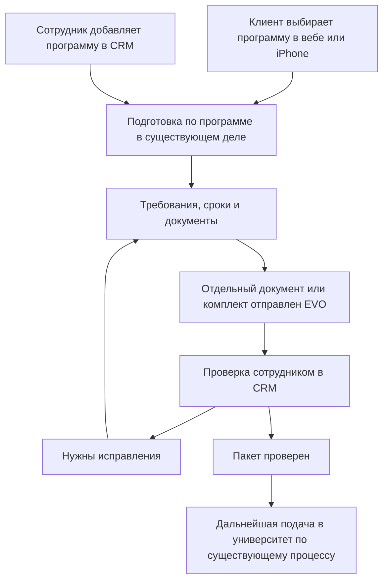

# EVO — план улучшения CRM и единого поступления в вебе и iPhone

Дата: 20 сентября 2026 года. Исполнитель: GPT-6 Astra / Codex с учётом параллельной работы Claude Code Fable.

Документ объединяет выбранные владельцем изменения, его последующие ответы и новый сценарий подготовки документов по программе. Это план для следующего этапа реализации. Создание этого файла не запускает реализацию, миграции или релиз.

## 1. Цель и границы

Довести выбранные рабочие страницы CRM до понятного, связного интерфейса и собрать основной admissions-путь: клиент выбирает программу, готовит документы, отправляет их EVO, получает проверку и исправляет замечания. CRM, веб-портал и iPhone работают с одним делом и одними данными.

В работу входят только перечисленные ниже изменения и необходимые для них общие компоненты, серверные операции и схемы. Старый полный аудит не является дополнительным backlog. Новые полезные идеи за пределами этого документа не реализуются автоматически.

Приоритет решений: последние прямые ответы владельца → выбранная им подборка → этот план → старые планы и аналитические заметки. Предложения, ещё не подтверждённые владельцем, отдельно отмечены в разделе 14.

Результат — работающие функции и удобный интерфейс. Не добавлять KPI, конверсионную аналитику, SLA менеджеров, коммерческие условия консультаций, организационные регламенты и отдельный «Обзор руководителя».

## 2. Контекст для исполнителя

| Объект | Значение |
|---|---|
| Репозиторий | https://github.com/izzhackt/evo_AI_CRM |
| Канонический checkout | `/Users/iskhak.tazhibaev/Documents/01_Projects/EVO/evo_AI_CRM` |
| Состояние checkout при подготовке | Ветка `izzhackt/evo-inbox-folder-rename`, пользовательские изменённые и неотслеживаемые файлы. Не использовать её для новой реализации |
| Новая работа | Отдельный worktree от свежего `origin/main`, новая ветка с префиксом `izzhackt/` |
| Проверенный main при сборке файла | `7af9405f65e11f43faf9ce17b06bc56150792f0e` |
| Основной анализ admissions | `b7598a1c5046fe3c2b16fc014bc0c22044e64b27`; последующая дельта main проверена отдельно |
| CRM сотрудников | https://crm.evoadmissions.com |
| Клиентский веб-портал | https://app.evoadmissions.com |
| Приложение | **EVO admissions**, существующий логотип EVO |
| Общий Supabase project | `iosckaqtovbbnssqcpde` — адрес проекта из действующего контракта; живую конфигурацию сверить перед реализацией |
| Сервер | `hermes-vps`, SSH alias; `/opt/evo-crm` |

До изменений прочитать свежие `AGENTS.md`, родительские `AGENTS.md` и `CONTEXT.md`, корневые `CONTEXT.md`, `PRODUCT.md`, `DESIGN.md`, `docs/EVO_LAUNCH_PLAN.md`, `docs/PLAN_CHANGES.md` и относящиеся к выбранной функции ADR. Существующие WIP, файлы и данные не сбрасывать.

GitHub — общий источник актуального кода и состояния PR. История обсуждения и SHA выше — датированные ориентиры, а не разрешение игнорировать последующие изменения.

Уже известные пересечения:

- [PR #913](https://github.com/izzhackt/evo_AI_CRM/pull/913), восстановление загрузки воронки поступления: **OPEN** на момент подготовки. Сначала проверить его новый статус и точный diff; не создавать второе исправление той же причины.
- [PR #925](https://github.com/izzhackt/evo_AI_CRM/pull/925) уже в main: улучшена карточка университета на iPhone и читаемость программ. Использовать эту версию как основу, не возвращать старую компоновку. Это не реализация выбора программы и отправки пакета.
- Старые номера миграций и release receipts не считать текущими. Перед изменением схемы сверить main, открытые ветки и живой ledger. Номера будущих миграций здесь не резервируются.

## 3. Один продукт и общие данные

У одной клиентской функции — единые данные, правила и результат на вебе и iPhone. CRM — рабочее представление того же дела для сотрудников с их полномочиями.

- Один аккаунт клиента и существующее дело. Выбор нескольких программ не создаёт несколько независимых людей или дел.
- Общие документы, версии, решения проверки, сообщения и факты сопровождения. Разные интерфейсы читают и изменяют разрешённую часть этих же записей.
- Файлы в общем защищённом Storage; не создавать отдельные копии для CRM, веба и iPhone.
- Изменение карточки в CRM сохраняет связь с клиентским порталом. Изменение текущего профиля не переписывает молча исторические финансовые факты.
- Общая БД не означает одинаковые права. Студент видит своё, сотрудник — доступные ему дела. Личные результаты тестов не становятся доступными персоналу из-за этого плана.
- Новая функция получает общий серверный контракт и интерфейс на обеих клиентских платформах. Рабочий веб не означает автоматически готовый iPhone.
- Веб — первый полный рабочий выпуск, включая desktop и мобильный браузер. Разработку iPhone можно вести параллельно на согласованных общих операциях; затем довести тот же новый admissions-путь на iPhone. Не откладывать полноту веба ради отдельного мобильного сценария.
- Клиентские интерфейсы сохраняют русский и кыргызский языки. Новые надписи добавляются в обе локализации. Полную локализацию CRM этим планом не расширять.

## 4. Дизайн и UX/UI

Режим интерфейсов — **Operate**: сотрудник или клиент приходит выполнить конкретную работу. Исполнитель самостоятельно выбирает окончательную композицию в пределах согласованных функций, опираясь на Impeccable и текущий визуальный язык EVO.

### Визуальные требования

- Сохранить логотип, существующие брендовые токены, Golos в вебе и красный акцент основного действия. Для iPhone учитывать уже принятые native-компоненты и доступные системные размеры текста.
- Основная рабочая информация видна раньше второстепенных сводок и больших пустых блоков. Уменьшать повторения и отступы, а не важный текст и зоны нажатия.
- Основной веб-текст обычно 14–16 px, вторичный 12–13 px. Не делать имя человека, задачу, документ или срок трудно читаемыми ради плотности.
- На desktop использовать пространство для списка и контекстных деталей. На телефоне — понятные записи и полноэкранные детали, когда боковая панель уже неудобна.
- На изменяемых экранах устранить лишнюю горизонтальную прокрутку, обрезанные действия и конкурирующие основные кнопки. Таблица допустима там, где её действительно удобнее читать.
- Не добавлять декоративные графики, искусственный прогресс, демонстрационные данные, тяжёлые анимации и объяснения устройства системы в рабочий интерфейс.

### Базовые принципы

1. Видно, что происходит: загрузка, сохранение, результат и ошибка различимы.
2. Названия соответствуют действиям; одинаковая подпись не скрывает разные операции.
3. Пользователь сохраняет контроль: отмена, возврат, понятное исправление ошибки.
4. Одинаковые действия ведут себя одинаково на связанных экранах.
5. Ошибки предотвращаются до записи: явный выбор человека, видимый период, защита повторной отправки.
6. Нужные сведения показаны в контексте; их не приходится запоминать при переходах.
7. Сохраняются фильтры, позиция, выбранная страница и несохранённый текст, где это применимо.
8. В интерфейсе остаётся только полезное для текущей работы.
9. Ошибка объясняет конкретное действие для восстановления, без необоснованных обещаний.
10. Клавиатура, видимый фокус, подписи полей, доступные меню и сообщения о результате работают на изменённых элементах.

Сообщения об исходе действия должны быть доступны вспомогательным технологиям без ненужного перехвата фокуса: [W3C — Status Messages](https://www.w3.org/WAI/WCAG22/Understanding/status-messages.html).

### Тексты

Без AI explanatory phrases, AI slop, рекламных вступлений и технического повествования во frontend. Удалить такие фразы в затронутых блоках. Полезные инструкции к документу, конкретная ошибка и причина отказа сохраняются.

Подписи короткие и предметные: «Продажа добавлена», «Повторить», «Исправить», «Отправить на проверку». `provider claims`, `plain-text draft`, hash, «Сохранено в платформе» и подобные технические пояснения не должны занимать рабочий экран.

Для исполнения применять подходящие проходы Impeccable: `layout`, `clarify`, `typeset`, `harden`, `adapt`, `distill`. Это инструменты достижения результата, а не обязательный полный цикл всех команд на каждой странице. Проверку дизайна проводить ограниченными проходами desktop/mobile, исправлять найденное одним собранным набором, без бесконечной полировки.

## 5. Главная и отчёт продаж

### CRM-01. Главная: воронка продаж

Маршрут: `/v3/main`.

- Сохранить визуальный компонент пути от лида к клиенту. Название — **«Воронка продаж»**.
- Показывать текущие количества людей на соответствующих этапах. Проценты, конверсию и новые KPI убрать из этого блока.
- Не выдавать прежний накопительный подсчёт продвижения когорты за текущее распределение по этапам. Источник данных должен соответствовать выбранному смыслу.
- Не применять к текущей воронке скрытый фильтр даты создания лида от соседнего отчёта. Если существующий переключатель периода относится к другому блоку, визуально и логически отделить его.
- Не считать наличие Student case продажей. Продажа подтверждается соответствующим фактом отчёта; назначение куратора и оплата — отдельные факты.
- Существующие этапы и правила движения не менять произвольно. Исторические импортированные продажи без связанного лида не превращать в выдуманные лиды ради диаграммы.

Проверка: отображённые количества соответствуют разрешённым текущим данным и подписанным этапам; воронка не показывает проценты и не смешивает разные основания подсчёта.

### CRM-02. Отчёт продаж

Маршрут: `/v3/main?view=sales`.

**Права и достоверность**

- Создаёт продажу **Sales Manager**. Обычный Sales не создаёт записи. Ограничение действует и на UI, и на сервере; не вводить неоговорённое исключение для Admin.
- Использовать устойчивые права/идентификаторы роли, а не сравнение редактируемой подписи роли.
- Продавец определяется подтверждённой связью с сотрудником, а не тем, кто нажал «Сохранить». Сотрудник, фиксирующий продажу, может быть другим человеком.
- Сохранять исходные подписи продавцов из импорта. Не объединять похожие имена автоматически.
- Текущие данные клиента и условия редактируются в общей карточке. Отчёт сохраняет исторический снимок факта продажи; обычная правка карточки не переписывает его.
- Ошибку в исторической продаже исправляет Sales Manager явным действием с причиной и историей изменений. Импорт без связанной карточки можно исправить в отчёте в рамках этих же прав.

**Добавление и месяц**

- Использовать единое понятное название существующей даты — «Дата продажи»; не создавать вторую дату только из-за прежних разных подписей.
- Месяц новой записи вычислять из даты продажи на сервере и показывать до сохранения. Открытый месяц отчёта не должен скрыто определять назначение новой записи.
- Существующие исторические месяцы и даты автоматически не переносить и не пересчитывать.
- Основные выборы формы — человек и куратор. Условия показывать из карточки со ссылкой «Исправить условия»; дата и целевой месяц видны.
- При быстрой смене человека устаревший ответ не должен заменить предпросмотр нового выбора.
- После успеха открыть нужный период, сделать добавленную строку видимой и выделить её. Если фильтр её скрывает, явно привести экран к показу сохранённой записи. Сообщение — «Продажа добавлена», действие — «Открыть дело».

**Поиск, фильтры и итоги**

- Поиск по имени, телефону и договору в пределах доступных записей. Поиск/фильтрация выполняются до пагинации.
- На виду — период, поиск, продавец; направление выбирается из реальных значений. Архив и уточнения — дополнительные фильтры.
- Сброс фильтров сохраняет период. Пустой результат говорит о фильтрах, а не предлагает сменить месяц независимо от причины.
- Подписи «Найдено по фильтрам» и «План отдела» разделяют охват. Не вычислять выполнение общего плана по отфильтрованной части.
- Стоимость, «Оплачено по записи» и фактические поступления за месяц не объединять в один «Доход». Разные валюты не складывать, неизвестные суммы не изображать нулём.
- Компактную сводку фактических поступлений отдела сохранить здесь. Исправить обнаруженное несоответствие проверки прав после проверки текущего контракта; не расширять для этого всю Sales-роль.
- Уточнения показывать по известной причине: дата, валюта, продавец, комментарий. Если причины нет в данных — «Требует проверки», без выдуманной диагностики.
- Конкретную служебную запись исключать из рабочих итогов только после установления её точного ID и назначения. Историю сохранить. Это не массовая очистка записей по имени.

**Компоновка**

- Заголовок и добавление → компактные фильтры → короткие итоги → список продаж → пагинация. Рабочие строки должны появляться на первом экране обычного desktop-окна.
- Сначала краткий просмотр записи; редактирование — отдельное действие. На desktop допустима боковая область, на телефоне — отдельный экран.
- На телефоне человек и его суммы читаются вместе в вертикальной записи. На подходящей ширине можно сохранить таблицу с закреплённой первой колонкой/заголовком.
- Возврат сохраняет фильтры, страницу и положение списка. В годовом виде виден месяц отчёта.
- Первоначальный импорт убрать из повседневного отчёта в существующее место управления для разрешённого администратора; отдельную систему импорта не строить.

Проверка: правильные права, продавец, дата/месяц и суммы; новая строка видна после сохранения; исправления оставляют историю; поиск и возврат работают за пределами первой страницы.

## 6. Очереди, воронки и студенты

### CRM-03. Заявки — `/v3/requests`

- Применять фильтр источника до ограничения выборки, а не после первых 100 записей.
- Дать доступ к следующим результатам с устойчивым порядком и без скрытого обрезания.
- «Все» включает доступные типы обращений, в том числе консультации кабинета; вид обращения обозначен. Если для части данных нет доступа, не маскировать это под полный охват.
- Общая очередь не превращает разные обращения в одну бизнес-операцию: консультация, регистрационное одобрение и новый комплект EVO имеют собственные действия.
- Сохранить фильтры при открытии и возврате.

### CRM-04. Входящие — `/v3/inbox`

- При отсутствии диалогов показывать одно ясное пустое состояние. Не предлагать одновременно выбрать несуществующий диалог.
- Отдельно отражать фактическую готовность канала: подключён, недоступен или состояние не удалось получить.
- Пустая очередь не означает отключённый канал. Не изображать подключение успешным без реального подтверждения.
- Подключение новых провайдеров и переконфигурация WhatsApp в этот пункт не входят.

### CRM-05. Воронка продаж — `/v3/pipeline`

- Сделать фильтры компактными.
- На телефоне переключать этапы со счётчиками; пустые этапы не должны занимать несколько экранов перед единственной рабочей карточкой.
- Сохранить доступ ко всем этапам и существующие правила перемещения. Не менять процесс продаж ради компоновки.

### CRM-06. Воронка поступления — `/v3/admissions-pipeline`

- Восстановить загрузку, согласовав работу с PR #913 и его актуальным состоянием.
- Сохранить предусмотренную доску и её смысл. Не заменять её другим трекером.
- При ошибке — «Повторить» и доступный переход к студентам. Ошибку не подменять пустой успешной доской.
- Проверить реальную загрузку без фильтров и с выбранными фильтрами после доставки исправления.

### CRM-07. Сообщения со студентами — `/v3/messages`

- Добавить отбор **«Нужен ответ» / «Ждём студента»** на основе фактической переписки и доступных дел.
- Прочтение не означает, что вопрос решён или что сотрудник ответил. Не изменять рабочее состояние только из-за открытия диалога.
- Устранить гонку поиска: ответ старого запроса не заменяет новые результаты. Ошибка поиска отображается явно, отдельно от отсутствия совпадений.
- Снятие обсуждений и связей с задачами из командного чата не распространять автоматически на этот раздел.

### CRM-08. Студенты и карточка

- В шапке дела показывать назначенного куратора из самого дела. Продавца показывать отдельно с правильной подписью.
- Объединить повторяющиеся блоки доступа в кабинет в один ясный блок с существующими состояниями и действиями.
- Не менять назначения сотрудников и политику регистрации как побочный эффект исправления отображения.
- Файлы, анкета, программы и новый комплект из раздела 11 остаются внутри этого же дела.
- Самостоятельный перенос большой сводки в списке студентов пока не включён: выбранная владельцем формулировка оборвана. См. раздел 14.

## 7. Договор, оплата и EVO Docs

### CRM-09. Один раздел договора и оплаты

В существующем деле выстроить последовательность:

**Стоимость → договор → транши → оплаты и чеки → остаток.**

- «Стоимость не указана» открывает реально доступный редактор стоимости, а не обзор со скрытой формой.
- Убрать конкурирующие старые финансовые формы и техническую вкладку договора после переноса необходимых рабочих действий в единый раздел.
- Сохранить историю, подписи/статусы договора, подтверждённые оплаты, чеки, транши и предусмотренные исправления. Не сводить разные факты в один статус.
- Остаток опирается на реальные условия и подтверждённые события. Не смешивать валюты, неизвестные суммы и нули.
- Технические данные остаются в подходящих служебных местах, если нужны для работы системы; не показывать `provider claims`, `plain-text draft`, hash в обычном процессе сотрудника.
- Этот раздел продолжает отдавать студенту его договор, оплату и статусы через существующие общие данные. Новую платёжную интеграцию не вводить.

### CRM-10. EVO Docs, анкета и документы

Сохранить один путь:

**Анкета → требования → файлы → проверка → готовые формы.**

- Различать «требования ещё не настроены» и «требования есть, но документы не загружены».
- Студент и сотрудник работают с теми же пунктами, файлами и версиями дела.
- Существующие готовые формы, заполнение по анкете, OCR и экспорт не заменять другим движком. Если новый admissions-путь затрагивает их входы/выходы, проверить соответствующую прямую зависимость.
- Не объявлять OCR/экспорт проверенными только на основании прежнего визуального прохода — тогда эти операции не запускались.
- Новые программы и комплекты из раздела 11 продолжают эту систему документов, а не создают альтернативный Docs.

## 8. Университеты и бланки

Маршруты: `/v3/universities`, `/v3/universities/manage`, существующие карточки и формы; связанные клиентские каталог и карточка университета.

- Фильтр стран строится по доступным данным каталога. Не использовать слишком общий перечень, не связанный с реальными записями.
- Ближайший подтверждённый срок виден в списке с достаточным контекстом программы/набора. Неизвестную или неподтверждённую дату не выдавать за установленный дедлайн.
- Сделать карточки компактнее, сохранив название, расположение, программы и нужные действия.
- В управлении — поиск и заметное добавление университета. Существующие бланки остаются связанными с вузом/программой.
- Добавление программы сотрудником происходит в контексте существующего студенческого дела. Новый выбор клиентом из каталога приводит к той же подготовке внутри дела.
- На iPhone опираться на уже смерженную карточку из PR #925. Полный повтор её редизайна не требуется.
- Не добавлять массовое наполнение каталога, новые страны, выдуманные требования или дедлайны под видом UI-работы.

## 9. Командный чат

Маршрут: `/v3/team-chat`. Этот раздел относится к общению сотрудников.

### Одна лента

- Одна общая хронологическая лента выбранного канала и одно поле ввода.
- Убрать ветки, боковую панель «Обсуждение», счётчики ответов и переходы в отдельное обсуждение.
- Оставить **«Ответить» с цитатой**: цитата появляется над вводом, ответ отправляется в общую ленту.
- Старые ответы включить в общую хронологию с исходными авторами, датами, ID и связью с цитатой. Не копировать и не отправлять их заново.
- Существующие ссылки на сообщения должны открывать соответствующее место новой ленты. Черновики из прежнего контекста не теряются и не отправляются автоматически.

### Задачи из чата убираются

- Удалить «Создать задачу» из меню сообщения, «Задача создана ↗», автоматические карточки/названия/статусы связанных задач.
- Убрать ненужную зависимость загрузки ленты от получения task links.
- Сами задачи и история сообщений сохраняются. Создание/ведение задач остаётся в разделе «Задачи».
- Вручную вставленные людьми обычные ссылки не вырезать из текста.

### Плотность и поиск

- Группировать соседние реплики одного автора без постоянного повтора имени. Сохранять явные границы автора и дня.
- Сократить повторяющиеся отступы и отдельные ряды действий. Второстепенные действия доступны при наведении и фокусе; на телефоне — через явное меню.
- Удалённое сообщение без ответов показывать компактно; цитируемое удалённое сообщение сохраняет понятный след без раскрытия удалённого текста.
- Убрать постоянное большое поле поиска по нескольким названиям каналов. Сделать заметным поиск сообщений с областью **«В этом канале»**.
- Подсвечивать совпадения, открывать результат с окружающей перепиской, возвращать к результатам с сохранённым запросом и положением.
- Каналы показываются одинаково: название → настоящее последнее сообщение → время → непрочитанное. Отсутствующий предпросмотр не означает пустой канал.
- Поиск сразу по всем каналам сюда не входит.

### Ввод, положение и непрочитанное

- Поле ввода начинается с одной строки, растёт до 5–6 строк, затем прокручивается внутри. При удалении текста уменьшается; после подтверждённой отправки возвращается к одной строке.
- При чтении истории новые сообщения не сдвигают экран вниз. Появляется понятный переход к новым сообщениям; переход вниз показывается только когда нужен.
- Даты понятны и в старых ответах после объединения ленты.
- Автоматически отмечать просмотренными реально показанные сообщения в активной вкладке. Пропущенные при прыжке вниз сообщения остаются непрочитанными.
- Результат поиска или короткая цитата не означает просмотр исходного сообщения. Старую историю прочтения не сбрасывать.
- Не использовать один общий курсор, который незаметно помечает весь пропущенный промежуток: изменить способ учёта в минимально необходимом объёме.

### Ошибки

| Действие | Сообщение и восстановление |
|---|---|
| Загрузка истории | «Не удалось загрузить сообщения» и «Повторить» |
| Неизвестен результат отправки | «Не удалось подтвердить отправку», сохранённый текст и безопасная сверка/повтор с тем же идентификатором операции |
| Неизвестен результат удаления | «Не удалось подтвердить удаление», сверка фактического состояния и соответствующее действие |

Не обещать сохранённый черновик при ошибке чтения или удаления. Повтор отправки не создаёт дубликат. Подтверждённые действия не изображаются неуспешными из-за запоздавшего обновления экрана.

## 10. Личный календарь

Маршрут: `/v3/calendar`.

- Показывать **только задачи, назначенные текущему сотруднику**, включая те, которые он назначил себе. Созданная им задача для другого человека сюда не попадает.
- Правило действует и для Admin в личном календаре. Наличие расширенных прав не превращает этот экран в календарь всех сотрудников.
- Сроки поступления, университетские дедлайны и документные сроки сами по себе здесь не отображаются. Они остаются в деле и «Моём поступлении». Назначенная сотруднику задача с таким сроком остаётся обычной его задачей.
- Отбор выполняется на сервере до лимита/пагинации. Детали календаря соответствуют тому же отбору; существующие права доступа к задачам из других рабочих разделов не урезать ради этого фильтра.
- Из общего календаря форма не подставляет первого студента. Выбор явный. Из дела конкретного студента допустимо подставить это дело с видимым контекстом.
- Заменить два одинаковых «Создать задачу» с разным назначением одним ясным действием с выбором типа. Если существующие пути сохраняются, подписи различаются: «Задача сотруднику» / «Задача по студенту».
- Сверху — компактная панель периода и действий. «Без срока — N» сворачивается. Пустой ближайший дедлайн не занимает отдельную большую карточку.
- Форма и детали на desktop открываются сбоку, не вытесняют всё расписание. На телефоне — подходящий отдельный экран/панель с управлением фокусом и возвратом.
- Название задачи — ориентир 14 px; студент и срок — 12–13 px. Плотность достигается компоновкой.
- Существующие состояния выполнения и история задач сохраняются. Новый самостоятельный редизайн всего раздела «Задачи» не требуется.

## 11. Программа → документы → проверка EVO

Это новое явно выбранное дополнение к CRM-подборке. Оно охватывает общую серверную логику, CRM, клиентский веб и iPhone.

### 11.1. Кому доступно

**Клиентам с подключённым сопровождением.** Самостоятельный пользователь с одобренным аккаунтом продолжает пользоваться общими возможностями каталога/избранного и сначала обращается в EVO для сопровождения.

Одобрение регистрации не открывает выбор программы для подготовки, загрузку и отправку документов автоматически. Новую оплату, договорной гейт или повторную регистрацию этим планом не добавлять — использовать согласованное состояние сопровождения.

### 11.2. Общее устройство

Оба входа используют одну запись подготовки программы в том же деле. Регистрационная анкета, консультация, избранное, подготовка и реальная подача в университет остаются разными действиями, связанными с одним человеком.

### 11.3. Что уже существует и чего не хватает

По исходникам `b7598a1c` уже есть каталог программ/наборов, дело, документные пункты, версии файлов, проверка конкретной версии, причины возврата и показ результата студенту. Один документ дела можно связать с несколькими вариантами поступления.

Не собран полный путь: выбор программы самим студентом → её требования → отправка целого комплекта в EVO → рабочая очередь и решение по комплекту. Загрузка сейчас сразу отправляет отдельный файл на проверку. Наличие общей БД и этих отдельных функций не означает, что новый сценарий уже готов.

### 11.4. Выбор программы и «Моё поступление»

- Сохранить конкретный университет, программу и набор/период поступления с устойчивыми идентификаторами. Свободного названия недостаточно для привязки требований и сроков.
- Повторное действие не создаёт дубль той же подготовки. Несколько существующих вариантов поступления внутри дела сохраняются; новый лимит программ не вводится.
- Предлагаемое решение: выбор сразу начинает подготовку и виден сотруднику, без дополнительного подтверждения самого выбора. Оно отмечено отдельно в разделе 14.
- В «Моём поступлении» отображаются выбранные программы, реальные сроки, состояние подготовки и ближайшие необходимые действия.
- Внутри программы — её требования, документы, замечания и отправки. Не заставлять студента искать нужный файл в одном плоском списке всего дела.

### 11.5. Требования и сроки

- Стартовый набор новой простой программы: **Фото** и **Загранпаспорт**.
- Это начальные требования EVO, не утверждение, что любой университет требует только два файла. Существующие полноценные перечни сохраняются.
- Возможность дальше добавлять требования, эссе, инструкции и сроки строится в существующем управлении программами/документами. Не ограничиваться двумя жёстко зашитыми полями.
- Общие документы дела можно использовать в нескольких программах без копирования. Материалы с разными требованиями — например, эссе на разные темы — остаются отдельными.
- Готовность считается по обязательным пунктам конкретной программы. Документы другой программы не увеличивают её готовность.
- Показывать только подтверждённые даты с корректным периодом/часовым поясом. Если срок неизвестен, не создавать выдуманный дедлайн.
- Изменение требований не подменяет молча уже отправленный или принятый комплект. Сохраняется редакция требований и видимость новых необходимых действий.

### 11.6. Загрузка и отправка

- **«Загрузить»** сохраняет файл; **«Отправить на проверку»** направляет конкретный документ сотруднику. Если оба действия есть в интерфейсе, серверные состояния действительно разделены.
- Файл до отправки не должен автоматически попадать в новую очередь проверки только из-за завершения upload. Существующую проверку файла/Storage не обходить.
- **«Отправить пакет в EVO»** доступно, когда все обязательные материалы представлены и технически доступны. Предварительное одобрение этих файлов сотрудником не требуется для первой отправки.
- Если чего-то не хватает, показать конкретные недостающие пункты рядом с действием. Отдельный готовый документ при этом можно отправить самостоятельно.
- Уже принятые подходящие документы используются повторно. Не требовать повторной загрузки всего комплекта ради одного исправления.
- Отправка фиксирует программу/набор, требования, состав и конкретные версии файлов. Бинарные копии для каждого пакета не создаются.
- После отправки видны подтверждённый статус и время. Повтор нажатия или сетевой повтор не создаёт новую одинаковую отправку.

### 11.7. Работа сотрудника и обратная связь

- В существующем admissions-пространстве CRM нужна очередь поступивших документов/комплектов с переходом в соответствующее дело и программу.
- В очереди: студент, программа, срок, что отправлено и что требует проверки. Получатели и видимость определяются существующим назначением и правами на дело.
- Комплект не должен исчезать из работы из-за отсутствия назначенного сотрудника: такое дело остаётся видно уполномоченной очереди для распределения, без автоматического назначения случайного куратора.
- Сотрудник открывает конкретные версии, принимает документ либо возвращает с конкретным замечанием. Неправильный файл не равен отказу в поступлении.
- После проверки обязательных материалов и состава сотрудник подтверждает весь комплект: **«Пакет проверен»**.
- Студент видит решения, замечания и следующее действие на вебе и iPhone. Замечание ведёт к нужному документу, а не просто к главной странице.
- Замена файла сохраняет прошлую версию и решение. Новая версия не подменяет уже одобренную отправку; повторная проверка касается изменённой части и её влияния на комплект.
- Нужен видимый сигнал о новой работе и результатах. Автоматически создавать отдельную задачу на каждый файл не требуется.

### 11.8. Статусы и смысл

Для документа различимы: отсутствует → загружен → на проверке → нужен исправленный файл / принят. Имеющиеся состояния отказа и технических ошибок отображаются по их настоящему смыслу.

Для комплекта: подготовка → отправлен на проверку EVO → нужны исправления / пакет проверен. Дополнительное «Проверяется» показывать только при реальном действии сотрудника, а не по таймеру.

Существующее `submitted` университетской заявки означает внешний этап с подтверждением. Нажатие «Отправить пакет в EVO» не переводит заявку в «Отправлено в университет», не изображает принятие университетом и не создаёт продажу.

### 11.9. Паритет веба и iPhone

- Один доступ к функции по состоянию сопровождения.
- Те же выбранные программы, требования, файлы и версии.
- Те же отправки, решения и замечания.
- Полный путь исправления на обоих устройствах.
- При обновлении/возвращении на экран показывать актуальный серверный результат; не обещать мгновенную синхронизацию, если она не реализована и не проверена.
- Предварительно проверить несекретную конфигурацию iPhone-сборки: общий код не доказывает, что конкретная сборка подключена к нужному проекту.

## 12. Порядок реализации и параллельная работа

### Этап 0. Сверка и фиксация объёма

1. Проверить свежий main, активные PR и пересечения с Fable; создать отдельный worktree.
2. Перенести этот план в `docs/` своей ветки, связать с `docs/EVO_LAUNCH_PLAN.md`, добавить scope в append-only `docs/PLAN_CHANGES.md`. Изменить старые противоречащие описания только по согласованным решениям: личный календарь, чат, роли продаж, общий admissions-путь.
3. Проверить, какие пункты уже доставлены. Не переделывать подтверждённую реализацию и не считать открытый PR завершённой работой.
4. Следовать подтверждённым решениям раздела 14: прежняя компоновка студентов и немедленное начало подготовки по выбранной программе.

### Этап 1. Ошибки данных и критичные рабочие пути

Воронка поступления; корректный куратор; права/продавец/месяц отчёта продаж; доступный редактор стоимости; корректный отбор заявок. Сначала устранить причины неверного результата, затем уплотнять интерфейс.

### Этап 2. CRM-страницы

Главная и отчёт → заявки/входящие/воронка продаж → сообщения и карточка → единый договор/оплата → каталог/Docs. Для каждого блока сделать функциональную часть и UX вместе, до понятного результата действия.

### Этап 3. Командный чат и календарь

Это отдельные ограниченные блоки. Перед снятием обсуждений обеспечить чтение старых ответов и новый учёт непрочитанного. Перед уплотнением календаря исправить его состав и выбор студента. Изменения общего composer задач координировать между блоками.

### Этап 4. Общие admissions-операции

Связь программы/набора/требований → сохранённые файлы и отправка → комплект с версиями → проверка/очередь сотрудника → клиентский результат. Использовать существующие case/document/application сущности и команды, дополняя их только по доказанным пробелам.

### Этап 5. Полный клиентский путь

Собрать выбор программы и «Моё поступление» в вебе; затем обеспечить тот же охват на iPhone. Параллельная реализация экранов допустима после согласования общих операций. Проверить оба входа: клиент выбрал программу и сотрудник добавил её в дело.

### Этап 6. Проверка, review и доставка

Точечная проверка каждого изменённого пути, ограниченный визуальный проход, обязательные короткие PR checks и независимое review точной головы. Доставка — по действующему разрешённому релизному контракту, с отдельной фиксацией того, что смержено, развёрнуто и проверено.

### Владение работой

- Основной исполнитель этого плана владеет выбранными CRM-блоками и согласованной интеграцией admissions.
- Fable параллельно работает с Portal/iPhone. Перед изменением его экранов согласовать владение файлами и задачами по текущему состоянию репозитория/сессий. Не поручать обеим сессиям одну и ту же страницу одновременно.
- Общие документы, Auth/права, серверные операции, компоненты, Supabase, lockfile, CI и release-конфигурация требуют согласованного владельца изменения.
- Один координатор номеров и применения миграций, один владелец production-релиза. Worktree изолирует файлы, но не main, БД и сервер.
- Этот план не создаёт новых задач/сессий и не отправляет сообщения другим исполнителям сам по себе.

## 13. Проверки и критерии завершения

Fast Execution: проверять изменённую функцию и её прямые риски на реальном разрешённом пути. Не запускать автоматически полный тяжёлый набор после каждой правки. Не использовать fake/demo данные, mocks, canned success и подмены интеграций для доказательства готовности.

| Блок | Минимальная содержательная проверка |
|---|---|
| Главная и продажи | Реальный состав этапов; правильные права, продавец, дата/месяц; сохранение/исправление и отражение в списке; фильтры и разные валюты |
| Очереди и воронки | Отбор до лимита и следующие записи; настоящие состояния канала; восстановленная доска; нужная карточка достижима на телефоне |
| Карточка и финансы | Правильный куратор/продавец; редактор стоимости достижим; договор/оплаты/остаток и история не расходятся с общими данными |
| Командный чат | Старые ответы в общей ленте; цитата; поиск и контекст; безопасный повтор; новые сообщения не сбивают чтение; пропущенное остаётся непрочитанным |
| Календарь | Только назначенные текущему сотруднику задачи; нет скрытой подстановки студента; форма и детали не вытесняют расписание |
| Admissions | Выбор программы → файлы → отдельная отправка и комплект → очередь сотрудника → замечание → исправление → принято; один результат в CRM, вебе и iPhone |
| Границы admissions | Пользователь без сопровождения не получает новые права; нельзя обратиться к чужому делу; повтор не создаёт дубль; новая версия не переписывает старый принятый комплект |

Проверки выполняются с разрешёнными аккаунтами/операциями; не создавать произвольные записи и сообщения реальным клиентам ради теста. Если реальный путь недоступен, указать конкретно отсутствующий доступ или сломанный шаг, не заменять его симуляцией. Разрешённая проверка в изолированной среде остаётся доказательством именно этой среды.

Документные загрузки сохраняют существующие проверки файлов и разграничение доступа. Общая платформа использует серверные права и Storage policies; см. [Supabase Storage access control](https://supabase.com/docs/guides/storage/security/access-control).

Результат каждого блока фиксировать кратко: что изменено, точная ревизия, какой реальный путь проверен, результат, оставшиеся ограничения. Существующие доказательства использовать повторно, только если код и условия не изменились; не называть их новым прогоном.

Для релиза сохранить действующие exact-main admission, один immutable build, точечный реальный smoke изменённой функции, rollback, acceptance и disarm. Защищённые короткие проверки и независимое review не обходить. Не заменять этот контракт обязательным полным регрессионным марафоном. Публикация в App Store этим документом не поручается.

Общий план завершён, когда все согласованные блоки реализованы, проверены в указанном объёме и имеют честный статус доставки. Непроверенная функция, открытый PR и установленная iOS-сборка — разные состояния; не объединять их в «всё готово».

## 14. Решения владельца, подтверждённые при реализации 20.09.2026

1. **Страница «Студенты».** «Оставить расположение как сейчас». Поиск, список и сводка сохраняют нынешнюю компоновку; выбранные изменения карточки и прямые зависимости общего поступления остаются в scope.
2. **Выбор программы.** «Сразу открывать подготовку». Клиент с сопровождением начинает подготовку документов сразу после выбора программы; выбор сразу виден уполномоченному сотруднику. Отдельное одобрение самого выбора не требуется. Загрузка и отправка пакета в EVO остаются разными действиями.

Для точечного исключения служебной продажи требуется установить её ID и назначение. Это задача проверки данных, не повод выбирать запись по похожему имени или блокировать остальной план.

## 15. Что не входит

- Новый редизайн Knowledge Base, настроек, всего task workspace или других невыбранных страниц.
- Новый обзор руководителя, KPI, конверсия, планы на 90 дней, SLA, ценовая политика консультаций.
- Новый английский курс, профориентация, публичный сайт и остальные части прежнего большого Portal-плана.
- Самостоятельная автоматическая отправка в университеты и новые интеграции университетских кабинетов.
- Открытие сопровождения всем одобренным аккаунтам.
- Поиск командного чата по всем каналам, новые коммуникационные каналы и массовые рассылки.
- Массовое исправление/удаление исторических продаж, программ, переписок или документов.
- App Store submission, новые Apple capabilities и отдельная переработка приложения за пределами описанного паритета.

Прямую зависимость можно изменить, если без неё нельзя выполнить конкретный пункт плана. Исполнитель указывает этот пункт и минимальную причину расширения; полезность сама по себе не добавляет функцию в scope.

## 16. Карта исходников для старта

Пути относительно репозитория; это ориентиры проверенного снимка, перед реализацией сверить свежие расположения.

| Область | Основные входы |
|---|---|
| Главная и продажи | `src/lib/v3/funnel-source.ts`, `src/components/v3/Funnel.tsx`, `src/components/v3/SalesRegisterView.tsx`, `src/components/v3/SalesRegisterForms.tsx`, `src/components/v3/profile/LeadSaleConditions.tsx` |
| CRM-маршруты | `src/app/(v3)/v3/` — `main`, `requests`, `inbox`, `pipeline`, `admissions-pipeline`, `messages`, `profile`, `calendar`, `team-chat`, `universities` |
| Дело и программы | `src/lib/platform-admissions-actions.ts`, `src/lib/platform-application-contract.ts`, `src/components/v3/profile/ApplicationCreateDialog.tsx` |
| Документы и проверка | `src/lib/platform-private-documents.ts`, `src/lib/platform-document-review-action.ts`, `src/lib/platform-document-checklist-actions.ts`, `src/components/v3/profile/Documents.tsx`, `src/components/v3/profile/DocumentReviewForm.tsx` |
| Загрузка | `src/lib/server/platform-document-storage-route-handlers.ts` и существующие `src/app/api/portal/document-slots/` маршруты |
| Клиентский веб | `src/components/portal/admission/`, `src/components/portal/universities/`, `src/lib/v3/portal-source.ts`, `src/app/(portal)/portal/` |
| iPhone | `ios/EVOAdmissions/Services/SupabaseService.swift`, `ios/EVOAdmissions/Views/UniversityDetailView.swift`, `ios/EVOAdmissions/Views/MyAdmissionView.swift`, `ios/EVOAdmissions/Views/AdmissionDocumentsView.swift` |
| Общие договорённости | `docs/EVO_UNIFIED_WORKFLOW_PLAN_2026-09-18.md`, `docs/EVO_OTHER_FABLE_PLAN_2026-09-19.md`, `docs/EVO_PORTAL_WEB_IPHONE_PLAN_2026-09-19.md` |

Полезные исторические миграции для понимания связей: `113` — связь документа с вариантами поступления; `179` — базовый чек-лист дела; `190` — добавление программы сотрудником; `192` — уровни доступа портала. Это ссылки на историю схемы, не список новых миграций для применения.

Весь необходимый продуктовый scope изложен в этом файле. Локальные временные отчёты и прежняя переписка не требуются для понимания поручения.

## 17. Короткий стартовый prompt для будущей реализации

> Реализуй приложенный EVO_CRM_UX_AND_ADMISSIONS_PLAN_2026-09-20.md по согласованным пунктам. Сначала сверь свежий main и параллельную работу Fable, используй отдельный worktree и сохрани пользовательские изменения. Не добавляй функции вне плана. Следуй подтверждённым решениям раздела 14. Общий путь CRM, веба и iPhone должен использовать одно дело и документы. UX/UI проработай с Impeccable, без AI-риторики во frontend. Проверяй реальные изменённые пути точечно, соблюдай текущие права и релизный контракт, честно фиксируй доставку и ограничения.
