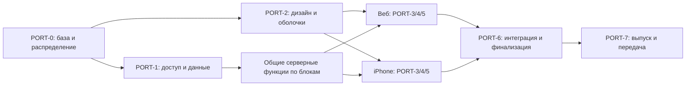

# EVO Portal — полный план для Claude Code / Fable

Дата: 19 сентября 2026. Статус: согласованный объём и план реализации; разработку выполняет Fable.

## 1. Задание

Доведи EVO Portal до полноценного продукта для школьников, которые выбирают образование за границей, и для клиентов EVO, которые проходят поступление с командой. Полностью переработай UX/UI и реализуй недостающие функции. Разрабатывай **веб с приоритетом десктопа и полноценное приложение для iPhone параллельно**, на общих данных и с одним аккаунтом.

Самостоятельный абитуриент и приглашённый клиент получают одну общую среду: университеты, карту, профессии, английский, тесты, избранное и профиль. Клиент дополнительно получает сопровождение: дело, документы, задачи, общение с куратором и доступные ему договорные/финансовые сведения. Переход в сопровождение сохраняет аккаунт и накопленные данные.

Это задание на реализацию и доведение до выпуска, а не на очередной концепт или набор макетов. В этой подготовке создан только план; наличие документа не означает, что описанные функции уже реализованы, проверены или опубликованы.

## 2. Какие решения действуют

Владелец собирал обсуждение последовательно: более поздние уточнения заменяют ранние. Следующие правила — итоговая версия; старый отчёт Fable на `5f9c90dd` не является текущим контрактом.

| Вопрос | Итоговое решение |
| --- | --- |
| Аудитория | В первую очередь школьники: самостоятельные пользователи и клиенты EVO |
| Регистрация | Обязательная анкета; создание аккаунта доступно только в конце анкеты |
| Доступ | После регистрации необходимо одобрение сотрудника; до него — статус заявки и необходимые действия аккаунта |
| Приглашения | Новый приглашённый пользователь проходит тот же путь; приглашение связывает его с существующей записью, но не обходит анкету и одобрение |
| Общие возможности | Доступны обеим аудиториям после одобрения |
| Сопровождение | Дополнительные права клиента, отдельно от одобрения регистрации |
| Платформы | Полный веб и полный iPhone разрабатываются параллельно |
| Языки | Русский и кыргызский; английский — содержание обучения, не третий язык интерфейса |
| Английский | Начинаем с основ, постепенно усложняем; pre-intermediate — направление дальнейшего развития |
| Тесты | Ответы и результаты видит только ученик; staff-доступа, досье и кнопки передачи EVO нет |
| Дизайн | Полная трансформация UX/UI; Fable самостоятельно выбирает направление в рамках бренда EVO |
| Текст фронтенда | Короткий, предметный и полезный; без AI-пояснений, технического наполнителя и рекламных обещаний |
| CRM | Используем существующую CRM; добавляем только то, что необходимо функциям портала |
| Проверки | Точечные реальные проверки изменённых функций и их прав доступа; обязательные короткие проверки репозитория сохраняются |
| Выпуск | Fable ведёт разрешённый релизный процесс, включая arm/disarm и честную фиксацию результатов |

Старые предложения о регистрации без анкеты, гостевом каталоге, немедленном доступе, передаче результатов тестов и последовательной разработке веб → iPhone отменены. Урезанный iPhone, в котором документы и сопровождение доступны только через переход в браузер, не соответствует заданию.

PR [#859](https://github.com/izzhackt/evo_AI_CRM/pull/859) уже снял запрет на самостоятельных пользователей и устранил два ADR 0014. Повторять эту работу не нужно. Его первоначальный порядок поставки заменён решением о параллельной разработке. Архитектурный ADR сохранил номер 0014; приоритеты знаний — ADR 0029.

## 3. Контекст для исполнителя

### Репозиторий и окружение

| Назначение | Контекст |
| --- | --- |
| GitHub — общая точка правды | `https://github.com/izzhackt/evo_AI_CRM` |
| Канонический checkout | `/Users/iskhak.tazhibaev/Documents/01_Projects/EVO/evo_AI_CRM` |
| Общие инструкции | `/Users/iskhak.tazhibaev/Documents/01_Projects/EVO/AGENTS.md` и `CONTEXT.md` |
| Этот план | `docs/EVO_PORTAL_WEB_IPHONE_PLAN_2026-09-19.md` |
| Общий контракт выполнения | `docs/EVO_LAUNCH_PLAN.md`, журнал `docs/PLAN_CHANGES.md` |
| Продукт и дизайн | `PRODUCT.md`, `DESIGN.md`, действующие `docs/adr/` |
| Студенческий портал | `https://app.evoadmissions.com` |
| CRM сотрудников | `https://crm.evoadmissions.com` |
| Сервер | `hermes-vps`, `/opt/evo-crm`, Compose `evo-crm` |
| Основная БД | Существующий managed Supabase `iosckaqtovbbnssqcpde` |
| Публичный сайт | Соседний репозиторий `evoadmissions-website`; его редизайн сюда не входит |

Канонический checkout содержит пользовательские изменения и старую ветку. Не переключай его, не делай reset/clean и не перезаписывай файлы. Fetch свежего `origin/main`, затем отдельный worktree и ветка с префиксом `izzhackt/`. Проверяй занятость пути и ветки перед созданием; существующие worktree других задач не переиспользуй без проверки.

Этот план подготовлен в worktree `/Users/iskhak.tazhibaev/.codex/worktrees/evo-portal-web-iphone-plan/evo_AI_CRM`, ветка `izzhackt/portal-web-iphone-plan`, от main `c033ec466a73e39f0be591c182ec41c377464279`. Это источник документа, не обязательный путь реализации. Перед стартом проверь, где находится последняя версия плана, вошла ли она в main, и зафиксируй свежий SHA. Если PR плана ещё не слит, сначала проведи его по обычным проверкам и review, затем начинай реализацию от актуального main.

Fable сообщил о готовности Xcode, симулятора, OrbStack, `gh` и Supabase. Это переданный статус, не повторная проверка этих инструментов автором плана. Подтверди нужные зависимости перед соответствующим блоком; не делай отдельный большой аудит всего компьютера.

### Проверенная стартовая основа и ограничения знания

При подготовке просмотрен main `c033ec466a73e39f0be591c182ec41c377464279`; production, его текущий ledger и реальные аккаунты в рамках подготовки плана не проверялись.

- Есть портал, публичная анкета, очередь заявок, staff-решение, приглашения, университетский каталог, личные тесты, документы и связанные серверные контракты. Расширяй существующие пути.
- Одобрение уже может создавать доступный pending-case без куратора. Не принимай утверждение «нужно полностью убрать зависимость от case» за обязательную архитектуру: сначала проверь текущую модель и выбери минимальное корректное разделение общего доступа и сопровождения.
- В main есть миграции до 186 включительно. Это снимок, а не разрешение занять 187: номера выбираются только после свежей сверки main, параллельных веток и production-ledger.
- Идёт отдельная работа `docs/EVO_OTHER_FABLE_PLAN_2026-09-19.md`: staff-задачи, университетские подборки, договор/оплата и общение по делу. Сверяй её текущие PR, повторно используй появившиеся модели и не создавай параллельные ledger, задачи или чат.
- Серверные API-маршруты уже существуют. Отдельно установи, каких контрактов не хватает для мобильного клиента; утверждение «API нет вообще» из раннего отчёта не использовать.
- Подтверждение email и Resend имеют отдельный согласованный scope. В просмотренном коде публичной регистрации ещё встречается `email_confirm: true`; не объявляй доставку и подтверждение готовыми по наличию настройки. Сверь актуальный email-план и доведи нужный реальный путь без произвольного отключения или перенастройки Auth.
- Цифры каталога, опубликованных записей и фото из раннего отчёта не являются текущим production-инвентарём. Проверь реальные доступные данные до наполнения экранов.

Начальные точки чтения: `src/app/apply/`, `src/app/(portal)/`, `src/components/v3/portal/`, `src/lib/supabase/student-portal-authority.ts`, `src/lib/server/student-public-registration.ts`, `src/lib/v3/portal-source.ts`, `src/lib/platform-route-contract.ts`. Это указатели на просмотренную версию, не требование сохранить структуру файлов после редизайна.

| Задача | Дополнительные точки чтения на стартовом SHA |
| --- | --- |
| Одобрение | `src/lib/student-application-actions.ts`, `src/components/v3/admissions/StudentApplications.tsx`, `supabase/migrations/180_platform_unified_intake_access.sql` |
| Приглашение | `src/lib/student-portal-provisioning-actions.ts`, `src/lib/server/student-portal-invite-coordinator.ts`, `src/lib/student-invite-callback-contract.ts` |
| Каталог | `src/lib/platform-university-catalog.ts`, `src/lib/v3/university-source.ts`, `src/components/v3/universities/UniversityCatalogue.tsx` |
| Тесты | `src/lib/student-assessment-contract.ts`, `src/lib/student-assessment-actions.ts`, `src/components/v3/portal/assessments/` |
| Документы | `src/app/api/portal/document-slots/[documentSlotId]/versions/route.ts`, `src/app/api/portal/document-versions/[versionId]/download/route.ts` |
| Обращения и финансы | `src/lib/platform-admissions-support-actions.ts`, `src/lib/platform-finance-entry-contract.ts`, `src/components/v3/portal/PaymentsView.tsx` |
| Локализация | `src/lib/i18n.ts`, `src/lib/i18n-data.ts` и текущие прямые строки portal-компонентов |
| Release | `.github/workflows/evo-platform-ci.yml`, `.github/workflows/evo-fast-release.yml`, `scripts/evo-fast-release.sh`, `scripts/fast-release-ledger-gate.mjs` |

## 4. Структура продукта

```text
Анкета → Создание аккаунта → Ожидание одобрения → Общий портал
                                                   │
                         ┌─────────────────────────┼────────────────────┐
                         │                         │                    │
                   Исследование               Подготовка           Личное
              Университеты / карта       Английский / тесты    Профиль / избранное
                     Профессии                                  Уведомления
                                                   │
                                   Подключение сопровождения командой
                                                   │
                                Общие возможности + «Моё поступление»
                                Дело / документы / задачи / общение
                                     Договор и финансовые сведения
```

Веб и iPhone показывают одни и те же записи. Они могут иметь разную компоновку навигации. Fable выбирает итоговые названия и группировку разделов, сохраняя все возможности и понятность входа в них.

Рабочая структура: главная, университеты, профессии, английский, личные тесты, избранное, профиль и уведомления; для клиента — сопровождение. Не нужно превращать каждый подраздел в отдельный пункт нижней панели iPhone. Тест профориентации доступен из профессий, английский тест — из обучения; результаты принадлежат одной личной области, без дублирования попыток.

### Состояния доступа

| Состояние | Что доступно | Чего состояние не даёт |
| --- | --- | --- |
| Не зарегистрирован | Анкета, вход в существующий аккаунт, необходимые сведения о продукте/приватности | Каталог, тесты и создание аккаунта в обход анкеты |
| Аккаунт создан, ожидает решения | Статус заявки и необходимые действия входа/поддержки | Общая часть портала и клиентские данные |
| Сотрудник одобрил | Все общие возможности, личные данные и прогресс | Автоматическое право на сопровождение |
| Подключено сопровождение | Общая часть плюс разрешённые данные своего дела | Чужие дела, staff-функции и приватные данные других учеников |
| Заявка отклонена либо доступ отозван | Понятный фактический статус и допустимое действие | Доступ по сохранённой ссылке или старой клиентской сессии |

Состояния — требования к поведению; они не предписывают названия новых enum или таблиц. Проверки действуют на сервере/в БД и на обоих клиентах, а не только в меню.

## 5. Пути пользователя

### Самостоятельный школьник

1. Проходит существующую анкету с понятными шагами и возвратом к ответам.
2. На последнем шаге создаёт аккаунт. Система сохраняет ответы и заявку без дублей при повторной отправке.
3. Видит ожидание одобрения. Вход с другого устройства показывает тот же статус.
4. После решения сотрудника получает общие возможности.
5. Изучает университеты и профессии, сохраняет варианты, проходит личные тесты, занимается английским.
6. При желании отправляет запрос на консультацию; видит, что запрос принят, и его фактическое состояние.
7. При подключении сопровождения продолжает пользоваться тем же аккаунтом, избранным и учебным прогрессом.

### Новый клиент по приглашению

1. Открывает действительное приглашение и проходит анкету; уже известные и разрешённые сведения не вводит повторно без необходимости.
2. Создаёт аккаунт в конце и ждёт одобрения сотрудника. Само наличие invite-ссылки не открывает обходной путь регистрации.
3. После одобрения получает общие возможности и отдельно разрешённое сопровождение, связанное с его существующей записью.
4. Работает с документами, заданиями и куратором внутри выбранного клиента — веба или iPhone.

Для уже активированных пользователей сохраняй доступ и связи. Повторная регистрация для существующего аккаунта не нужна. Повторное приглашение, занятый email, просроченная ссылка, повторное одобрение и прерванная регистрация должны завершаться определённым состоянием без дублей и потери данных.

### Сотрудник

Получает регистрацию и запросы в существующей CRM, выполняет разрешённое решение, подключает сопровождение по действующему процессу и работает с тем же делом. Сотрудник не получает доступ к личным ответам и результатам тестов. В этой задаче не создаются новая CRM, новый рабочий день куратора или отдельное мобильное приложение для персонала.

## 6. Возможности и ожидаемый результат

| Область | Что реализовать | Когда функция закончена |
| --- | --- | --- |
| Анкета и доступ | Единый путь на вебе и iPhone, приглашения, создание аккаунта в конце, ожидание и staff-решение | Данные сохранены; решение открывает только разрешённые возможности; обход через прямой запрос закрыт |
| Главная | Самостоятельному пользователю — сохранённые варианты, исследование и продолжение обучения; клиенту также ближайшие действия своего дела | Главная помогает продолжить реальное действие, не показывает вымышленные проценты готовности |
| Каталог | Университеты и программы, поиск, применимые фильтры, подробная карточка, избранное и сравнение | Карта и список используют один набор записей и фильтров; сохранение доступно на другом устройстве |
| Карта | Масштаб страны/города, точки вузов, выбор карточки, удобная связь со списком | Координаты действительны, выбор не теряется при переключении; отсутствие координат не создаёт ложную точку |
| Профессии | Рабочий день, среда, навыки, интересные/сложные стороны, пробное задание, связанные направления и программы | Есть содержательные карточки и работающие переходы к образованию, а не только название с картинкой |
| Английский | Начальный учебный модуль, последовательность уроков, упражнения, объяснение ответа, повторение и сохранение прогресса | Ученик проходит законченный модуль, прерывается и продолжает с другого устройства |
| Тесты | Существующие английский и профориентационный тесты, продолжение попытки, результат и понятная интерпретация | Ответы/результаты доступны только владельцу; интерфейс не заявляет сертификат или гарантированный выбор профессии |
| Избранное | Сохранённые университеты/программы, доступ к сравнению, удаление из избранного | Повторное нажатие и повтор запроса не создают дублей; результат синхронизирован |
| Профиль | Данные пользователя, язык, доступные настройки аккаунта, вход/выход и восстановление по действующему Auth-контракту | Изменения сохраняются; личный аккаунт не смешивается с данными другого пользователя |
| Моё поступление | Состояние своего дела, разрешённые этапы и следующие действия из CRM | Портал отражает действительные записи; нет отдельного несогласованного трекера |
| Документы | Требования, загрузка, просмотр/скачивание, замечания, повторная подача и история доступных версий | Реальный Storage-путь работает на обеих платформах, права и ограничения файлов соблюдаются |
| Задачи | Доступные ученику задания, сроки, материалы и разрешённые действия выполнения | Студент и сотрудник видят одно состояние одной задачи |
| Общение | Существующий или согласованный чат/вопрос по делу, отправка, статус и продолжение диалога | Сообщение действительно сохранено и видно разрешённому адресату; нет притворного «отправлено» |
| Договор и оплата | Свои доступные документы договора, суммы, платежи/транши и статусы из существующей модели | Информация совпадает с CRM; это не новый интернет-эквайринг |
| Уведомления | События заявки, задачи, документа и сообщения; прочтение и переход к объекту | Уведомление ведёт к реальному доступному объекту; нет утечки приватного содержимого |
| Консультация | Короткий запрос из общего портала или выбранной программы в существующую staff-очередь | Повтор не создаёт дубль; ученик видит результат отправки, сотрудник — нужный контекст |

Все строки относятся и к вебу, и к iPhone, кроме самого рабочего места сотрудника. Внешние сайты университетов могут открываться внешними ссылками; основные действия портала не должны требовать перехода в браузер из приложения.

### Каталог и материалы

- Переиспользуй существующий каталог и публикацию. Отделяй подготовленные, проверенные и опубликованные записи; не выдавай весь сырой набор за готовый каталог.
- Для стоимости, дедлайнов, требований, координат и программ сохраняй источник и актуальность. Не придумывай недостающие значения ради заполненного дизайна. Непроверенное значение не показывай как факт.
- У карты и списка одинаковые фильтры, состояние выбора и сущности. Сравнение — фактические свойства программ, не рейтинг шансов поступления и не сравнение офферов.
- Не превращай карту в обязательный способ доступа: список остаётся полноценным представлением для клавиатуры, доступности и точного поиска. Сбой карты показывается явно; список не маскирует её неисправность.
- Фотографии и материалы должны иметь допустимое использование и атрибуцию. Используй управляемое хранение при разрешённых правах, не случайные hotlink и не синтетические изображения, выдаваемые за реальный кампус.
- Для профессий исходный ориентир 30–50 карточек не является утверждённым числом. Fable выбирает покрытие на основе доступного проверенного содержания и фиксирует его в PORT-0. Не публикуй пустые карточки для достижения количества.
- Зарплаты и работодатели — только при наличии актуального надёжного источника; это не обязательные поля первой версии. Материалы по поступлению берутся из разрешённой клиентской базы знаний, без сырых архивов и частной переписки.

### Английский и профориентация

- Дай законченный начальный модуль с последовательным усложнением. Fable определяет список и количество уроков в PORT-0; ранние 10–12 уроков — ориентир, а не отдельно согласованная квота.
- Начальные темы соответствуют уровню: знакомство, базовые слова и простые конструкции, понимание коротких фраз, вопросы и повседневные ситуации. Переписка с приёмной комиссией и интервью не должны становиться обязательным стартом для новичка.
- Урок включает цель, краткое объяснение, задания, проверку с полезным разбором и итог. Используй подходящие типы заданий: выбор, сопоставление, короткий ответ, чтение; аудирование — с реальной подготовленной записью и доступным текстом.
- Версионируй учебное содержание и правила проверки, сохраняй попытки, ответы и прогресс. Ошибка сети не должна отмечать урок пройденным или терять уже сохранённую работу.
- Сделай повторение изученного и ошибок; завершение уроков отражает реальные действия. Не нужен общий процент «готовности к поступлению».
- Приятная обратная связь и игровая подача допустимы на усмотрение Fable. XP, рейтинги, социальные соревнования, давление сериями дней и копирование Duolingo не являются требованиями.
- Не меняй методику существующих тестов лишь ради нового оформления. Не выдавай диагностический тест за официальный CEFR/IELTS-сертификат. Профориентация помогает исследовать интересы, не определяет человеку обязательную профессию.
- Ответы и результаты не попадают в staff-интерфейс, логи поддержки, уведомления, консультацию или дело. Для личного учебного прогресса также не добавляй staff-аналитику.

## 7. Полный редизайн UX/UI

### Полномочия Fable

Самостоятельно выбери и реализуй визуальное направление, информационную архитектуру, компоненты, типографическую иерархию, ритм, изображения и взаимодействия. Можно существенно изменить существующие экраны и навигацию. Продукт должен быть выразительным, современным, привлекательным школьнику и удобным для повседневной работы с документами.

Обязательная основа: оригинальный логотип EVO, узнаваемая брендовая идентичность, доступность и сохранность данных. Карта, реальные фотографии кампусов, атмосферная подача профессий и аккуратное движение поддерживают содержание. Не нужно сохранять старую плотность или белые карточки портала только потому, что они уже написаны. Не нужно автоматически переносить на портал ограничения рабочего интерфейса CRM.

В начале PORT-2 создай внутри репозитория краткий портальный дизайн-контракт: выбранное направление, карта экранов, навигация веб/iPhone, токены, основные компоненты и правила состояний. Это рабочая фиксация решения Fable, не обязательный новый раунд согласования с владельцем. Свяжи его с `DESIGN.md`; в вебе изолируй изменения от staff-стилей.

### Золотые принципы UX

| Принцип | Применение в EVO |
| --- | --- |
| Видимое состояние | Понятно, отправлена ли заявка, сохранён ли ответ, загружается ли файл и что происходит дальше |
| Язык пользователя | Университет, документ, задание, урок; внутренние роли, RPC, статусы БД и инфраструктура скрыты |
| Контроль | Работают назад, отмена и закрытие; фильтры и уже введённые ответы не исчезают без причины |
| Последовательность | Одинаковые действия названы одинаково; компоненты и термины согласованы между вебом и iPhone |
| Предотвращение ошибок | Ограничения файла показаны до загрузки, обязательные поля понятны, повторная отправка безопасна |
| Узнавание вместо запоминания | Видны выбранные фильтры, нужные требования и контекст задания; данные не приходится переносить в голове |
| Удобство частых действий | Продолжение урока, открытие своего документа и возврат к избранному доступны без лишних шагов |
| Иерархия и отсутствие лишнего | Один заметный главный шаг; разделы строятся вокруг задач, а не одинаковых декоративных карточек |
| Восстановление после ошибки | Сообщение говорит, что произошло и как продолжить; работа не исчезает из-за неудачного запроса |
| Помощь по месту | Краткая подсказка там, где есть реальное затруднение; не постоянные обучающие абзацы над каждым экраном |

Эта практическая основа следует [эвристикам Nielsen](https://www.nngroup.com/articles/ten-usability-heuristics/). Для iPhone используй также [Apple HIG — Feedback](https://developer.apple.com/design/human-interface-guidelines/feedback) и [Design foundations](https://developer.apple.com/videos/play/wwdc2025/359/).

### Тексты фронтенда — прямое требование владельца

- Никаких AI explanatory phrases / AI slop: общих вступлений, пустых обещаний, объяснений очевидной кнопки и повествования о том, как построена система.
- Убери постоянные фразы вида «Здесь вы можете…», «Ваш путь к успешному будущему…», «Все данные синхронизируются…», «Единое пространство для…», если они не помогают выполнить конкретное действие.
- Экран говорит предметно: название, данные, действие, состояние. Текст кнопки обозначает действие; сообщение после него — фактический результат.
- Не выводи во фронтенд `RLS`, `RPC`, `Supabase`, `source of truth`, feature flags, имя миграции, технический токен, маркетинговые ярлыки «умный» или «на базе ИИ».
- Пустое состояние кратко сообщает, чего ещё нет, и предлагает нужное действие. Ошибка помогает исправить ситуацию; она не содержит stack trace и не обещает несуществующее восстановление.
- Полезное содержание не вырезать: объяснение учебной темы, разбора ответа, причины отказа, требований документа и последствий удаления аккаунта необходимо.
- Все состояния и подписи полноценно перевести на русский и кыргызский. Не заменять отсутствующий перевод случайной английской строкой; английские задания сохраняют учебный смысл.

Проверить тексты на реальных экранах и в их состояниях, а не только поиском нескольких запрещённых слов. Это относится к меню, формам, карточкам, onboarding, ошибкам, пустым состояниям, уведомлениям и мобильным экранам.

### Доступность, устройства и быстродействие

Для веба выполняй относящиеся к изменённым экранам требования [WCAG 2.2 AA](https://www.w3.org/TR/WCAG22/): клавиатура, семантика, подписи, видимый фокус, контраст, масштабирование и понятные ошибки. Для iPhone — [Apple Accessibility](https://developer.apple.com/design/human-interface-guidelines/accessibility): VoiceOver, увеличение текста, удобные области касания и доступная обратная связь. Цвет или жест не должны быть единственным способом понять состояние или выполнить действие.

Десктопный веб остаётся приоритетной веб-средой; узкий браузерный экран также пригоден для работы. iPhone получает компоновку под телефон, безопасные области, клавиатуру и системный выбор файлов. Не копируй десктопную таблицу в экран телефона без переработки. Анимации учитывают reduced motion; карта и большие изображения не блокируют чтение и основные действия.

## 8. Общие данные и архитектура

Fable выбирает мобильную технологию по актуальной документации и возможностям существующего проекта, записывает краткое решение в ADR и продолжает реализацию. SwiftUI — возможный выбор, а не решение владельца. Отдельная переоценка всего стека не нужна. Критерии выбора: полный функционал, удобство iPhone, документы/файлы, поддерживаемая авторизация, доступность, сборка и публикация через Apple tooling.

Основные контракты:

1. **Один пользователь и одни записи.** Общие идентификаторы, связи с делом и история. Аккаунт, одобрение доступа и сопровождение — разные состояния.
2. **Общая серверная авторизация.** Веб и iPhone проверяют те же полномочия. Сессия сама по себе не означает staff-одобрение. Клиент не может присвоить себе approval, client entitlement или чужой case ID.
3. **Переиспользование Supabase.** Используй существующие Auth/RPC/Storage-пути; мобильный транспорт дополняет их там, где необходимо. SDK/JWT не заменяют проверки approval, организации и дела. Service-role и административные секреты не входят ни в веб-клиент, ни в приложение. Основание: [Supabase Auth](https://supabase.com/docs/guides/auth), [RLS](https://supabase.com/docs/guides/database/postgres/row-level-security), [Swift SDK](https://supabase.com/docs/reference/swift/auth-signinwithpassword).
4. **Case-зависимость выбирается по коду.** Можно использовать существующий pending-case или отделить общий профиль, если это действительно необходимо. Не создавать фиктивное клиентское сопровождение ради прохождения старого guard. Не сломать существующие аккаунты при изменении authority.
5. **Личные данные.** Избранное, учебные попытки и тесты принадлежат пользователю. Staff получает только информацию, разрешённую существующим процессом; приватные тесты исключены даже из косвенных экспортов.
6. **Публикуемый контент.** Университеты, профессии, учебные модули и локализации имеют стабильные ID и управляемую версию. Обновление урока не портит историю завершённой попытки.
7. **Надёжные записи.** Повторы регистрации, консультации, загрузки и отправки сообщения обрабатываются без дублей. Ошибки приводят к явному состоянию, не к бесконечным автоматическим retry.
8. **Синхронизация.** Изменение, подтверждённое сервером на одной платформе, доступно на другой. Определи разрешение конфликтов для редактируемого профиля и возобновления попыток; не перезаписывай новые данные устаревшим локальным состоянием.
9. **Сессии и устройство.** Используй безопасное хранение сессии, поддерживаемое выбранным стеком. Logout, отзыв доступа и переключение аккаунта очищают частные клиентские данные; возврат по deep link заново проверяет права.
10. **Файлы.** Те же разрешённые загрузки, ограничения, проверки и выдача файлов действуют для iPhone. Не создавай публичные ссылки на частные документы ради удобства мобильного клиента.

Карта может использовать MapLibre или подходящую поддерживаемую альтернативу. Выбор движка не предоставляет автоматически тайлы, геокодинг и право на медиа; проверь источник карт, условия и атрибуцию. [MapLibre GL JS](https://maplibre.org/maplibre-gl-js/docs/) — исследованный вариант, не обязательный стек.

## 9. Параллельное выполнение

После короткой фиксации общих контрактов одновременно начинаются веб и iPhone. iPhone не ждёт завершения веба. Общие серверные зависимости внедряются по функциям, чтобы оба клиента подключались к действительному работающему контракту.



Распределение ответственности: координатор ведёт контракт, миграции, review и интеграцию; веб-исполнитель владеет портальными веб-экранами; iPhone-исполнитель — приложением и сборкой; при наличии дополнительного исполнителя он ведёт контент/локализации. Каждый работает в отдельном worktree/ветке. Серверный контракт и номера миграций имеют одного владельца. Исполнители знают о параллельных изменениях и не откатывают чужую работу.

Параллельность разработки не требует одновременного merge всех PR. Интегрируй небольшими согласованными частями после review и нужных проверок. Незавершённые функции не изображай готовыми и не подключай к фиктивному API. Пока серверная зависимость не готова, мобильный/веб-исполнитель продолжает независимые компоненты и платформенные задачи.

## 10. Блоки реализации

### PORT-0 — старт и актуальные контракты

- Прочитать инструкции, план, свежий main и текущие PR, особенно OTH и Auth/email. Установить реально развёрнутый SHA и ledger перед изменениями production.
- Сопоставить существующие функции с разделом 6: что переиспользуется, что меняется, что добавляется. Не переписывать готовые модули без конкретной причины.
- Сверить этот план с `PRODUCT.md`, `DESIGN.md` и launch plan; последние решения владельца уже отражены в документах этой поставки.
- Выбрать мобильный стек, границы клиента и необходимые API; зафиксировать новую архитектуру/схему в ADR и `PLAN_CHANGES.md` до реализации.
- Утвердить рабочий состав первого учебного модуля и покрытия профессий на основе реального содержания; решения принимает Fable, числа не требуют нового бизнес-интервью.
- Создать параллельные worktree/ветки и компактную таблицу блоков, ответственных, зависимостей и текущих PR.

Результат: исполнители начинают по одному контракту; нет неразрешённого противоречия «web-first» против параллельной разработки.

### PORT-1 — доступ и общая основа

- Довести анкету, создание аккаунта, приглашения, ожидание и staff-одобрение до единого пути на обеих платформах.
- Явно разделить общий approved-доступ и сопровождение. Сохранить существующие approved-аккаунты и связи с делами.
- Реализовать необходимые общие контракты профиля, языка, доступа и клиентских полномочий; подготавливать контракты остальных функций небольшими частями.
- Сохранить действующие identity-denial и non-retryable конфликты; не возвращать исправленный инцидент `portal_identity_conflict`.
- Совместить с утверждённой email-работой без повторного провайдера или тихого Auth bypass.

Проверка: фактический путь анкета → аккаунт → ожидание → одобрение; отказ ожидающему пользователю при прямом обращении к общей части; отсутствие автоматического доступа к клиентским документам после одного approval. Достаточно целевых проверок этой границы.

### PORT-2 — выбранный UX/UI и две основы клиента

- Создать портальный дизайн-контракт, общую терминологию и полные RU/KY-словари для внедряемых экранов.
- Веб: новая оболочка портала, навигация, главная, базовые формы и состояния; сохранить изоляцию staff CRM.
- iPhone: настоящий проект, сборка/запуск, навигация, реальные Auth/approval-состояния, профиль и подключение к общему серверу.
- Проверить основные компоненты на реальном содержании; не добавлять демо-статистику и фальшивые документы для красивых скриншотов.

Результат: обе платформы реально запускаются и используют одну модель доступа; есть выбранный дизайн, а не ожидание финального веба перед началом iPhone.

### PORT-3 — университеты и исследование

- Подготовить актуальные публикуемые записи, координаты и разрешённые медиа.
- Добавить сохранение программ/университетов и синхронизацию избранного.
- Реализовать каталог, список/карту, фильтры, карточки и фактическое сравнение на обеих платформах.
- Проверить продолжение выбранного сценария после возврата, refresh и смены устройства.

Результат: пользователь находит, сравнивает и сохраняет реальные варианты; карта и каталог не расходятся.

### PORT-4 — профессии, тесты и английский

- Подготовить содержательные профессии с источниками и связями с каталогом; сохранить атрибуцию используемой методики/материалов.
- Встроить существующие личные тесты в новую навигацию; адаптировать прохождение и результаты на обеих платформах.
- Реализовать учебные модули, уроки, упражнения, объяснения и повторение; наполнить законченный начальный модуль.
- Сохранить прогресс и историю; подготовить русский и кыргызский учебный интерфейс.

Результат: обучение и тесты — работающие действия с сохранением, а не декоративная «подготовка скоро». Проверить приватность изменённых путей и продолжение реальной попытки между устройствами.

### PORT-5 — полное сопровождение и консультация

- Подключить главную клиента, дело, документы, задания, общение, уведомления, договорные и финансовые сведения из существующей модели.
- Согласовать изменения с текущими OTH-блоками; при недостающей зависимости дополнить конкретную функцию, не строить второй контур CRM.
- На iPhone реализовать выбор/загрузку/просмотр документов и работу с заданиями/диалогом внутри приложения.
- Добавить запрос консультации и нужный контекст в существующую очередь без автоматической передачи тестов или всего личного профиля. Создание регистрационной заявки не отключать под лозунгом «регистрация ≠ лид»: сохранить необходимый процесс одобрения.
- При добавлении сопровождения сохранить накопленные данные и общие возможности.

Результат: клиент способен выполнять свои повседневные действия в обеих версиях; сотрудник продолжает существующую работу с теми же записями.

### PORT-6 — завершение содержания и UX

- Закрыть недостающие строки раздела 6 на обеих платформах, включая ошибки, ожидание, пустые состояния и восстановление.
- Убрать AI-пояснения и повторяющийся текст из всего изменённого фронтенда. Проверить RU/KY, длинные строки, клавиатуру, увеличение текста и телефонную компоновку.
- Проверить реальные чтение/сохранение между платформами, отзыв доступа и доступность затронутых экранов.
- Довести account settings и инициирование удаления аккаунта до требований выбранного канала публикации, с ясными последствиями и существующими правилами хранения данных.
- Обновить снимки реальных экранов и короткий список результатов по функциям. Не объявлять полную сертификацию доступности по нескольким проверкам.

Результат: согласованный объём закончен; ограничения явно названы, нет скрытых заглушек или оставленного только для браузера сопровождения.

### PORT-7 — выпуск и передача

- Веб: текущий управляемый release-процесс из main, точный SHA, immutable build, нужные forward-миграции, короткий smoke изменённой функции и подтверждённый rollback.
- iPhone: подписанная сборка при доступной подписи, проверка действительного backend, TestFlight, материалы App Store и подача по доступным полномочиям. Сборка симулятора не означает готовность подписи или публикации.
- Для review при ручном approval подготовить разрешённый заранее одобренный аккаунт с доступом к проверяемым функциям, без чужих клиентских документов. Не добавлять обход авторизации или выдуманный demo-режим.
- Зафиксировать отдельно готовность кода, веб-релиз, iPhone build/TestFlight, подачу на review и фактическую публикацию. Apple review не должен останавливать независимую готовую веб-поставку.

## 11. Проверки и критерии завершения

Для каждого блока выбирай минимальные реальные проверки изменённого поведения и непосредственных рисков. Не вводи обязательную многочасовую приёмку всего поступления с учеником и куратором, полный исторический набор миграций или отдельную программу KPI. Однако отсутствие ошибки сборки само по себе не доказывает загрузку документа или правильные права доступа.

- Сначала используй существующие подходящие проверки и актуальные подтверждения; не повторяй неизменённый тяжёлый прогон без новой причины.
- Проверяй настоящий UI/API/Auth/Storage-путь затронутой функции. Отрицательные проверки доступа нужны там, где изменена граница доступа или приватности.
- Никаких mock API, fake-success, синтетических пользователей/данных и demo-провайдеров как замены реальной работе. Для записи используй разрешённый реальный аккаунт и данные. Если такой доступ отсутствует, назови конкретный непройденный путь и продолжай независимые блоки; не выполняй чужие бизнес-действия ради теста.
- Не запускай действия внешних клиентов, WhatsApp/amoCRM-операции или массовые сообщения ради подтверждения портала. Подтверждения UI и административный preview не называй проверкой действительного Student-пути.
- Обязательные защищённые PR-проверки и независимый review точного head сохраняются. Подтверждения старого SHA не переименовываются в проверку нового.
- Для документационных правок достаточно review и `git diff --check`; runtime-тесты относятся к реализации, не к этому MD-файлу.

Краткая финальная ведомость: функция → веб → iPhone → проверенный SHA/сборка → результат → оставшееся ограничение. Пишется по фактам, без процента готовности «на глаз». Отдельная матрица не требует повторять уже действительные проверки.

Завершение реализации означает: путь регистрации и одобрения работает; обе аудитории имеют свои права; все согласованные функции доступны на обеих платформах; общий аккаунт и данные сохраняются; приватность тестов соблюдена; RU/KY и полный редизайн закончены; тексты фронтенда соответствуют разделу 7; нужные реальные проверки пройдены либо конкретный внешний блокер честно отделён от законченной работы.

## 12. Миграции, релизы и автономность

Владелец передал, что Fable ведёт релиз автоматически: `EVO_PRODUCTION_RELEASE_ARMED`, arm/disarm, CI на exact-main, неизменяемый образ, deploy, smoke, acceptance и rollback. Используй текущий контракт репозитория, не обходи его ручным изменением receipt, image tag или результата проверок.

Перед production-изменениями сверяй свежий main, развёрнутую версию, pending/arm и ledger миграций. Нужны только forward-миграции с трёхзначными уникальными последовательными номерами. Номера распределяет один координатор; не копируй устаревшие номера из OTH-плана и не редактируй уже применённые миграции.

Оцени совместимость миграции с работающим вебом и установленными iPhone-сборками. После публикации Apple-клиент обновляется не у всех сразу: контракт не должен внезапно ломать уже разрешённые действия; если потребуется принудительное обновление, заранее реализуй понятный путь. Совместимость релиза — конкретный риск, не повод сохранять все старые внутренние слои навсегда.

Для схемы используй действующее разрешение и доступ в сессии Fable. Если DB-секрет отсутствует или правило требует отдельного ручного apply, подготовь точные миграции, проверенный текущий реестр и команду с существующей ссылкой на секрет. Укажи, что остаётся сделать, без запроса пароля в чат. Сам текст плана не выдаёт новые секреты и не снимает реальные ограничения среды.

Не выполняй reset БД, удаление пользовательских данных, нецелевые изменения Auth, DNS, чужих сервисов или покупки. Не трогай WAHA, Inbox, lead-agent, amoCRM и другие VPS-проекты, если конкретная функция этого плана не требует уже разрешённого действия. Runtime-ресурсы и мобильный исходник хранятся в этом продукте; сборка не зависит от личных Downloads или родительского каталога.

При остановке/ошибке релиза безопасно заверши текущую операцию, сохрани достоверное состояние и проверь disarm. Не выдавай наличие зелёного CI за работающий production.

Fable принимает обычные продуктовые и технические решения в согласованном объёме сам и записывает существенные изменения до кодирования. Не возвращается за подтверждением каждого экрана, числа карточек или выбора компонента. При объективном отсутствии доступа, прав на материал, подписи Apple или противоречии новому решению владельца поднимает конкретный вопрос по зависимому шагу и продолжает остальную разрешённую работу.

## 13. App Store и реальные внешние зависимости

Цель iPhone — полноценное приложение с возможностью публикации в App Store. Подготовь сведения о приложении, privacy disclosures по фактическому сбору данных, support/privacy URLs, изображения реальных экранов, подходящий возрастной рейтинг и инструкции review. Доступ к Apple Developer/App Store Connect, подпись, обязательные сведения владельца и решение Apple — реальные внешние зависимости. Не принимать договоры и не покупать членство от имени владельца без соответствующего разрешения.

[App Review Guidelines](https://developer.apple.com/app-store/review/guidelines/) требуют работающей сборки и доступа к проверяемым функциям (§2.1), полезного приложения (§4.2) и обоснованных account-функций (§5.1.1(v)). Эти правила не предписывают SwiftUI и не запрещают web-технологии вообще. Сохрани утверждённый путь анкеты и одобрения; поля анкеты должны быть нужны продукту, а review получает действительный заранее разрешённый доступ. Проверять актуальную редакцию перед подачей.

При возможности создать аккаунт приложение должно позволять инициировать его удаление — [Apple Account deletion](https://developer.apple.com/support/offering-account-deletion-in-your-app/). Спроектируй реальное выполнение запроса, состояния и последствия, а не кнопку с текстом «напишите нам» или только logout. Порядок удаления/сохранения обязательных договорных записей согласуй с существующими правилами хранения; неопределённость не разрешает удалять реальные дела при разработке.

Отсутствие Apple-подписи или ожидание review указывается отдельно. С ним можно завершать веб, backend и доступную часть iPhone, но нельзя писать «приложение опубликовано».

## 14. Что не добавлять в этот объём

- KPI, цели на 90 дней, D7/D30, конверсионные панели и оценку юнит-экономики.
- SLA менеджеров, регламенты команды, маркетинговые эксперименты, рассылки и обработку «тёплых молчунов».
- Обязательное обсуждение цен и монетизации перед началом работы; обещание «бесплатно навсегда» также не согласовано.
- Новую CRM, директорскую аналитику, отдельные воронки продаж и новый staff-мобильный продукт.
- Гостевой каталог и регистрацию в обход анкеты/одобрения.
- Передачу ответов/результатов тестов EVO, досье, staff-аналитику обучения и функцию «поделиться результатом».
- Самостоятельную подачу заявок в университеты, прогноз шансов поступления, сравнение офферов или замену сопровождения публичным трекером.
- Новый эквайринг, подписки, платёжный SDK, видеоконсультации или календарь записи без отдельной необходимости согласованной функции.
- AI-чатбота, автоматического консультанта, социальную сеть, рейтинг учеников, полный аналог Duolingo или полный offline-режим.
- Маркетинговые push/email. Внутрипродуктовые уведомления по делу нужны; системные iOS-push не объявлены отдельным обязательным модулем этого плана.

Если улучшение необходимо для понятного и законченного согласованного действия, Fable включает его в соответствующий блок. Новый самостоятельный продуктовый модуль — отдельное изменение объёма, а не скрытое расширение задачи.

## 15. Что передать владельцу

1. Ссылки на работающий веб и реально доступную iPhone-сборку/TestFlight/App Store с точным статусом.
2. Короткую карту разделов и возможностей для самостоятельного пользователя и клиента.
3. PR/commit и release-ссылки; актуальный план с отметками выполненных блоков, выбранную архитектуру и портальный дизайн-контракт.
4. Краткие результаты реальных проверок и известные ограничения без заявлений о непроверенном.
5. Только конкретные внешние действия владельца, если они действительно остались: доступ/подпись/сведения для Apple либо требуемый ручной шаг существующего release-процесса.

Передаваемый результат — функционирующий портал в двух клиентах, а не только описание, скриншоты или зелёный CI.

## 16. Источники и актуальность

Продуктовые решения взяты из последовательного обсуждения владельца и последней сводки от 19.09.2026. Последними уточнены обязательное staff-одобрение, параллельная разработка и свобода Fable в полном UX/UI-редизайне с предметным текстом фронтенда. Переданный комментарий Fable о web-first описывал PR #859 до этих уточнений и не отменяет их.

Кодовая основа просмотрена на `c033ec466a73e39f0be591c182ec41c377464279`. Официальные документы Apple, W3C, Nielsen Norman Group, Supabase и MapLibre проверены при подготовке; ссылки стоят рядом с соответствующими требованиями. Context7 в этой сессии вернул исчерпанную месячную квоту, поэтому SDK/Auth проверены по прямым официальным страницам. Перед внедрением конкретного SDK повторно проверь его актуальную документацию и совместимость с выбранными версиями.
