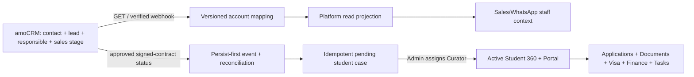

# EVO amoCRM funnel readiness

Статусный снимок: `origin/main` / `d243b2bb370d052750278e7f5cc2625991d5f870`, 2026-08-17 (Asia/Bishkek).

## Вердикт

**Platform пока не готова заменить amoCRM или вести в ней живую sales funnel.**

Текущий `main` готов только к двум fail-closed задачам:

1. сохранить versioned sanitized discovery snapshot account-specific pipelines/statuses/users/custom fields;
2. при уже известных exact account/contact/lead IDs показать в WhatsApp thread небольшой read-only canonical context: contact, lead, responsible manager, pipeline and status.

Даже эти две задачи не имеют принятого real-provider proof в текущем evidence set. Mapping approval/activation, список живых сделок, provider webhooks, reconciliation, amoCRM writes, sanitized test-lead workflow and automatic signed-contract handoff не merged. Поэтому первая безопасная версия должна оставлять продажи и изменение стадий в amoCRM, а Platform использовать для коммуникации и post-contract operations.

Во время этого аудита amoCRM не открывалась и API не вызывался; никаких лидов, контактов, стадий, задач или webhook settings не читалось и не изменялось.

## Что уже merged

| Слой | Реализация | Что доказано в repository | Чего не доказывает |
| --- | --- | --- | --- |
| P4A mapping discovery | Migration `058`, `platform-amocrm-discovery-client.ts`, immutable private discovery versions | Bounded HTTPS GET client, sanitized schema, append-only versions, service-only ingest, Admin-scoped reads | No credential, no scheduled job/route, no exact account discovery, no current/approved mapping |
| P4R1 canonical context | Migration `064`, GET-only client/service/repository, `/whatsapp/[id]` context card | Exact account/contact/lead relationship validation, current pipeline/status/responsible read, stale/degraded/fail-closed state, append-only observations | No phone/name search, no identity creation, no list/funnel, no tasks/calls/chats, no writes, no handoff |
| Platform case lifecycle | Migration `042`, Admin assignment, case/Portal RLS | Synthetic pending case → Admin assigns Curator → Portal/object-scope rotation | No verified amoCRM signed-contract trigger or account mapping |
| Sales UI | `/sales`, board/list design and source-of-truth disclosure | Accepted UI contract and explicit blocked copy | Connected provider intentionally returns `leads: []`; it is not a live amoCRM funnel |
| Legacy amoCRM code | `src/lib/amocrm.ts`, legacy settings, `src/lib/lead-stages.ts` | Existing legacy/runtime behavior only | Not valid Platform authority; global hardcoded IDs/settings cannot be reused as Platform mappings |

## Current readiness by required capability

| Requirement | Current status | Evidence | Exact gap / blocker |
| --- | --- | --- | --- |
| Exact account-domain validation | Repository-ready | Read config/discovery clients accept validated account subdomain only | Need owner-approved real domain and credential |
| Discover account, pipelines, statuses, users, custom fields | Repository-ready, not operated | P4A issues only `GET /account`, `/leads/pipelines`, paged `/users`, lead/contact custom fields | No orchestration route/job; no authorized account run |
| Immutable sanitized discovery history | Ready in code | Migration `058` append-only table/RPCs and audit | Production migration/runtime state `unknown` |
| Explicit semantic mapping selection | Missing from main | P4B docs exist | Need Admin selection of sales pipeline, each lifecycle status, responsible-user and required fields |
| Approval/revocation/current pointer | Missing from main | Earlier P4B implementation not merged | Need reviewed successor and RLS/audit tests |
| No hardcoded Platform IDs | Enforced in target/P4R1 | P4R1 requires provider-issued account/contact/lead relationships | Legacy `lead-stages.ts` and settings still exist; must remain fixture/legacy-only |
| Read one exact contact/lead/stage/owner | Repository-ready, disabled | P4R1 exact GET adapter and context card | `EVO_PLATFORM_AMOCRM_READ_ENABLED` is kept `0` in P8D4; no real credential/test entity proof |
| Read live funnel/list of leads | Missing | Connected `/sales` provider returns an empty array | Need approved read model, pagination, access scope, freshness and UI wiring |
| Resolve identity by phone/name | Explicitly excluded | P4R1 refuses inferred/name/phone matching | Must design deterministic identity-resolution contract or keep resolution in retained Lead Agent |
| Read amoCRM sales tasks | Missing | Target ownership doc only | GET adapter, safe fields, owner/entity binding, pagination and stale state |
| Read calls/recordings references | Missing | Target ownership doc only | Provider scope, metadata/link rules, PII boundary and UI |
| Read Kommo chat-record references | Missing | Target ownership doc only | Separate Kommo chat IDs, provider scope, reconciliation and safe projection |
| Persist-first amoCRM webhook inbox | Missing | TZ/target requirement only | Endpoint authentication/validation, raw evidence, pointer queue and fast ACK |
| Lead/status/responsible webhook processing | Missing | Official Kommo events support these events; no Platform worker exists | Idempotent async consumer and per-account mapping version |
| Reconciliation for missed events | Missing | Requirement `INT-004` only | Bounded poll/cursor, drift detection and repair evidence |
| Loop prevention | Missing because writes absent | Requirement `INT-006` only | Correlation/outbox identity before any write is allowed |
| Create/update lead/contact/stage/task/note | Explicitly deferred | ADR 0018/0019 negative boundary | Fresh owner approval, write scopes, approved mapping and controlled test |
| Sanitized test lead | Not prepared by Platform | Sales UI says test leads disabled | Owner-controlled pre-created test entity or separate approval to create one |
| Signed-contract → pending case | Data RPC exists; provider trigger missing | Migration `042`, local lifecycle tests | Approved contract-status mapping, provider event/reconciliation and idempotent binding |
| Pending case → Curator → Portal | Repository-ready | Admin assignment and BW7/P6D local proof | Real staff identities and exact production smoke |
| Provider cutover | Not authorized | ADR 0019 retains legacy path | Read-only proof, reconciliation, rollback, owner approval and exact release window |

## Нормальная архитектура воронки

Ключевой принцип: **amoCRM stage не заменяется Platform operational stage.** amoCRM отвечает за sales truth. После подтверждённого договора Platform создаёт student operational file. Admin assignment, а не AI и не название стадии, активирует Curator ownership and Portal.

## Account-specific mapping, который нужно утвердить

Следующий P4B successor должен хранить не «магические числа в коде», а versioned mapping, выбранный уполномоченным Admin/Sales Owner:

| Platform meaning | amoCRM value to select | Почему нельзя угадывать |
| --- | --- | --- |
| Sales pipeline | `pipeline_id` from exact account snapshot | В аккаунте может быть несколько pipeline |
| `new` | one account status | Названия и IDs account-specific |
| `contacting` | one account status | Semantics must be owner-approved |
| `qualified` | one account status | Нельзя определять только по названию |
| `meeting_scheduled` | one account status | May not exist as a separate stage |
| `meeting_completed` | one account status | May be represented by task/note today |
| `potential` | one account status | Requires business definition |
| `contract_signed` | exact contract status | This status may create a pending case; highest-risk mapping |
| Responsible Sales | provider `responsible_user_id` | Must be provider-issued and active/scoped |
| Applicant/contact fields | exact `field_id` mapping | Phone/name/email labels can differ and values can be multi-valued |
| Country/program/intake/source | exact lead/contact custom fields | Field availability and enum IDs are account-specific |

Approval record must include mapping version, discovery source version, selected IDs, semantic labels, approver, reason, timestamp, verification/test result and revocation/supersession state. The newest discovery snapshot must never become active automatically.

## Safe read-only execution plan

This plan intentionally avoids all amoCRM writes.

1. **Inventory only names/presence, never values.** Confirm the owner of the amoCRM integration, credential custody, allowed scopes, account domain and a sanitized test entity. Do not print tokens or customer data.
2. **Run P4A discovery against the exact authorized account.** GET only; store one sanitized provider-observed version. Stop on host mismatch, missing scope, 401/403/429, unexpected schema or oversized response.
3. **Human mapping workshop.** Sales Owner/Admin selects the pipeline, lifecycle statuses and required fields from the immutable snapshot. No ID is typed into source code.
4. **Implement a new reviewed P4B successor.** Add approval/revocation/current pointer, exact version binding, RLS/audit and explicit degraded state. Do not add writes in the same PR.
5. **Bind one pre-created sanitized test lead.** Use provider-issued account/contact/lead IDs supplied under approval. P4R1 reads and cross-checks both relationship directions, pipeline/status and responsible user.
6. **Prove the staff view.** Authorized Admin/Sales/Curator sees the safe context; Finance/Student/cross-org/stale authority fails closed. No provider body/token reaches the browser.
7. **Add read-only lead-list/funnel projection.** Page by provider IDs and approved mappings, cache only bounded/stamped projection, show observed/stale/degraded states, never local-success fallback.
8. **Add persist-first webhooks and reconciliation.** This is still read synchronization: process lead/status/responsible events idempotently and periodically reconcile missed events. No provider write.
9. **Prove contract handoff without stage mutation.** Moving the sanitized lead to the already-approved contract status is performed manually in amoCRM by an authorized human during a separately approved test. Platform creates exactly one pending case; Admin assignment activates Curator/Portal.
10. **Only then discuss writes.** Lead creation, stage/task/note changes and cutover require a new action-time approval and a separate launch-control block.

## Reconciliation design required before real handoff

Kommo documents webhook events for lead add/update, status changes and responsible-user changes. Webhooks are notifications, not a complete durable history, so Platform also needs reconciliation.

Required minimum:

- persist the received webhook evidence before processing;
- normalize event identity with account, entity, event type and provider timestamp;
- acknowledge quickly, then process asynchronously;
- bind every decision to the active mapping version at observation time;
- deduplicate exact replay and reject conflicting replay;
- poll changed leads with a durable cursor/watermark;
- compare provider `pipeline_id`, `status_id`, `responsible_user_id` and linked contact IDs with the current projection;
- mark stale/degraded/unavailable explicitly;
- never interpret a missing event as permission to guess a handoff;
- retain separate Platform UUID, amoCRM entity ID, Kommo chat ID and WAHA message/chat IDs;
- follow current provider limits: no more than 7 requests/s, max 250 entities/page, and prefer no more than 50 writes/batch if writes are later authorized.

Official references:

- [Kommo webhooks and supported events](https://developers.kommo.com/docs/webhooks-general)
- [Kommo webhook event names](https://developers.kommo.com/reference/webhook-events)
- [Kommo API limits](https://developers.kommo.com/docs/limitations)
- [Kommo lead fields](https://developers.kommo.com/reference/leads-list)
- [Kommo pipeline/status discovery](https://developers.kommo.com/reference/pipelines-list)

## Controlled test-lead and handoff acceptance

The first real test must use an EVO-controlled, clearly labelled, sanitized test record. A mock does not count. If such a record does not already exist, creating it is a provider write and requires explicit action-time approval.

Acceptance sequence:

1. Owner identifies the exact test account/contact/lead and confirms it contains no customer data.
2. Read-only discovery is persisted as `provider_observed` and a human approves the mapping version.
3. P4R1 shows exact contact, lead, responsible manager and pipeline/status names; IDs cross-reference correctly.
4. The lead appears once in the approved Platform read model with freshness and mapping version visible.
5. An authorized human changes the test lead to the mapped `contract_signed` status in amoCRM under a separately approved window.
6. The webhook path persists before processing; reconciliation independently confirms the same provider state.
7. Platform creates exactly one `pending` student case; replay creates no second case.
8. Portal remains unavailable while no Curator is assigned.
9. Admin assigns a Curator with a reason; case becomes operational and Portal activates.
10. Sales retains only the permitted summary after handoff; Curator receives full assigned scope; unrelated/Finance/other Student access fails closed.
11. Rollback disables new ingestion/processing without deleting observations, mappings, audit or the retained Lead Agent path.

## Exact blockers and owner questions

These are action-time inputs; they must not be guessed:

1. Who is the Sales Owner/Admin authorized to approve and revoke the production mapping?
2. What exact amoCRM/Kommo account domain and provider account ID are in scope?
3. Which OAuth integration/token is approved for read-only discovery/context, who owns rotation, and what scopes does it have?
4. Which pipeline is the EVO admissions sales pipeline?
5. Which exact statuses mean `new`, `contacting`, `qualified`, `meeting_scheduled`, `meeting_completed`, `potential` and `contract_signed`?
6. Which lead/contact fields are authoritative for applicant, phone, country, program, intake and source?
7. Does a sanitized, clearly marked test contact/lead already exist? If yes, who may provide its IDs process-only? If not, will the owner separately approve its creation?
8. Which staff identities represent the responsible Sales, Admin and Curator for the handoff test?
9. Is the account plan allowed to configure required webhooks, and who may change webhook settings?
10. What reconciliation interval and freshness SLA are acceptable for the first pilot?
11. Is the first pilot read-only context only, or may it include a human-performed contract-stage change on the test lead?
12. Who owns rollback and incident response if provider state is stale, conflicting or unavailable?

Until these answers and real evidence exist, every screen must say `not configured`, `not linked`, `stale`, `degraded` or `unavailable` honestly. It must never show synthetic deals as live.

## Evidence paths

- `CONTEXT.md`
- `docs/specs/EVO_PLATFORM_TZ.md`
- `docs/adr/0014-unified-evo-platform-target-architecture.md`
- `docs/adr/0018-defer-amocrm-and-retain-lead-agent.md`
- `docs/adr/0019-gate-autonomous-inbound-replies-and-resume-read-only-amocrm.md`
- `docs/platform/p4a-amocrm-mapping-discovery.md`
- `docs/platform/p4b-amocrm-mapping-selection-approval.md`
- `docs/platform/p4r1-amocrm-canonical-context.md`
- `docs/platform/p1b-student-case-lifecycle.md`
- `docs/platform/data-ownership.md`
- `supabase/migrations/042_platform_student_admissions.sql`
- `supabase/migrations/058_platform_amocrm_mapping_discovery.sql`
- `supabase/migrations/064_platform_amocrm_canonical_context.sql`
- `src/lib/server/platform-amocrm-discovery-client.ts`
- `src/lib/server/platform-amocrm-mapping-repository.ts`
- `src/lib/server/platform-amocrm-read-config.ts`
- `src/lib/server/platform-amocrm-canonical-context-client.ts`
- `src/lib/server/platform-amocrm-canonical-context-repository.ts`
- `src/lib/server/platform-amocrm-canonical-context-service.ts`
- `src/app/(staff)/whatsapp/[id]/page.tsx`
- `src/app/(staff)/sales/SalesPageContent.tsx`
- `tests/platform-amocrm-discovery.test.mjs`
- `tests/platform-amocrm-canonical-context.test.mjs`
- `tests/platform-amocrm-canonical-context-ui.test.mjs`
- `supabase/tests/platform_amocrm_mapping_discovery_inventory.sql`
- `supabase/tests/platform_amocrm_mapping_discovery_rls.sql`
