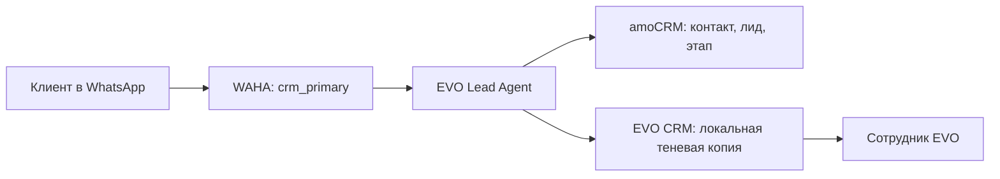
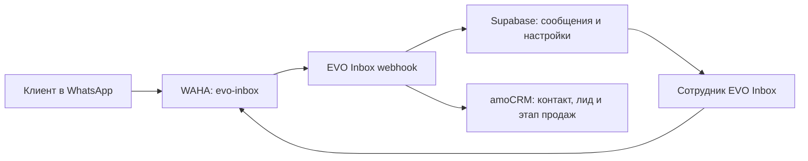

# Как устроена EVO Admissions Platform

- Owner: технический ответственный EVO Admissions
- Status: Active (действующий)
- Last verified: 2026-07-12
- Sources: `package.json`, `src/app/`, `docker-compose.prod.yml`,
  `agent-lead2-inbox/`, `evo-lead-agent/`, `AGENTS.md`

## Главное простыми словами

EVO Admissions Platform — не одна большая программа. Это несколько систем с
разными обязанностями:

- **CRM** помогает сотрудникам вести поступление и операционную работу.
- **EVO Inbox** даёт отдельное рабочее место для WhatsApp-диалогов.
- **Lead Agent** обрабатывает автоматизированный путь сообщений основной CRM.
- **amoCRM** является главным владельцем личности лида/контакта и этапа продаж.
- **WAHA** технически подключает WhatsApp. Это транспорт, а не CRM и не база
  знаний.

Наличие интеграционного кода ещё не доказывает, что внешний сервис сейчас
подключён. Реальная работа WAHA, amoCRM, Supabase или AI подтверждается только
проверкой с действующими учётными данными и записывается в
[текущем статусе](current-status.md).

## Карта компонентов

| Компонент | Что видит команда | Техническая основа | Где находится |
|---|---|---|---|
| EVO Admissions CRM | Клиенты, заявки, документы, визы, платежи, задачи, звонки, продажи и WhatsApp-контекст | Next.js, SQLite | корень репозитория; рабочий сервер `/opt/evo-crm` |
| EVO Inbox | Диалоги, контакты, контекст этапа продаж, настройки, база знаний, AI-черновики и ручная отправка | Next.js, управляемый Supabase | `agent-lead2-inbox/`; рабочий сервер `/opt/evo-inbox` |
| EVO Lead Agent | У команды нет отдельного публичного интерфейса; это приватный сервис обработки | Python, FastAPI, локальная SQLite-память | `evo-lead-agent/`; сервис Compose основной CRM |
| amoCRM | Канонический контакт, лид и этап продаж | Внешний облачный сервис | вне репозитория |
| WAHA | WhatsApp-сессия, приём webhook и отправка сообщения | Приватный контейнер | отдельная сессия для CRM и отдельная для Inbox |
| Edge proxy | Публичный HTTPS-вход в CRM и Inbox | Caddy, сеть `evo_public_web` | `evo-edge-caddy` на `hermes-vps` |

## Два WhatsApp-пути

У платформы есть два разных пути. Их нельзя соединять одной сессией или одним
webhook без отдельного архитектурного решения.

### Путь основной CRM и Lead Agent

1. WAHA получает сообщение и отправляет подписанный webhook Lead Agent.
2. Lead Agent удаляет дубли и находит или создаёт контакт и лид в amoCRM.
3. После успешного resolution Lead Agent отправляет подписанное внутреннее
   событие в CRM.
4. CRM показывает сотруднику теневую копию (shadow record) нужного контекста,
   но не объявляет
   её новым владельцем личности лида.

Безопасный режим по умолчанию запрещает автоматические и исходящие ответы.

### Путь EVO Inbox

1. Отдельная WAHA-сессия `evo-inbox` доставляет сообщения в
   `/api/waha/webhook` EVO Inbox.
2. Inbox хранит разговор и рабочее состояние в своём Supabase-проекте.
3. Для контакта и лида Inbox обращается к amoCRM и хранит только ссылочные ID,
   то есть идентификаторы канонических записей amoCRM.
4. Сотрудник может проверить AI-черновик и вручную отправить ответ через WAHA.

На первом запуске массовые рассылки, широкие автоматизации, flows, Meta Cloud
API и автоматические AI-ответы намеренно отключены.

## Почему данные не складываются в одну базу

Одна физическая база выглядела бы проще, но создала бы спор: какое значение
правильное, если один и тот же статус изменился в amoCRM и в Inbox. Поэтому у
каждого вида данных есть один владелец, а другим системам разрешены только
ссылки или явно обозначенные теневые копии. Полная матрица находится в
[data-ownership.md](data-ownership.md).

## Production-границы

- EVO-сервисы используют собственные Compose projects и сеть
  `evo_public_web`.
- `acadis_*` — отдельный проект. Новые зависимости EVO от сетей Acadis
  запрещены.
- WAHA и Lead Agent не должны иметь публично открытые API или dashboard.
- EVO Inbox не использует базу, webhook или WAHA-сессию основной CRM.
- Секреты остаются в игнорируемых Git файлах `.env`, секретных файлах VPS,
  панелях внешних сервисов или зашифрованных настройках приложения.

## Где читать дальше

- [Владельцы данных](data-ownership.md)
- [Текущий статус](current-status.md)
- [Процесс поступления](../business/admissions-process.md)
- [Словарь терминов](../../CONTEXT.md)
- [Архитектурные решения](../adr/)
