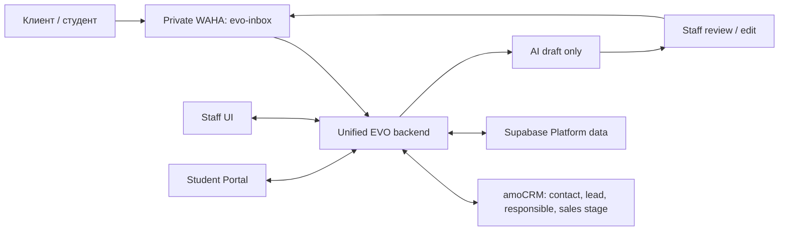

# Как устроена EVO Platform

- Owner: технический ответственный EVO Admissions
- Status: Target approved; current production remains split until controlled cutover
- Last verified against repository: 2026-07-28
- Architecture decision: `docs/adr/0014-unified-evo-platform-target-architecture.md`
- Supabase boundary: `docs/adr/0015-establish-canonical-supabase-schema-and-migration-boundary.md`
- Execution contract: `docs/EVO_PLATFORM_LONG_RUN_PLAN.md`

## Главное простыми словами

Целевая EVO Platform — одно рабочее приложение для сотрудников и студентов с
единым backend и одной логической моделью собственных данных. Однако принятие
этой архитектуры не означает, что production уже переведён на неё. Пока не
завершены миграция, реальный end-to-end тест, отдельное разрешение на cutover и
контролируемое наблюдение, действующие CRM, EVO Inbox и EVO Lead Agent остаются
раздельными.

amoCRM остаётся каноническим владельцем:

- контакта;
- лида;
- ответственного sales manager;
- sales pipeline и sales stage.

EVO Platform хранит собственное операционное состояние поступления, но не
подменяет им sales stage amoCRM.

## Текущее состояние до cutover

Репозиторий всё ещё содержит три runtime-контура:

| Контур | Текущее назначение | Текущее хранилище |
|---|---|---|
| Root CRM | Основная staff CRM и admissions UI | SQLite и собственная auth-модель |
| EVO Inbox | WhatsApp inbox и ручная работа с AI-черновиками | отдельный Supabase-контур |
| EVO Lead Agent | приватная обработка WAHA/amoCRM и внутренний sync | Python-сервис и локальное состояние |

Существующая конфигурация также содержит два WhatsApp-пути: `crm_primary` для
старого CRM/Lead Agent path и `evo-inbox` для Inbox. Это описание текущего кода,
а не разрешение менять production-сессии. Старый путь нельзя отключать, пока
новый не доказал отсутствие потерь и дублей и не прошёл rollback gate.

Актуальный уровень доказательств записывается в
[current-status.md](current-status.md). Наличие кода или конфигурации не
засчитывается как доказательство работы реальных WAHA, amoCRM, Supabase или AI.

## Целевая карта

Целевой backend поглощает EVO Inbox и полезную, безопасную логику Lead Agent:

- нормализацию телефона;
- проверку WAHA HMAC и timestamp;
- raw persistence до обработки;
- idempotency по `X-Webhook-Request-Id` и бизнес-ключу
  `session + payload.id`;
- буферизацию, durable jobs, retry, dead-letter и reconciliation;
- resolve/create amoCRM contact и lead через канонический adapter;
- mapping notes/tasks, handoff и loop prevention;
- отдельные внутренние UUID, WAHA message IDs и Kommo conversation/message IDs;
- ACK-аудит и правило «не повторять автоматически неизвестный результат send».

Auto-reply и unattended outbound не входят в целевую активную функцию.

## Данные и среды

Для собственных данных используется один dedicated production-проект
Supabase. Это не означает одну физическую базу для всех сред:

- local/dev изолирован;
- staging persistent и изолирован;
- preview branches создаются там, где это поддерживается;
- production data по умолчанию не копируется в preview;
- schema/config идут как код через root `supabase/config.toml` и одну
  immutable migration history.

P2 вводит явную границу:

| Schema | Назначение | Browser/Data API |
| --- | --- | --- |
| `public` | legacy Inbox 001–039 до P3/P5 cutover | временная совместимость, только с RLS |
| `platform` | новая EVO operational model | exposed с explicit grants и RLS на каждой table |
| `platform_private` | backend-only helpers/secret references | не exposed; browser access отсутствует |

P2A переносит 001–039 byte-for-byte в root `supabase/`. После
checksum/reset proof P2B добавляет forward-only migration 040: создаёт только
namespace/grant boundary и закрывает legacy secret-bearing tables от browser
roles. Legacy `owner/admin/agent/viewer` не получают автоматического
соответствия Platform ролям, а legacy signup не создаёт Platform membership.

P2C добавляет organizations, auth-linked profiles, одну активную membership,
immutable versioned permission bundles, typed record scopes и append-only
audit. Auth Hook выдаёт только coarse `platform_role` и
`platform_access_version`. RLS заново сверяет их с live profile, organization,
membership, bundle и scope; смена authority увеличивает version и немедленно
закрывает старый token. Direct `service_role` DML не является target backend
API: каждый backend capability получает отдельный reviewed function grant.

P2D добавляет student/admissions domain поверх этой live-authority модели:
pending/active/closed cases, Admin-only Curator assignment and handoff,
immutable scope rotation, multiple applications, Curator-owned visa, tasks и
append-only events. Base tables остаются staff-full; post-handoff Sales и
activated Student используют отдельные fixed-column projections. Migration 042
доказывается только на disposable local Supabase/PostgreSQL и не означает
amoCRM, managed Supabase или production Portal cutover.

P2E начинается после migration 042 и добавляет migration 043 для document
metadata, manual finance и notification intent. Это repository-candidate
database/RLS contract: migration, exact API/grants, disposable PostgreSQL и
real local Supabase boundary tests реализованы; independent review и
exact-head CI ещё pending.
Документы на этом шаге — checklist, versions, validation/review и
integrity/malware evidence state без binary Storage или scanner proof.
Notification — одна durable запись для одного получателя в in-app или
individual WhatsApp channel с consent/dedupe, а не Queue или подтверждённая
доставка. Подробная граница:
[`p2e-documents-finance-notifications.md`](p2e-documents-finance-notifications.md).

Каждая exposed table должна иметь RLS. Browser использует только publishable
key. Secret/service-role ключи и provider secrets остаются только на backend.
Coarse role может приходить из custom JWT claim, но доступ к конкретной
организации, студенту, разговору и Storage object проверяется через RLS.

Private Storage используется только через поддерживаемый API, authenticated или
короткоживущие signed downloads. Запрещено писать напрямую в таблицы схемы
`storage`.

Durable retryable business work идёт через Supabase Queues с идемпотентными
consumer-ами. Database Webhooks допустимы для асинхронного event push, но не
заменяют durable очередь. DB-resident secrets могут храниться в Vault при
закрытом доступе. PITR зависит от выбранного плана; Storage objects требуют
отдельной backup-процедуры.

## Роли и границы

Первый release использует роли:

- `admin`;
- `sales`;
- `curator`;
- `finance`;
- `student` (user-facing label: Client/Student).

The current root `client` role is a legacy identifier. It remains unchanged
until P3 and receives no implicit Platform membership or role mapping.

Отдельной роли `visa` нет, хотя module `/visa` остаётся. Только Admin приглашает
или блокирует staff и назначает или переназначает Curator. Reassignment требует
причину, before/after и audit. Curator ведёт назначенного студента целиком:
документы, несколько university applications, visa case, tasks и
communication.

Sales владеет очередью и диалогом до подтверждённого signed-contract stage в
account-specific amoCRM mapping. После handoff ответственность переходит
Curator; единая история сохраняется, а Sales видит только разрешённый
несекретный summary. Portal активируется лишь после подтверждённого contract и
Admin assignment Curator.

Finance/Admin подтверждают obligations, payments и refunds вручную, с evidence
и audit. Подтверждённые суммы используют integer minor units; payment не может
превысить остаток, а refund — подтверждённую невозвращённую часть exact
payment. Overdue вычисляется из obligation/payment/refund/due time и никогда не
выводится из amoCRM stage. Sales и текущий Curator получают только безопасный
operational status в своём scope. Student видит только свои безопасные
obligation label/category, amount/currency, due time, derived status, понятный
overdue notice и next action, но не evidence, actor IDs, transaction-event
history или внутренние stop-factor поля.

В document workflow Admin и текущий Curator имеют полный доступ в разрешённом
case scope. Sales до handoff видит только фиксированный checklist, Student —
fixed self history, а Finance не видит sensitive document metadata.

## AI и отправка сообщений

AI создаёт только draft на RU или EN по языку последнего customer message.
Неуверенный язык требует ручного выбора или handoff. Кыргызский customer-draft
contract и автоматическая отправка запрещены.

Draft строится только на approved versioned knowledge. Сотрудник обязательно
review/edit и нажимает manual send. Перед ответом backend вызывает
`/api/sendSeen`, отправляет только при WAHA session `WORKING`, сохраняет
operator, final text hash, provider IDs и ACK progression. Неизвестный результат
send не повторяется автоматически.

EVO может обещать только исполнение собственных услуг и обязательств. Platform
не должна гарантировать admission, scholarship, visa или решение внешнего
органа.

## Что должно произойти до cutover

1. P2A–P2I последовательно доказывают canonical 001–039 history,
   namespace/grant containment, identity/RBAC, domain slices, real local
   Queues, real local Storage и whole-foundation evidence.
2. Миграции и RLS проходят clean reset и отрицательные cross-role,
   cross-student и cross-organization тесты.
3. Database restore и Storage-object restore доказываются отдельно.
4. Local Supabase proof не выдаётся за managed project parity, PITR или
   production readiness; эти пункты ждут region/plan, credentials и отдельного
   разрешения.
5. SQLite inventory, backup, deterministic mapping, dry-run и staging import
   дают проверяемые counts, orphans и checksums.
6. amoCRM adapter обнаруживает и версионирует account-specific mappings; IDs не
   hardcode-ятся как глобальные.
7. На выделенном тестовом номере и sanitized test lead проходит реальный путь:
   WhatsApp receive → amo resolve/link → Platform → AI draft → operator manual
   send → delivery/read/unknown → audit.
8. Production mutation получает отдельное явное разрешение и release window.
9. Старый Lead Agent удаляется только отдельным reviewed PR после минимум 72
   фактических часов стабильного трафика, reconciliation и zero unexplained
   loss/duplicates.

До выполнения этих условий target остаётся принятым контрактом, а не
production-complete заявлением.
