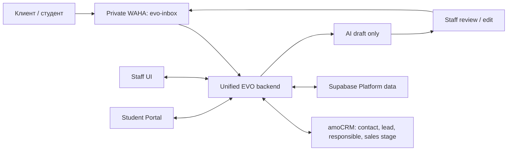

# Как устроена EVO Platform

- Owner: технический ответственный EVO Admissions
- Status: Target approved; current production remains split until controlled cutover
- Last verified against repository: 2026-07-28
- Architecture decision: `docs/adr/0014-unified-evo-platform-target-architecture.md`
- Execution contract: `docs/EVO_PLATFORM_LONG_RUN_PLAN.md`

## Главное простыми словами

Целевая EVO Platform — одно рабочее приложение для сотрудников и студентов с
единым backend и одной логической моделью собственных данных. Однако принятие
этой архитектуры не означает, что production уже переведён на неё. Пока не
завершены миграция, реальный end-to-end тест, отдельное разрешение на cutover и
контролируемое наблюдение, действующие CRM, EVO Inbox и EVO Lead Agent остаются
раздельными.

amoCRM остаётся каноническим владельцем:

- контакта;
- лида;
- ответственного sales manager;
- sales pipeline и sales stage.

EVO Platform хранит собственное операционное состояние поступления, но не
подменяет им sales stage amoCRM.

## Текущее состояние до cutover

Репозиторий всё ещё содержит три runtime-контура:

| Контур | Текущее назначение | Текущее хранилище |
|---|---|---|
| Root CRM | Основная staff CRM и admissions UI | SQLite и собственная auth-модель |
| EVO Inbox | WhatsApp inbox и ручная работа с AI-черновиками | отдельный Supabase-контур |
| EVO Lead Agent | приватная обработка WAHA/amoCRM и внутренний sync | Python-сервис и локальное состояние |

Существующая конфигурация также содержит два WhatsApp-пути: `crm_primary` для
старого CRM/Lead Agent path и `evo-inbox` для Inbox. Это описание текущего кода,
а не разрешение менять production-сессии. Старый путь нельзя отключать, пока
новый не доказал отсутствие потерь и дублей и не прошёл rollback gate.

Актуальный уровень доказательств записывается в
[current-status.md](current-status.md). Наличие кода или конфигурации не
засчитывается как доказательство работы реальных WAHA, amoCRM, Supabase или AI.

## Целевая карта

Целевой backend поглощает EVO Inbox и полезную, безопасную логику Lead Agent:

- нормализацию телефона;
- проверку WAHA HMAC и timestamp;
- raw persistence до обработки;
- idempotency по `X-Webhook-Request-Id` и бизнес-ключу
  `session + payload.id`;
- буферизацию, durable jobs, retry, dead-letter и reconciliation;
- resolve/create amoCRM contact и lead через канонический adapter;
- mapping notes/tasks, handoff и loop prevention;
- отдельные внутренние UUID, WAHA message IDs и Kommo conversation/message IDs;
- ACK-аудит и правило «не повторять автоматически неизвестный результат send».

Auto-reply и unattended outbound не входят в целевую активную функцию.

## Данные и среды

Для собственных данных используется один dedicated production-проект
Supabase. Это не означает одну физическую базу для всех сред:

- local/dev изолирован;
- staging persistent и изолирован;
- preview branches создаются там, где это поддерживается;
- production data по умолчанию не копируется в preview;
- schema/config идут как код через `supabase/config.toml` и migrations.

Каждая exposed table должна иметь RLS. Browser использует только publishable
key. Secret/service-role ключи и provider secrets остаются только на backend.
Coarse role может приходить из custom JWT claim, но доступ к конкретной
организации, студенту, разговору и Storage object проверяется через RLS.

Private Storage используется только через поддерживаемый API, authenticated или
короткоживущие signed downloads. Запрещено писать напрямую в таблицы схемы
`storage`.

Durable retryable business work идёт через Supabase Queues с идемпотентными
consumer-ами. Database Webhooks допустимы для асинхронного event push, но не
заменяют durable очередь. DB-resident secrets могут храниться в Vault при
закрытом доступе. PITR зависит от выбранного плана; Storage objects требуют
отдельной backup-процедуры.

## Роли и границы

Первый release использует роли:

- `admin`;
- `sales`;
- `curator`;
- `finance`;
- `client/student`.

Отдельной роли `visa` нет, хотя module `/visa` остаётся. Только Admin приглашает
или блокирует staff и назначает или переназначает Curator. Reassignment требует
причину, before/after и audit. Curator ведёт назначенного студента целиком:
документы, несколько university applications, visa case, tasks и
communication.

Sales владеет очередью и диалогом до подтверждённого signed-contract stage в
account-specific amoCRM mapping. После handoff ответственность переходит
Curator; единая история сохраняется, а Sales видит только разрешённый
несекретный summary. Portal активируется лишь после подтверждённого contract и
Admin assignment Curator.

Finance/Admin подтверждают obligations, payments и refunds вручную, с evidence
и audit. Student видит понятный overdue notice и next action, но не внутренние
чувствительные поля.

## AI и отправка сообщений

AI создаёт только draft на RU или EN по языку последнего customer message.
Неуверенный язык требует ручного выбора или handoff. Кыргызский customer-draft
contract и автоматическая отправка запрещены.

Draft строится только на approved versioned knowledge. Сотрудник обязательно
review/edit и нажимает manual send. Перед ответом backend вызывает
`/api/sendSeen`, отправляет только при WAHA session `WORKING`, сохраняет
operator, final text hash, provider IDs и ACK progression. Неизвестный результат
send не повторяется автоматически.

EVO может обещать только исполнение собственных услуг и обязательств. Platform
не должна гарантировать admission, scholarship, visa или решение внешнего
органа.

## Что должно произойти до cutover

1. Миграции и RLS проходят clean reset и отрицательные cross-role,
   cross-student и cross-organization тесты.
2. SQLite inventory, backup, deterministic mapping, dry-run и staging import
   дают проверяемые counts, orphans и checksums.
3. amoCRM adapter обнаруживает и версионирует account-specific mappings; IDs не
   hardcode-ятся как глобальные.
4. На выделенном тестовом номере и sanitized test lead проходит реальный путь:
   WhatsApp receive → amo resolve/link → Platform → AI draft → operator manual
   send → delivery/read/unknown → audit.
5. Выполняются backup/restore и rollback rehearsal.
6. Production mutation получает отдельное явное разрешение и release window.
7. Старый Lead Agent удаляется только отдельным reviewed PR после минимум 72
   фактических часов стабильного трафика, reconciliation и zero unexplained
   loss/duplicates.

До выполнения этих условий target остаётся принятым контрактом, а не
production-complete заявлением.
