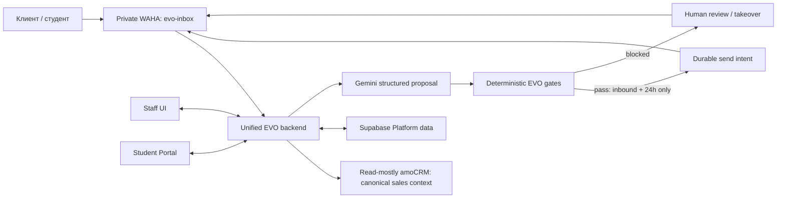

# Как устроена EVO Platform

- Owner: технический ответственный EVO Admissions
- Status: Target approved; greenfield Platform not deployed; legacy CRM remains
  separate and messaging provider ownership awaits controlled cutover
- Last verified against repository: 2026-08-09 at
  `93f48b82785836e4ade92dd7c56d8653fdd9e2ea`
- Architecture decision: `docs/adr/0014-unified-evo-platform-target-architecture.md`
- Supabase boundary: `docs/adr/0015-establish-canonical-supabase-schema-and-migration-boundary.md`
- External automation boundary:
  `docs/adr/0017-separate-student-profile-document-automation-from-evo-platform.md`
- Autonomy/read-mostly integration boundary:
  `docs/adr/0019-gate-autonomous-inbound-replies-and-resume-read-only-amocrm.md`
- Execution contract: `docs/EVO_PLATFORM_LONG_RUN_PLAN.md`

## Главное простыми словами

Целевая EVO Platform — одно рабочее приложение для сотрудников и студентов с
единым greenfield Supabase-native backend и одной логической моделью
собственных данных. Однако принятие этой архитектуры не означает, что
production уже переведён на неё. Legacy root CRM остаётся отдельной системой
без автоматического импорта или замены. Пока не завершены bounded cutover
evidence, реальный end-to-end путь, отдельное разрешение на provider cutover и
rollback proof, EVO Inbox и EVO Lead Agent сохраняют текущую messaging
ownership.

Student Profile document reading, extracted-fact confirmation, profile
autofill и profile-form export не являются частью этого runtime: owner вынес
их в отдельную систему вне `evo_AI_CRM`. Обычные Platform documents —
checklists, private objects, versions, review/rework и audited access — остаются
в EVO Platform. Автоматический обмен между системами не предполагается; любая
будущая интеграция требует отдельного контракта и проверки.

amoCRM остаётся каноническим владельцем:

- контакта;
- лида;
- ответственного sales manager;
- sales pipeline и sales stage.

EVO Platform хранит собственное операционное состояние поступления, но не
подменяет им sales stage amoCRM.

ADR 0019 возобновляет только read-mostly adapter: Platform может читать
canonical contact/lead/responsible/stage и ссылки на sales tasks, calls/recordings
и chat records. Real writes, inferred mapping, hardcoded IDs и silent fallback
не разрешены.

## Текущее состояние до cutover

Репозиторий всё ещё содержит три runtime-контура:

| Контур | Текущее назначение | Текущее хранилище |
|---|---|---|
| Root CRM | Основная staff CRM и admissions UI | SQLite и собственная auth-модель |
| EVO Inbox | WhatsApp inbox и ручная работа с AI-черновиками | отдельный Supabase-контур |
| EVO Lead Agent | приватная обработка WAHA/amoCRM и внутренний sync | Python-сервис и локальное состояние |

Существующая конфигурация также содержит два WhatsApp-пути: `crm_primary` для
старого CRM/Lead Agent path и `evo-inbox` для Inbox. Это описание текущего кода,
а не разрешение менять production-сессии. Старый путь нельзя отключать, пока
новый не доказал отсутствие потерь и дублей и не прошёл rollback gate.

The accepted Claude Design root frontend from PRs #64/#71/#72 remains the only
product UI contract. Thin-slice work must wire that UI through repository/session
seams, not revive a parallel or fallback Inbox UI. Its current polling path moves
to private Supabase Realtime only in a later reviewed implementation block.

Актуальный уровень доказательств записывается в
[current-status.md](current-status.md). Наличие кода или конфигурации не
засчитывается как доказательство работы реальных WAHA, amoCRM, Supabase или AI.

## Целевая карта

Целевой backend поглощает только нужную операторскую messaging-возможность EVO
Inbox и полезную, безопасную логику Lead Agent:

- нормализацию телефона;
- проверку WAHA HMAC и timestamp;
- raw persistence до обработки;
- idempotency по `X-Webhook-Request-Id` и бизнес-ключу
  `session + payload.id`;
- буферизацию, durable jobs, retry, dead-letter и reconciliation;
- read-mostly resolution of canonical amoCRM contact, lead, responsible Sales и
  stage plus task/call/chat-record references;
- explicit unresolved handoff и loop prevention без provider writes;
- отдельные внутренние UUID, WAHA message IDs и Kommo conversation/message IDs;
- ACK/session-аудит и правило «не повторять автоматически неизвестный результат
  send»;
- durable lead memory, approved pgvector knowledge, structured Gemini proposal,
  deterministic gate evidence and audited pause/resume.

Target разрешает только inbound-triggered autonomous reply inside the rolling
24-hour service window after every deterministic gate passes. Cold outbound,
broadcasts, campaigns, autonomous follow-up/re-engagement и out-of-window
free-form sends запрещены. Inbox dashboards, pipelines, deals, leads, flows,
generic analytics and unrelated settings не входят в первый thin slice.

## Данные и среды

Для собственных данных используется один dedicated production-проект
Supabase. Это не означает одну физическую базу для всех сред:

- local/dev изолирован;
- staging persistent и изолирован;
- preview branches создаются там, где это поддерживается;
- production data по умолчанию не копируется в preview;
- schema/config идут как код через root `supabase/config.toml` и одну
  immutable migration history.

P2 вводит явную границу:

| Schema | Назначение | Browser/Data API |
| --- | --- | --- |
| `public` | legacy Inbox 001–039 до P3/P5 cutover | временная совместимость, только с RLS |
| `platform` | новая EVO operational model | exposed с explicit grants и RLS на каждой table |
| `platform_private` | backend-only helpers/secret references | не exposed; browser access отсутствует |

P2A переносит 001–039 byte-for-byte в root `supabase/`. После
checksum/reset proof P2B добавляет forward-only migration 040: создаёт только
namespace/grant boundary и закрывает legacy secret-bearing tables от browser
roles. Legacy `owner/admin/agent/viewer` не получают автоматического
соответствия Platform ролям, а legacy signup не создаёт Platform membership.

P2C добавляет organizations, auth-linked profiles, одну активную membership,
immutable versioned permission bundles, typed record scopes и append-only
audit. Auth Hook выдаёт только coarse `platform_role` и
`platform_access_version`. RLS заново сверяет их с live profile, organization,
membership, bundle и scope; смена authority увеличивает version и немедленно
закрывает старый token. Direct `service_role` DML не является target backend
API: каждый backend capability получает отдельный reviewed function grant.

P2D добавляет student/admissions domain поверх этой live-authority модели:
pending/active/closed cases, Admin-only Curator assignment and handoff,
immutable scope rotation, multiple applications, Curator-owned visa, tasks и
append-only events. Base tables остаются staff-full; post-handoff Sales и
activated Student используют отдельные fixed-column projections. Migration 042
доказывается только на disposable local Supabase/PostgreSQL и не означает
amoCRM, managed Supabase или production Portal cutover.

P2E начинается после migration 042 и добавляет migration 043 для document
metadata, manual finance и notification intent. PR #88 controller-merged этот
database/RLS contract как
`aac1cba851e89070a7eb54baab4eddf921e3447c`; post-merge exact-main CI
[30402311903](https://github.com/izzhackt/evo_AI_CRM/actions/runs/30402311903)
зелёный.
Документы на этом шаге — checklist, versions, validation/review и
integrity/malware evidence state без binary Storage или scanner proof.
Notification — одна durable запись для одного Student-получателя в in-app или
individual WhatsApp channel с Student-only consent/dedupe; staff consent
fail-closed, а Queue или подтверждённая доставка здесь не заявляются.
Подробная граница:
[`p2e-documents-finance-notifications.md`](p2e-documents-finance-notifications.md).

P2F начинается с этого exact checkpoint и добавляет migration 044:
unified conversations/messages, five-role handoff scope, отдельные внутренние,
WAHA, Kommo и amoCRM identifiers, private raw-persist-before-process evidence,
dedupe/reconciliation state, approved versioned knowledge и draft-only AI.
PR #89 controller-merged этот database/RLS contract как
`8567455f281fa157fb088970db1c2a2397850843`; post-merge exact-main CI
[30407638837](https://github.com/izzhackt/evo_AI_CRM/actions/runs/30407638837)
зелёный. Pinned artifact содержит 6,881 lines и 194,076 bytes; SHA-256
`8d52b476981faed4a42a9c13ff2813a718bde6ad4aea1b315c4d61be9fd1ebc8`,
exact inventory — 10 exposed + 2 private tables и 19 functions.
Former Sales получает только fixed safe summary; Finance не получает transcript
или raw provider data, Student видит только safe self history. RU/EN draft
требует human review/edit/manual-send evidence; uncertain language идёт в
manual selection/handoff, а Kyrgyz customer draft запрещён. Полный merged
contract:
[`p2f-communications-contracts.md`](p2f-communications-contracts.md).

Merged P2G добавляет forward migration 045 и настоящий local
Supabase Queues/PGMQ contract. `platform_work_v1` и
`platform_dead_letter_v1` принимают только pointer body
`{v, work_item_id, kind}`; direct `pgmq`/`pgmq_public` grants закрыты, а
service worker использует только fixed RPC. Retryable work сохраняет тот же
PGMQ message через `read()`/visibility timeout/`set_vt()`, exhausted work
создаёт immutable dead-letter evidence. Manual WhatsApp work всегда
single-attempt: явный unknown или истёкший worker lease архивирует active
message и открывает reconciliation/Admin review без retry/DLQ. Exact artifact:
3,425 lines, 91,620 bytes, SHA-256
`a657c32c3dadec369b54157914a229b112c58beb395ee4a2ae99025d804723a2`.
Подробная граница:
[`p2g-durable-work-queues.md`](p2g-durable-work-queues.md).

Private provider row хранит provider/account/request references, WAHA session
или provider conversation reference, event type/time, raw event variant,
supplied verification result, private verification headers/evidence reference,
raw payload и его SHA-256. WAHA `message.ack` сохраняет variant, включая
unknown code; `message.any` требует `NULL`. Non-WAHA raw events не получают
вымышленный semantic dedupe, а normalized reconciliation effect имеет отдельный
canonical key. Browser получает только разрешённые normalized fields и
projections. P2F не доказывает, что real HMAC/timestamp verification
выполнилась. Такой migration/RLS row доказывает database state и authorization,
но не реальный webhook, AI generation, WAHA/Kommo/amoCRM call, provider send
или ACK. P2G доказывает local Queue/outbox/worker/retry/dead-letter mechanics,
но не provider delivery; private media/Storage/scanner относится к P2H.

At current main `93f48b82785836e4ade92dd7c56d8653fdd9e2ea`, PR #132
merged P5A receive-only ingress and migration 059. It validates configured
HMAC/timestamp evidence, persists before processing and enqueues verified
pointer-only work; runtime remains disabled by default. PR #133 is a draft,
unmerged P5B receive/project candidate. P5B may project inbound work into the
accepted root UI data path but may not call Gemini or send through WAHA. It is
blocked until valid media-only inbound becomes operator-visible and hands off
rather than completing as a missing-text no-op. Neither block is provider proof.

Каждая exposed table должна иметь RLS. Browser использует только publishable
key. Secret/service-role ключи и provider secrets остаются только на backend.
Coarse role может приходить из custom JWT claim, но доступ к конкретной
организации, студенту, разговору и Storage object проверяется через RLS.

Private Storage используется только через поддерживаемый API, authenticated или
короткоживущие signed downloads. Запрещено писать напрямую в таблицы схемы
`storage`.

Durable retryable business work идёт через Supabase Queues с идемпотентными
consumer-ами. Database Webhooks допустимы для асинхронного event push, но не
заменяют durable очередь. DB-resident secrets могут храниться в Vault при
закрытом доступе. PITR зависит от выбранного плана; Storage objects требуют
отдельной backup-процедуры.

## Роли и границы

Первый release использует роли:

- `admin`;
- `sales`;
- `curator`;
- `finance`;
- `student` (user-facing label: Client/Student).

The current root `client` role is a legacy identifier. It remains unchanged
until P3 and receives no implicit Platform membership or role mapping.

Отдельной роли `visa` нет, хотя module `/visa` остаётся. Только Admin приглашает
или блокирует staff и назначает или переназначает Curator. Reassignment требует
причину, before/after и audit. Curator ведёт назначенного студента целиком:
документы, несколько university applications, visa case, tasks и
communication.

Sales владеет очередью и диалогом до подтверждённого signed-contract stage в
account-specific amoCRM mapping. После handoff ответственность переходит
Curator; единая история сохраняется, а Sales видит только разрешённый
несекретный summary. Portal активируется лишь после подтверждённого contract и
Admin assignment Curator.

Finance/Admin подтверждают obligations, payments и refunds вручную, с evidence
и audit. Подтверждённые суммы используют integer minor units; payment не может
превысить остаток, а refund — подтверждённую невозвращённую часть exact
payment. Overdue вычисляется из obligation/payment/refund/due time и никогда не
выводится из amoCRM stage. Sales и текущий Curator получают только безопасный
operational status в своём scope. Student видит только свои безопасные
obligation label/category, amount/currency, due time, derived status, понятный
overdue notice и next action, но не evidence, actor IDs, transaction-event
history или внутренние stop-factor поля.

В document workflow Admin и текущий Curator имеют полный доступ в разрешённом
case scope. Sales до handoff видит только фиксированный checklist, Student —
fixed self history, а Finance не видит sensitive document metadata.

## AI и отправка сообщений

P2F's merged database contract remains historical draft/manual-send evidence.
ADR 0019 adds a narrower future lane: Gemini produces a structured
qualification/reply proposal, while deterministic EVO gates alone decide
whether an inbound-triggered reply may enter the durable queue. The model never
calls WAHA or declares a send successful.

Every autonomous proposal stores the exact inbound trigger, model and prompt
version, policy version, immutable context and hash, approved knowledge chunks,
structured output, proposed memory updates, every gate input/result, rendered
outbound and hash, transport response, ACK/session progression and human action.
Supabase owns this evidence, durable lead memory, pgvector retrieval, queues,
pause/resume state and audit.

Autonomous send is allowed only in the same conversation inside the rolling
24-hour service window and only after the gate passes both before queueing and
immediately before transport. Default business hours are
`Asia/Bishkek 09:00-21:00` until organization configuration exists. Staff
outbound or explicit takeover pauses autonomy immediately; only an authorized
staff actor may resume with an audited reason.

Opt-out, outside business hours, unsupported/uncertain language, media-only or
unsupported content, low confidence, missing approved knowledge, complaints,
payments/refunds, legal/privacy, admission/scholarship/visa guarantees,
unhealthy WAHA or unknown provider result fail closed to human review. A valid
media-only event is still persisted and operator-visible. Unknown send outcome
is reconciled and never retried automatically.

Cold outbound, broadcast, campaign, autonomous follow-up/re-engagement,
out-of-window free-form and model-direct WAHA sends remain prohibited. P5A,
P5B and the later autonomous worker are disabled by default until separately
authorized real-provider E2E.

EVO может обещать только исполнение собственных услуг и обязательств. Platform
не должна гарантировать admission, scholarship, visa или решение внешнего
органа.

## Что должно произойти до cutover

1. P2A–P2H последовательно доказывают reusable greenfield foundation:
   canonical 001–039 history, namespace/grant containment, identity/RBAC,
   domain slices, real local Queues и real local Storage contracts.
2. Миграции и RLS проходят clean reset и отрицательные cross-role,
   cross-student и cross-organization тесты.
3. Database restore и Storage-object restore остаются отдельной обязанностью,
   но moved to P7 and do not block the thin messaging slice.
4. Local Supabase proof не выдаётся за managed project parity, PITR или
   production readiness; эти пункты ждут region/plan, credentials и отдельного
   разрешения.
5. Legacy SQLite inventory остаётся historical reference; greenfield Platform
   path does not require SQLite import, account migration, dual-read or
   dual-write.
6. Read-mostly amoCRM adapter discovers and versions account-specific mappings;
   IDs are never global hardcodes, inferred by name or replaced with fallback.
7. P5B proves operator-visible text and media projection, bounded leases,
   retry/dead-letter/manual-review semantics and no Gemini/provider send.
8. History, media, ACK/session reconciliation and private Supabase Realtime are
   accepted before the autonomous-reply implementation begins.
9. На выделенном тестовом номере и sanitized test lead проходит реальный путь:
   WhatsApp receive → read-mostly amo resolve/link or explicit handoff → Gemini
   proposal → deterministic gate → one eligible reply plus forced-human cases →
   ACK/session/unknown reconciliation → private Realtime/audit.
10. Production mutation получает отдельное явное разрешение и release window.
11. EVO Lead Agent, legacy webhook/session and rollback path remain deployed and
    frozen. Retirement is outside current scope and requires a new owner decision
    plus separately reviewed evidence and rollback authority.

До выполнения этих условий target остаётся принятым контрактом, а не
production-complete заявлением.
