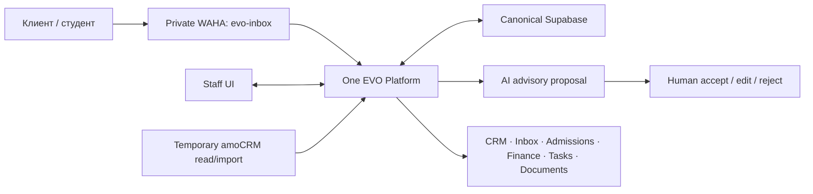

# Как устроена EVO Platform

- Owner: технический ответственный EVO Admissions
- Status: active target overview under #376 and ADR 0020; no live-readiness claim
- Last reconciled against repository: 2026-08-24 at
  `31d26b6e6bdc8a96fcf9f48210e417d43619370d`
- Architecture decision: `docs/adr/0020-unify-evo-v1-on-canonical-supabase.md`
- Supabase boundary: `docs/adr/0015-establish-canonical-supabase-schema-and-migration-boundary.md`
- External automation boundary:
  `docs/adr/0017-separate-student-profile-document-automation-from-evo-platform.md`
- Historical autonomy/read-mostly decision (superseded):
  `docs/adr/0019-gate-autonomous-inbound-replies-and-resume-read-only-amocrm.md`
- Execution contract: `docs/EVO_PLATFORM_LONG_RUN_PLAN.md`

## Главное простыми словами

Целевая EVO Platform — одно внутреннее рабочее приложение с одним login, staff
UI, role model и end-to-end workflow. Supabase — постоянная canonical foundation
для клиента, лида, стадии, ответственного, следующего действия, Student Case,
документов, заявок, visa, payment control, tasks, communication workflow и
audit. Принятие архитектуры не означает, что production уже переведён на неё.

Student Profile document reading, extracted-fact confirmation, profile
autofill и profile-form export не являются частью этого runtime: owner вынес
их в отдельную систему вне `evo_AI_CRM`. Обычные Platform documents —
checklists, private objects, versions, review/rework и audited access — остаются
в EVO Platform. Автоматический обмен между системами не предполагается; любая
будущая интеграция требует отдельного контракта и проверки.

amoCRM — временный read/import adapter и migration source. WAHA — private
transport adapter. AI — advisory и human-reviewed. Ни один из них не является
отдельным продуктом или canonical operational authority. Stage one не отправляет
WhatsApp и не пишет в amoCRM.

## Текущее repository-состояние до U10/U12

Репозиторий всё ещё содержит три исторически раздельных runtime-контура:

| Контур | Текущее назначение | Текущее хранилище |
|---|---|---|
| Root CRM | Основная staff CRM и admissions UI | SQLite и собственная auth-модель |
| EVO Inbox | WhatsApp inbox и ручная работа с AI-черновиками | отдельный Supabase-контур |
| EVO Lead Agent | приватная обработка WAHA/amoCRM и внутренний sync | Python-сервис и локальное состояние |

Существующая история также содержит два WhatsApp-пути: `crm_primary` для
старого CRM/Lead Agent path и `evo-inbox` для Inbox. Это описание текущего кода,
а не разрешение менять production-сессии. Старый путь нельзя отключать, пока
U10/U12 не доказали migration/cutover без потерь и дублей и rollback gate.
Это migration inputs, а не разрешение поддерживать dual-read/write.

The accepted Claude Design root frontend from PRs #64/#71/#72 remains the only
staff UI contract. U-slices wire it to canonical Supabase paths and must not
revive a parallel or fallback Inbox UI.

Актуальный уровень доказательств записывается в
[current-status.md](current-status.md). Наличие кода или конфигурации не
засчитывается как доказательство работы реальных WAHA, amoCRM, Supabase или AI.

## Целевая карта

Целевой backend объединяет нужную messaging-возможность EVO Inbox и полезную,
безопасную логику Lead Agent внутри одного продукта:

- нормализацию телефона;
- проверку WAHA HMAC и timestamp;
- raw persistence до обработки;
- idempotency по `X-Webhook-Request-Id` и бизнес-ключу
  `session + payload.id`;
- буферизацию, durable jobs, retry, dead-letter и reconciliation;
- temporary read/import of amoCRM contact, lead, responsible Sales и stage with
  explicit provenance plus permitted task/call/chat-record references;
- explicit unresolved handoff и loop prevention без provider writes;
- отдельные внутренние UUID, WAHA message IDs и Kommo conversation/message IDs;
- ACK/session-аудит и правило «не повторять автоматически неизвестный результат»;
- durable lead memory, approved knowledge, advisory AI proposal and audited
  human review.

Первый live stage — receive-only: signed inbound persists and appears in the
unified Sales queue, but neither a human nor AI sends WhatsApp and nothing
writes to amoCRM. Any later external-write stage needs a new owner decision,
bounded scope and real rollback.

## Данные и среды

Для собственных данных используется один dedicated production-проект
Supabase. Это не означает одну физическую базу для всех сред:

- local/dev изолирован;
- staging persistent и изолирован;
- preview branches создаются там, где это поддерживается;
- production data по умолчанию не копируется в preview;
- schema/config идут как код через root `supabase/config.toml` и одну
  immutable migration history.

Canonical schema boundary:

| Schema | Назначение | Browser/Data API |
| --- | --- | --- |
| `public` | historical Inbox objects as immutable migration/archive input | no new active behavior or compatibility dependency |
| `platform` | canonical EVO operational model | exposed с explicit grants и RLS на каждой table |
| `platform_private` | backend-only helpers/secret references | не exposed; browser access отсутствует |

### Historical merged P2-P8 evidence

The implementation chronology below records repository evidence that U-slices
may revalidate and reuse selectively. Old role, handoff, amoCRM-authority,
manual-send and autonomous-send clauses are not current product authority.

P2A переносит 001–039 byte-for-byte в root `supabase/`. После
checksum/reset proof P2B добавляет forward-only migration 040: создаёт только
namespace/grant boundary и закрывает legacy secret-bearing tables от browser
roles. Legacy `owner/admin/agent/viewer` не получают автоматического
соответствия Platform ролям, а legacy signup не создаёт Platform membership.

P2C добавляет organizations, auth-linked profiles, одну активную membership,
immutable versioned permission bundles, typed record scopes и append-only
audit. Auth Hook выдаёт только coarse `platform_role` и
`platform_access_version`. RLS заново сверяет их с live profile, organization,
membership, bundle и scope; смена authority увеличивает version и немедленно
закрывает старый token. Direct `service_role` DML не является target backend
API: каждый backend capability получает отдельный reviewed function grant.

P2D добавляет student/admissions domain поверх этой live-authority модели:
pending/active/closed cases, Admin-only Curator assignment and handoff,
immutable scope rotation, multiple applications, Curator-owned visa, tasks и
append-only events. Base tables остаются staff-full; post-handoff Sales и
activated Student используют отдельные fixed-column projections. Migration 042
доказывается только на disposable local Supabase/PostgreSQL и не означает
amoCRM, managed Supabase или production Portal cutover.

P2E начинается после migration 042 и добавляет migration 043 для document
metadata, manual finance и notification intent. PR #88 controller-merged этот
database/RLS contract как
`aac1cba851e89070a7eb54baab4eddf921e3447c`; post-merge exact-main CI
[30402311903](https://github.com/izzhackt/evo_AI_CRM/actions/runs/30402311903)
зелёный.
Документы на этом шаге — checklist, versions, validation/review и
integrity/malware evidence state без binary Storage или scanner proof.
Notification — одна durable запись для одного Student-получателя в in-app или
individual WhatsApp channel с Student-only consent/dedupe; staff consent
fail-closed, а Queue или подтверждённая доставка здесь не заявляются.
Подробная граница:
[`p2e-documents-finance-notifications.md`](p2e-documents-finance-notifications.md).

P2F начинается с этого exact checkpoint и добавляет migration 044:
unified conversations/messages, five-role handoff scope, отдельные внутренние,
WAHA, Kommo и amoCRM identifiers, private raw-persist-before-process evidence,
dedupe/reconciliation state, approved versioned knowledge и draft-only AI.
PR #89 controller-merged этот database/RLS contract как
`8567455f281fa157fb088970db1c2a2397850843`; post-merge exact-main CI
[30407638837](https://github.com/izzhackt/evo_AI_CRM/actions/runs/30407638837)
зелёный. Pinned artifact содержит 6,881 lines и 194,076 bytes; SHA-256
`8d52b476981faed4a42a9c13ff2813a718bde6ad4aea1b315c4d61be9fd1ebc8`,
exact inventory — 10 exposed + 2 private tables и 19 functions.
Former Sales получает только fixed safe summary; Finance не получает transcript
или raw provider data, Student видит только safe self history. RU/EN draft
требует human review/edit/manual-send evidence; uncertain language идёт в
manual selection/handoff, а Kyrgyz customer draft запрещён. Полный merged
contract:
[`p2f-communications-contracts.md`](p2f-communications-contracts.md).

Merged P2G добавляет forward migration 045 и настоящий local
Supabase Queues/PGMQ contract. `platform_work_v1` и
`platform_dead_letter_v1` принимают только pointer body
`{v, work_item_id, kind}`; direct `pgmq`/`pgmq_public` grants закрыты, а
service worker использует только fixed RPC. Retryable work сохраняет тот же
PGMQ message через `read()`/visibility timeout/`set_vt()`, exhausted work
создаёт immutable dead-letter evidence. Manual WhatsApp work всегда
single-attempt: явный unknown или истёкший worker lease архивирует active
message и открывает reconciliation/Admin review без retry/DLQ. Exact artifact:
3,425 lines, 91,620 bytes, SHA-256
`a657c32c3dadec369b54157914a229b112c58beb395ee4a2ae99025d804723a2`.
Подробная граница:
[`p2g-durable-work-queues.md`](p2g-durable-work-queues.md).

Private provider row хранит provider/account/request references, WAHA session
или provider conversation reference, event type/time, raw event variant,
supplied verification result, private verification headers/evidence reference,
raw payload и его SHA-256. WAHA `message.ack` сохраняет variant, включая
unknown code; `message.any` требует `NULL`. Non-WAHA raw events не получают
вымышленный semantic dedupe, а normalized reconciliation effect имеет отдельный
canonical key. Browser получает только разрешённые normalized fields и
projections. P2F не доказывает, что real HMAC/timestamp verification
выполнилась. Такой migration/RLS row доказывает database state и authorization,
но не реальный webhook, AI generation, WAHA/Kommo/amoCRM call, provider send
или ACK. P2G доказывает local Queue/outbox/worker/retry/dead-letter mechanics,
но не provider delivery; private media/Storage/scanner относится к P2H.

At current main `8dbc99c578a9bad0750a04cb322f26a2fe68b1c0`, PR #132
merged P5A receive-only ingress and migration 059. It validates configured
HMAC/timestamp evidence, persists before processing and enqueues verified
pointer-only work; runtime remains disabled by default. PR #133 is a draft,
unmerged P5B receive/project candidate. P5B may project inbound work into the
accepted root UI data path but may not call Gemini or send through WAHA. It is
blocked until valid media-only inbound becomes operator-visible and hands off
rather than completing as a missing-text no-op. Neither block is provider proof.

Каждая exposed table должна иметь RLS. Browser использует только publishable
key. Secret/service-role ключи и provider secrets остаются только на backend.
Coarse role может приходить из custom JWT claim, но доступ к конкретной
организации, студенту, разговору и Storage object проверяется через RLS.

Private Storage используется только через поддерживаемый API, authenticated или
короткоживущие signed downloads. Запрещено писать напрямую в таблицы схемы
`storage`.

Durable retryable business work идёт через Supabase Queues с идемпотентными
consumer-ами. Database Webhooks допустимы для асинхронного event push, но не
заменяют durable очередь. DB-resident secrets могут храниться в Vault при
закрытом доступе. PITR зависит от выбранного плана; Storage objects требуют
отдельной backup-процедуры.

## Роли и границы

Первый внутренний пилот использует три human-facing роли:

- Sales Manager (`sales`);
- Admissions Manager (existing canonical admissions role);
- Director/Admin (`admin`).

Отдельной роли `visa` нет. Director/Admin управляет staff access и назначает
Admissions Manager с обязательной причиной, before/after и audit.

Sales владеет pre-handoff работой. Когда EVO подтверждает contract и first
mandatory payment, audited handoff создаёт/обновляет Student Case, назначает
Admissions owner и starter work. Override доступен Director/Admin только с
причиной. Единая история и provenance сохраняются.

Только actor с explicit payment-confirmation permission подтверждает obligations,
payments и refunds с evidence и audit. Подтверждённые суммы используют integer minor units; payment не может
превысить остаток, а refund — подтверждённую невозвращённую часть exact
payment. Overdue вычисляется из obligation/payment/refund/due time и никогда не
выводится из amoCRM stage. Sales и текущий Curator получают только безопасный
operational status в своём scope. Student видит только свои безопасные
obligation label/category, amount/currency, due time, derived status, понятный
overdue notice и next action, но не evidence, actor IDs, transaction-event
history или внутренние stop-factor поля.

В document workflow Director/Admin и назначенный Admissions Manager имеют
доступ в разрешённом case scope. Student Portal следует в более позднем
milestone и не блокирует первый pilot.

## AI и отправка сообщений

AI is advisory only. It may summarize, classify, suggest a next action, draft
text and identify gaps/deadlines. Every result stores sufficient source,
uncertainty/risk and review evidence for a human to accept, edit or reject it.

The model never calls WAHA, changes a stage, assigns staff, accepts a document
or confirms a payment. The first live stage sends no WhatsApp message, including
human-approved drafts. ADR 0019 autonomous-reply artifacts are historical source
evidence and confer no active capability or rollout authority.

Valid media-only inbound is still persisted and operator-visible. Missing or
unavailable provider access fails closed with the exact blocker rather than a
fake healthy state.

EVO может обещать только исполнение собственных услуг и обязательств. Platform
не должна гарантировать admission, scholarship, visa или решение внешнего
органа.

## Что должно произойти до cutover

1. U0 reconciles authority and legacy disposition, then merges from one exact
   reviewed docs-only head.
2. U1-U9 prove the unified pilot workflow against real Supabase-backed seams
   with positive and negative authorization coverage.
3. U10 inventories, archives, migrates and reconciles active records required
   for pilot, then freezes legacy writes for those records without a bridge.
4. U11 proves truthful health, append-only audit and separate database/Storage
   backup and rollback in an authorized non-production environment.
5. U12 proves real staff login, managed Supabase and real inbound WhatsApp in
   receive-only mode. It sends no WhatsApp and writes nothing to amoCRM.
6. U13 completes ten working days and five real cases in one EVO workflow.
7. U14 migrates/archives historical closed records after the stable pilot.
8. Local or repository proof never substitutes for managed, provider,
   deployment, backup or rollback evidence.

До выполнения этих условий target остаётся принятым контрактом, а не
production-complete заявлением.
