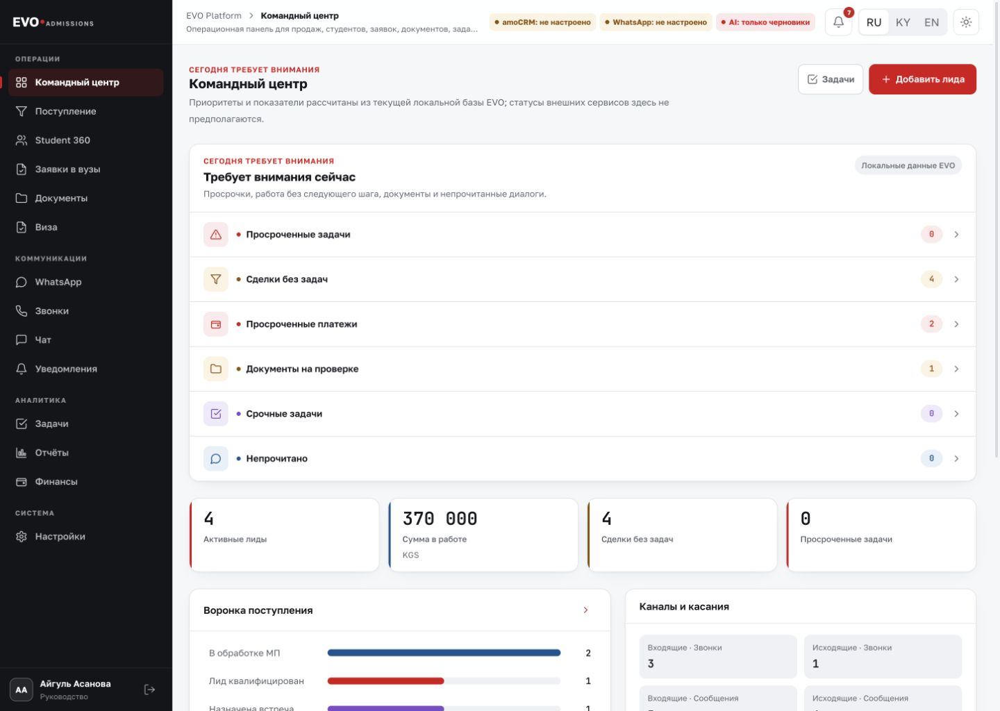
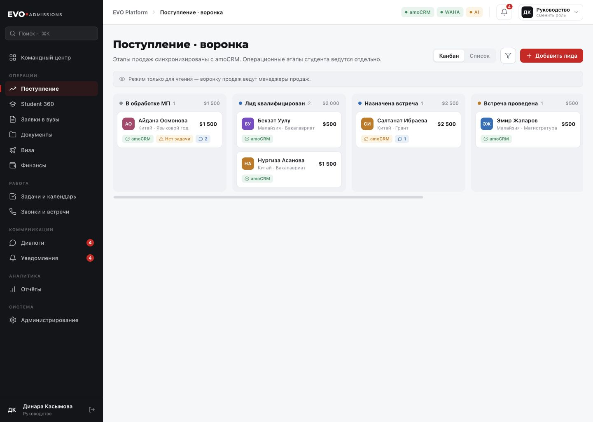
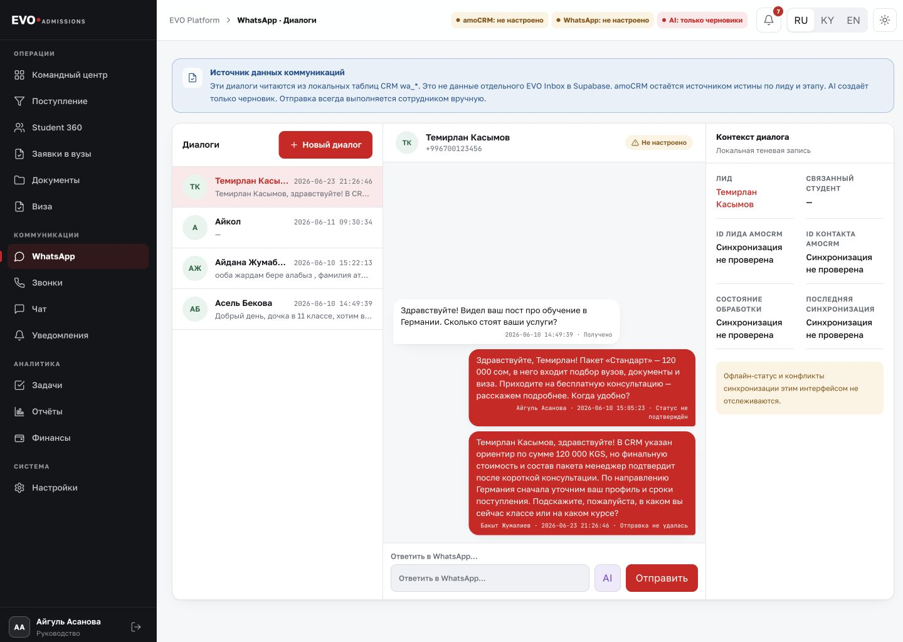
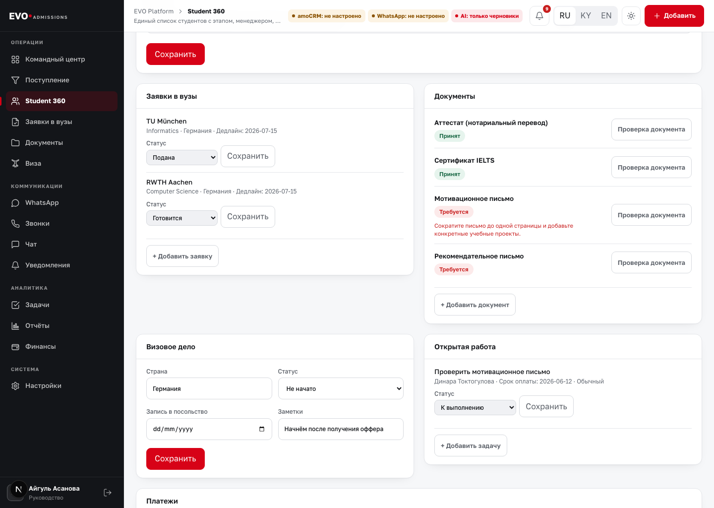
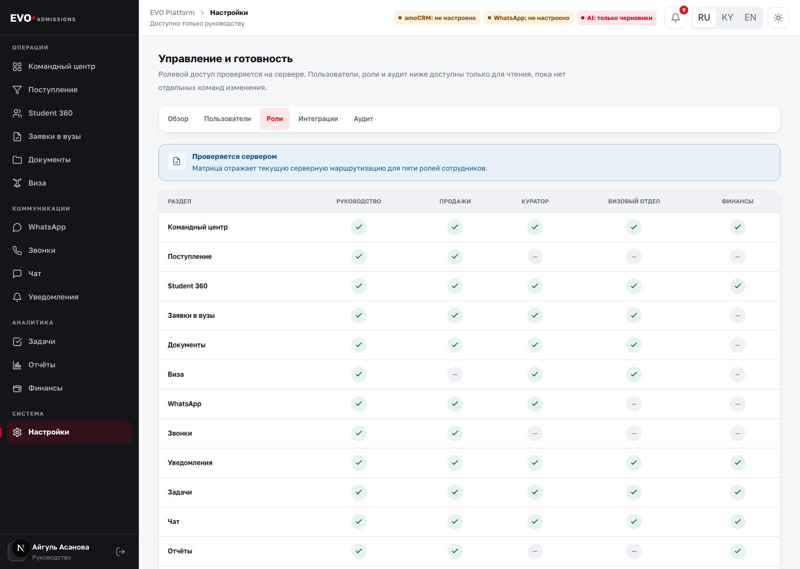
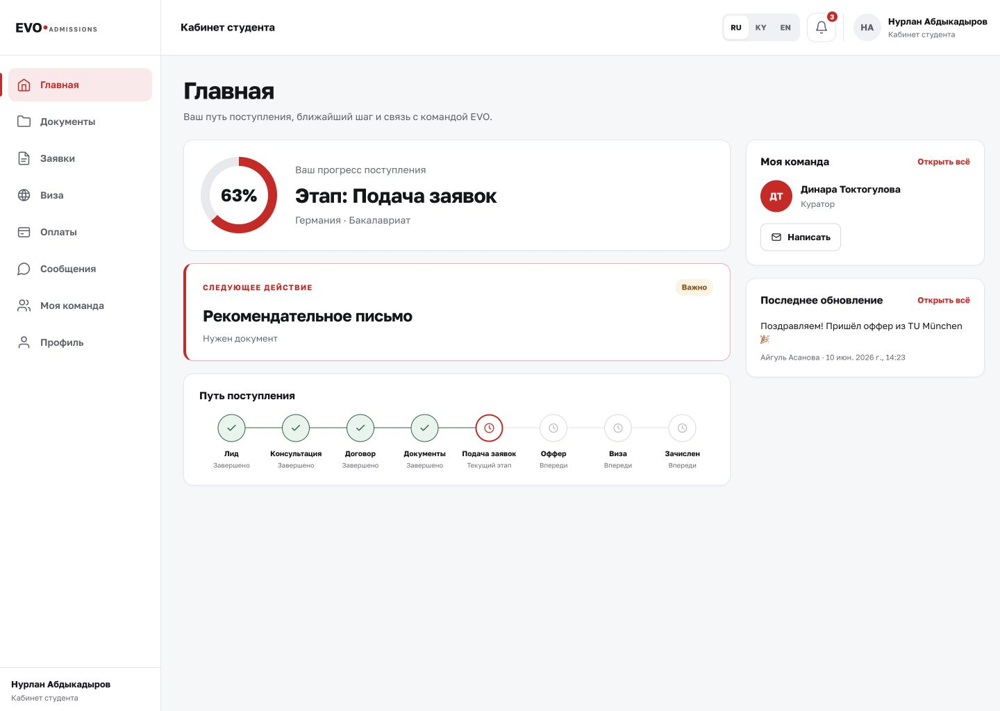

# Техническое задание

## Единая платформа автоматизации EVO Admissions

**Идентификатор документа:** EVO-PLATFORM-TZ-001
**Версия:** 1.8
**Статус:** действующий контракт repository-реализации; production-gates
остаются отдельными
**Дата:** 4 августа 2026 года
**Базовая версия репозитория:** `30bcc956fbf1ac90e79c2a75c22748633e219d9d`
**Текущий execution checkpoint:** `30bcc956fbf1ac90e79c2a75c22748633e219d9d`
**Язык документа:** русский

> **Назначение документа.** Это ТЗ является контрактом на последующую
> реализацию единой EVO Admissions Platform. Оно не утверждает, что внешние
> интеграции уже работают. После merge P0 оно разрешает только поэтапную
> repository-реализацию по `docs/EVO_PLATFORM_LONG_RUN_PLAN.md`; production
> deployment, migration, provider mutation, live send и удаление сервисов
> требуют отдельных gates и полномочий.

## Карточка документа

| Поле | Значение |
| --- | --- |
| Заказчик | EVO Admissions |
| Владелец продукта | Должность Product Owner EVO Platform |
| Владелец бизнес-процессов | Должность Business Process Owner |
| Технический владелец | Должность Technical Owner |
| Разработчик | Команда реализации EVO Platform |
| Объект автоматизации | Greenfield Supabase-native EVO Platform behind the accepted unified frontend; first delivery slice focuses on operator messaging, followed by normalized OP/OZO workflows, versioned country overlays and Student 360 |
| Формат согласования | SHA-bound review, должностное решение по открытым gates и audit evidence |
| Источник бренда | `docs/company/brand/evo-admissions-logobook.pdf` |
| Принятый preset | `standard_business_brief` |
| Текущий checkpoint | P0, P1A–P1D, reusable P2A–P2H, greenfield/UI boundary, BW0, P3A–P3C, BW1–BW4 и P2R0/P2R1 merged; PR #109 merged the P2R2 plan at `30bcc956fbf1ac90e79c2a75c22748633e219d9d` with green exact-main CI `30824043775`; PR #110 exact head `fd4428451793bdc59b3b183dcc9dde7518e80201` closed without merge after controller `changes_requested`; P2R3 stale-session/local-proof ownership gate active and BW5 paused |

> **Главная граница.** amoCRM остаётся источником истины для контакта, лида,
> ответственного sales manager и стадии продаж. Один dedicated production
> Supabase project хранит собственные операционные данные EVO Platform;
> local/dev, staging и preview физически изолированы от production.
> Платформа greenfield и Supabase-native: первый запуск не включает legacy
> SQLite data/account import, root-auth migration, dual-read или dual-write.
> Legacy deployed data plane остаётся отдельным reference contour и не
> становится launch dependency.

## 1. Как читать это ТЗ

В документе используются пять типов утверждений:

- **Текущее состояние** — подтверждено кодом, миграциями, документацией или
  зафиксированной проверкой.
- **Обязательное решение** — уже согласованная граница будущей платформы.
- **Требование** — то, что должна обеспечить реализация.
- **Открытое решение** — вопрос, который должен утвердить владелец до
  соответствующего этапа.
- **Будущая опция** — не входит в первый production-запуск.

Слова **MUST / обязательно**, **SHOULD / желательно** и **MAY / опционально**
задают приоритет. Если требование с приоритетом MUST не выполнено или не
проверено указанным способом, соответствующий этап не считается завершённым.

Статусы внешних интеграций:

| Статус | Что означает |
| --- | --- |
| Не настроено | Нет утверждённых или действующих реквизитов подключения |
| Настроено, не проверено | Конфигурация присутствует, но реальный вызов не доказан |
| Проверено на тестовой среде | Выполнен реальный контролируемый сценарий без production-пользователей |
| Проверено в production | Выполнен утверждённый сценарий на рабочем контуре и сохранены доказательства |
| Ошибка / деградация | Интеграция не выполняет контракт; данные и действия не должны изображаться успешными |

## 2. Резюме решения

EVO Admissions нужна единая рабочая платформа, чтобы сотрудник работал в одном
accepted unified frontend и видел канонический messaging context, историю
коммуникаций, ответственного, следующий шаг и связанные операционные данные без
параллельных CRM-контуров. Студенту нужен отдельный безопасный кабинет с
прогрессом, документами, сообщениями и понятными блокировками.

Целевая система строится только за already accepted unified frontend EVO
Platform из PR #64, #71 и #72. Он является единственным UI contract. Новый
parallel/generic UI, duplicate dashboard или второй CRM surface не входят в
scope. Архитектура должна greenfield-реализовать backend/auth/RBAC/repository/
workflow/messaging/integration слой за этим UI, используя из EVO Inbox только
operator messaging donor scope: conversation list/thread, operator context, WAHA
receive/send, delivery/ACK, AI draft + staff manual send, approved knowledge,
audit и minimal integration/settings health. Standalone dashboards, pipelines,
deals, leads, funnels, broadcast, flows, campaigns, unrelated analytics и
unrelated settings исключены из первого delivery slice.

Обязательные решения:

1. amoCRM остаётся единственным источником истины для контакта, лида,
   ответственного менеджера и стадии продаж.
2. Supabase становится основным хранилищем собственных данных EVO Platform:
   пользователей, ролей, студенческих дел, заявок, документов, виз, финансовых
   обязательств, задач, коммуникаций, AI-черновиков, синхронизации и аудита.
3. Используется один dedicated production Supabase project. Local/dev,
   persistent staging и preview branches/projects физически изолированы, имеют
   ту же migration history и не получают production data по умолчанию. Inbox и
   CRM не получают отдельные production-проекты.
4. Используется один входящий WhatsApp/WAHA-контур, одна private session
   `evo-inbox` и один webhook owner.
5. Полезная логика EVO Lead Agent переносится в единый backend как модули
   интеграции и фоновой обработки.
6. EVO Lead Agent не удаляется до bounded controlled real-path доказательства,
   completed reconciliation, health evidence, rollback readiness и отдельного
   reviewed retirement PR.
7. AI создаёт только черновик. Сотрудник проверяет, редактирует и вручную
   отправляет каждое клиентское сообщение.
8. Продажная воронка и операционный путь студента — разные модели.
9. Figma, прототипы и скриншоты являются дизайн-доказательствами, но не
   заменяют это ТЗ и не доказывают работу внешнего provider.
10. Роли v1: Admin, Sales, Curator, Finance и Client/Student. Target machine
    role для Client/Student — `student`; legacy root `client` остаётся только
    reference identifier вне launch scope и не создаёт Platform membership.
    Отдельной Visa role нет; визовый модуль ведёт Curator.
11. Только Admin приглашает/блокирует staff и назначает/переназначает Curator.
    Reassignment требует reason, before/after и audit.
12. Sales владеет разговором до подтверждённого договора; после handoff —
    Curator. История единая, а Sales видит только разрешённый summary.
13. EVO Platform временно является manual operational source финансов v1.
    Payment/refund подтверждают только Finance/Admin с evidence и audit.
14. EVO гарантирует только собственные услуги и обязательства, а не admission,
    scholarship, visa или решение внешнего органа.

## 3. Цели и измеримый результат

### 3.1 Бизнес-цели

- убрать повторный ввод одного и того же клиента в нескольких системах;
- сделать ответственность, следующий шаг и срок видимыми для команды;
- сократить ручной поиск сообщений, документов и истории решений;
- не допускать незаметной потери лида, сообщения, документа или задачи;
- обеспечить прозрачный аудит действий сотрудников и интеграций;
- дать студенту понятный маршрут без доступа к чужим данным;
- сохранить привычную amoCRM как каноническую систему продаж;
- подготовить основу для управленческой отчётности без «нарисованных» KPI.

### 3.2 Критерии результата первого production-запуска

- сотрудник входит под собственной учётной записью и видит только разрешённые
  разделы и записи;
- входящий WhatsApp-контакт связан с каноническим контактом и лидом amoCRM;
- история разговора, AI-черновик, ручная отправка и статусы доставки сохранены
  в одной последовательной истории;
- после договора создаётся связанное операционное дело студента без создания
  второго независимого лида;
- документы, заявки, визовый кейс, платежные обязательства и задачи ведутся
  отдельными объектами;
- студент видит только своё дело, свои файлы и свои сообщения;
- каждое чувствительное изменение имеет автора, время, исходное и новое
  значение либо ссылку на неизменяемое событие;
- финальный контролируемый сценарий проходит по цепочке:
  **WhatsApp → amoCRM → EVO Platform → AI-черновик → ручная отправка →
  delivery/read status → audit history**.

## 4. Источники и порядок приоритета

По текущему merged plan противоречия разрешаются в следующем порядке:

1. зафиксированные business decisions и отдельные должностные решения по
   открытым gates;
2. эта версия ТЗ и зарегистрированные изменения к ней;
3. ADR, launch-plan и security/runbook репозитория;
4. production-код, миграции и проверенные интеграционные контракты;
5. бизнес-процесс и утверждённая база знаний;
6. дизайн-материалы и принятый frontend;
7. исходное ТЗ «Платформа автоматизации ОЗО» как контекст первой итерации.

Исходный документ ОЗО содержит полезные потребности, но не является
автоматически правильной архитектурой. Его предположения о владельце оплаты,
«CRM» как одной системе, автоматической AI-валидации и мгновенных webhook
должны подтверждаться отдельными контрактами.

### 4.1 Проверенный набор источников

- 966 отслеживаемых файлов репозитория на базовом коммите;
- корневая Next.js EVO CRM и её SQLite-модель;
- EVO Inbox, миграции Supabase и серверные маршруты;
- EVO Lead Agent, его FastAPI/SQLite/amoCRM/WAHA контракты;
- `CONTEXT.md`, действующие ADR и launch-plan;
- бизнес-контекст, процесс поступления и матрица владельцев данных;
- итоговый frontend audit, completion checklist и дизайн-review closure;
- EVO Admissions logobook;
- сохранённая provenance исходного
  `TZ_Platforma_avtomatizacii_OZO.docx`; оригинальный binary отсутствует в
  чистом worktree и в любом случае является context, а не authority;
- ограниченная read-only проверка открытой amoCRM 23 июля 2026 года.
- read-only проверка 39 tabs Ultimate EVO Google Doc 30 июля 2026 года,
  accessible 21-page China checklist и только metadata linked admissions
  Sheet/Drive; student rows/folder names/files не читались и не копировались;
- blocked university Notion catalog: доступ требует sign-in в workspace
  AbdyldaYT, поэтому records не выдуманы и import не считается доступным.

Операционный screenshot amoCRM с именами сотрудников и реальными показателями
не включён в документ, чтобы не распространять персональные и внутренние
данные. В ТЗ используются обезличенные screenshots EVO Platform.

## 5. Текущее состояние системы

Текущий репозиторий уже содержит три технических контура вокруг amoCRM. Они
важны как reference и donor scope, но не являются launch dependency greenfield
Platform.

| Компонент | Назначение сейчас | Хранилище | Главный риск |
| --- | --- | --- | --- |
| Корневая EVO CRM | Legacy deployed reference contour behind the accepted frontend contract | Локальная SQLite | Не является greenfield launch data plane; локальные записи могут расходиться с amoCRM и Inbox |
| EVO Inbox | Donor contour для operator messaging behavior: conversation/thread, AI draft, manual send, ACK/history | Supabase/Postgres | Любые contacts/deals/pipeline/dashboards здесь нельзя переносить как второй CRM surface |
| EVO Lead Agent | Donor contour для WAHA webhook, amoCRM resolution, dedupe/retry ideas и readiness patterns | Локальная SQLite | Отдельный runtime, отдельная память и незавершённый retry/replay контракт; не launch dependency как data plane |
| amoCRM | Контакт, лид, ответственный, стадия продаж | Внешний SaaS | Webhook/API могут задержаться или временно быть недоступны |
| WAHA | Приём и отправка WhatsApp, session/status/ack events | Приватный runtime | Дубли webhook, неизвестный результат send, QR/session failure |

Read-only snapshot 28 июля 2026 года подтвердил два healthy WAHA containers и
два настроенных runtime-пути. Защищённый sessions endpoint вернул `401` без API
key, поэтому фактические session statuses в этом snapshot не доказаны. Эта
companion-граница не является целевой архитектурой единой платформы. Legacy
runtime revisions и deployed data plane здесь фиксируются только как reference
facts; greenfield launch не требует SQLite import, root-auth migration, account
import или dual-read/write с этими контурами. Lead Agent frozen,
worker/auto-reply/outbound выключены, amoCRM readiness false.

### 5.1 Что уже можно переиспользовать

- завершённый unified frontend staff workspace и Student Portal как единственный
  UI contract;
- серверные проверки маршрутов для ролей;
- доменные статусы продаж и поступления;
- Supabase Auth, RLS, разговоры, сообщения и минимальные integration/settings
  patterns Inbox;
- idempotency входящих WAHA-сообщений;
- неизменяемые AI draft и acknowledgement audit records;
- amoCRM contact/lead resolution и связанные safe sync patterns;
- handoff, буферизация, readiness/preflight и безопасные feature flags;
- существующие проверки lint, type, build, security, scenarios и Playwright.

### 5.2 Что нельзя считать доказанным

- реальная отправка WhatsApp и provider acknowledgement в greenfield Supabase-
  native messaging path behind the accepted frontend;
- live OAuth и двусторонняя синхронизация amoCRM;
- production-связь legacy root `/whatsapp` с новой greenfield Platform;
- реальное Supabase-хранилище документов студента;
- payment gateway, telephony, email delivery или автоматическая подача в вуз;
- production AI generation как утверждённая бизнес-функция;
- автоматические ответы клиенту;
- готовность удаления Lead Agent.

## 6. Целевая архитектура

### 6.1 Архитектурный стиль

Первый production-релиз должен быть **модульным монолитом**: один продукт,
один backend-контур и одна схема данных на среду, но отдельные модули с
явными обязанностями. Это уменьшает число сетевых отказов и синхронизаций.
Разделение на microservices допускается позже только по измеренной нагрузке или
организационной необходимости.

Целевые модули:

- Web Staff Workspace;
- Student Portal;
- Authentication and Access;
- amoCRM Adapter;
- WhatsApp/WAHA Adapter;
- Communications and AI Drafts;
- Admissions Operations;
- Documents and Storage;
- Finance and Stop Factors;
- Tasks, Notifications and Team Collaboration;
- Reporting and Audit;
- Background Jobs, Outbox and Reconciliation.

### 6.2 Целевая схема взаимодействия

```text
Клиент WhatsApp
      |
      v
Приватная WAHA session
      |
      v
Единый webhook EVO Platform -> Event Inbox / Deduplication
      |                                  |
      |                                  v
      |                           Background Jobs
      v                                  |
amoCRM Adapter <-> amoCRM                v
      |                           Supabase/Postgres
      v                                  ^
Linked Lead/Contact Read Model            |
      |                                   |
      +----------> Staff Workspace <------+
                         |
                         v
                  AI Draft (no auto-send)
                         |
                         v
                  Human approval -> Outbox -> WAHA

Student Portal -> Supabase Auth/RLS -> Admissions, Documents, Finance, Messages
```

### 6.3 Среды и Supabase

| Среда | Назначение | Данные | Внешние provider |
| --- | --- | --- | --- |
| Local/Development | Локальная разработка и автоматические тесты | Только синтетические/обезличенные | Реальный sandbox/test provider, когда требуется provider proof; недоступность помечается blocked |
| Staging | Реальные интеграционные проверки до релиза | Обезличенные либо специально разрешённые тестовые записи | Тестовые аккаунты/номер |
| Preview | Временная проверка PR, если plan/provider поддерживает branch | Без production data по умолчанию | Только явно разрешённые test provider |
| Production | Рабочая система EVO Admissions | Реальные данные в утверждённом объёме | Production accounts |

Production использует один dedicated Supabase project для всех EVO-owned
данных. Local/dev, persistent staging и preview реализуются отдельными
projects/branches по возможностям выбранного plan; у них изолированы
DB/API/Auth/Storage/Functions и они не копируют production data по умолчанию.
Во всех новых средах Platform использует одну Supabase-native logical model с
одинаковой migration history. Legacy deployed CRM/Inbox/Lead Agent data plane
остаётся отдельным reference contour и не является обязательной частью launch
data path.
Schema changes хранятся в Git (`supabase/config.toml`, migrations,
reset/diff/pull workflow). Browser использует publishable key; secret/service
role остаются только backend. RLS обязательна для каждой exposed table.

P2 устанавливает следующую schema/migration boundary:

| Schema/область | Назначение | Exposure |
| --- | --- | --- |
| root `supabase/` | единственный source config и immutable migrations; P2A переносит legacy 001–039 byte-for-byte без 040 | repository authority |
| `public` | repository-level legacy Inbox compatibility for historical consumers; не launch dependency greenfield Platform | временно exposed только для проверенных legacy consumers с RLS |
| `platform` | новая identity/operational/audit-facing model | Data API с explicit grants и RLS на каждой table |
| `platform_private` | backend-only helpers и secret references | не входит в Data API; browser grants отсутствуют |
| `auth`/`storage`/`vault`/`pgmq` | provider-owned schemas | не переименуются и не используются как Platform domain |

Merged migrations не редактируются; correction получает следующий свободный
номер. Legacy `owner/admin/agent/viewer` не маппятся автоматически на Platform
roles. Legacy signup может сохранять старый Inbox behavior в historical
compatibility path, но не создаёт Platform organization membership и не
является required launch path.

Дополнительные обязательные границы:

- coarse role приходит через versioned custom JWT claim, а organization,
  record/object scope проверяется RLS и server authorization;
- Next.js 16 использует `@supabase/ssr`, `proxy.ts`, async `cookies()` и
  `getClaims()` для server authorization; `getSession()` не считается
  авторизационным доказательством;
- Storage private; download только authenticated/signed URL либо server stream;
  application code не пишет напрямую в storage schema;
- Realtime channels private и защищены простой RLS;
- durable retryable work использует Supabase Queues; DB Webhooks допустимы как
  async push, но не заменяют durable queue;
- DB-resident secrets используют Vault;
- PITR включается только после выбора поддерживающего plan; database backup не
  включает Storage objects, поэтому Storage имеет отдельный backup/restore.

### 6.4 Границы источников истины

| Факт | Единственный владелец | Что хранит EVO Platform | Кто может менять |
| --- | --- | --- | --- |
| Контакт, lead ID, ответственный менеджер, sales stage | amoCRM | ID, нормализованный read model, sync status, version/timestamp | Через amoCRM API и разрешённый UI |
| Профиль пользователя и роль | Supabase Auth + EVO profile/role tables | Учётная запись, роль, scope, status | Admin по утверждённому процессу |
| Операционное дело студента | EVO Platform | Полная рабочая модель и история | Разрешённые сотрудники |
| Заявка в университет | EVO Platform; решение принадлежит внешнему вузу | Статусы, evidence, deadlines, response | Куратор; внешний result только по evidence |
| Документ и review | EVO Platform + private Storage | Metadata, versions, checks, decisions | Студент загружает; сотрудник принимает решение |
| Визовый result | Внешний орган | Case, tasks, received decision evidence | Curator фиксирует evidence; Admin видит/audit |
| Финансовое обязательство/оплата/refund v1 | EVO Platform manual operations | Obligation, invoice/reference, payment/refund evidence, status/history | Только Finance/Admin с evidence и audit |
| WhatsApp transport status | WAHA | Durable event, normalized status, unknown state | Только server integration |
| Разговор и сообщения | EVO Platform | Полная durable history и links | Server ingest; employee manual outbound |
| AI-черновик | EVO Platform | Prompt/context version, output, evidence, reviewer action | Server creates; employee reviews |
| Audit event | EVO Platform append-only audit | Actor, action, target, before/after hash, source, time | Server only |
| Admission/visa decision | Университет/орган | Полученный результат и evidence | Curator фиксирует без переименования в «гарантию» |

## 7. Модель данных

### 7.1 Обязательные группы сущностей

Группы 1–12 ниже создаются в `platform`, кроме явно backend-only helpers,
которые относятся к `platform_private`. Legacy Inbox tables из 001–039
остаются в `public` как historical compatibility layer и не становятся
Platform identity по переименованию, импорту или cutover.

1. **Организация и доступ:** organizations, profiles, roles, permissions,
   role_permissions, user_scopes, invitations, sessions.
2. **amoCRM read model:** amo_contacts, amo_leads, amo_users,
   amo_pipeline_stages, amo_sync_events, amo_sync_conflicts.
3. **Студент:** student_cases, student_profiles, admissions_routes,
   case_assignments, case_updates.
4. **Поступление:** university_applications, application_events, offers,
   enrollment_events.
5. **Документы:** document_requirements, document_slots, document_versions,
   document_reviews, document_access_events.
6. **Виза:** visa_cases, visa_requirements, visa_events.
7. **Финансы:** payment_obligations, payment_events, payment_evidence,
   stop_factors.
8. **Работа команды:** tasks, task_events, notifications, calls,
   team_channels, team_messages.
9. **Коммуникации:** whatsapp_accounts, conversations, participants, messages,
   message_events, provider_raw_events.
10. **AI:** ai_drafts, ai_context_snapshots, knowledge_documents,
    knowledge_chunks, ai_review_events.
11. **Надёжность:** integration_outbox, job_queue, dead_letter_events,
    idempotency_keys, reconciliation_runs.
12. **Контроль:** audit_events, access_events, integration_health_snapshots.

### 7.2 Идентификаторы и связи

- Внутренние сущности используют UUID.
- Внешние ID хранятся отдельно с указанием provider и environment.
- `amo_contact_id` и `amo_lead_id` уникальны в пределах организации и
  amoCRM-аккаунта.
- Телефон нормализуется к E.164, но не является единственным первичным ключом.
- Внутренний message UUID, WAHA session/message IDs и Kommo
  `conversation.id`/`message.id` хранятся раздельно.
- WAHA Provider message ID уникален в пределах WAHA session/account.
- Inbound dedupe учитывает `X-Webhook-Request-Id` и независимый business key
  `session + payload.id`; глобального ключа из одного message ID недостаточно.
- Студенческое дело связывается с amo lead/contact, но не наследует sales stage
  как операционный статус.
- Каждая заявка, версия документа, оплата и решение имеют собственный ID и
  отдельную историю.
- Hard delete чувствительных business records запрещён через обычный UI.

### 7.3 Состояния синхронизации

Каждая внешняя ссылка должна иметь один из статусов:

`unlinked`, `pending`, `linked`, `stale`, `conflict`, `failed`, `disabled`.

Поле `linked` разрешено показывать только после подтверждённого внешнего ID.
`configured` не равно `linked`, а HTTP timeout не равно success или failure
бизнес-действия.

## 8. Синхронизация amoCRM

### 8.1 Правила чтения и записи

- Account, pipeline, status, custom-field и user IDs обнаруживаются из
  конкретного amoCRM/Kommo account, кешируются и versioned; глобальные hardcoded
  ID запрещены.
- Все изменения контакта, ответственного и sales stage сначала отправляются в
  amoCRM.
- Canonical lead write использует `pipeline_id`, `status_id`,
  `responsible_user_id` и `custom_fields_values` по versioned mapping.
- Локальный read model обновляется после подтверждённого API response или
  канонического webhook/reconciliation.
- Если amoCRM недоступна, платформа не создаёт «успешное» локальное изменение
  канонического поля.
- Неканонические admission-поля не записываются в amoCRM без отдельной mapping
  таблицы и business approval.
- Webhook быстро валидируется, сохраняется и подтверждается; тяжёлая обработка
  выполняется асинхронно.
- Минимум обрабатываются add/update/status/responsible lead events и связанные
  events, включённые в утверждённую account subscription.
- Периодическая reconciliation сверяет изменения, пропущенные webhook.
- Adapter соблюдает максимум 7 requests/second/IP и предпочитает не более 50
  writes в одном batch.

### 8.2 Поиск, создание и дубли

1. Нормализовать телефон и email.
2. Искать точное совпадение в amoCRM по разрешённым полям.
3. Если найден один контакт — проверить связанные активные leads.
4. Если найдено несколько кандидатов — создать `conflict`, не объединять
   автоматически.
5. Если контакт отсутствует — создать его идемпотентно.
6. Найти или создать lead в утверждённой pipeline и начальном status.
7. Сохранить внешние ID и evidence ответа.
8. Назначить ответственного по утверждённому business rule.

### 8.3 Конфликт

Конфликт обязан показывать:

- какие записи конкурируют;
- какие поля различаются;
- какой источник владеет каждым полем;
- время последней подтверждённой синхронизации;
- безопасные варианты: обновить из amoCRM, повторить запрос, связать вручную,
  передать Admin;
- полный audit решения.

## 9. WhatsApp, WAHA и коммуникации

### 9.1 Единый входящий путь

Первый production-релиз использует одну WAHA session и один private webhook
EVO Platform. Dashboard/API WAHA не публикуются в internet.

Минимальные события:

- `message` — входящее сообщение;
- `message.any` — reconciliation входящих и собственных API-sent сообщений;
- `message.ack` — изменение доставки/прочтения;
- `session.status` — состояние session;
- при подтверждённой необходимости — message reaction/media events.

Webhook проверяет HMAC по raw body, timestamp и `X-Webhook-Request-Id`, сохраняет
raw event до business processing и проверяет business key
`session + payload.id`. Повторная доставка не должна создавать второе сообщение
или повторное business-действие.

### 9.2 Статусы сообщения

Платформа хранит и показывает точные состояния:

`received`, `prepared`, `sent`, `delivered`, `read`, `failed`, `unknown`.

- `prepared` означает запись в outbox, а не отправку provider.
- `sent` допустим только после подтверждённого ответа send API.
- `delivered` и `read` приходят из acknowledgement.
- Raw acknowledgement сохраняет WAHA states
  `ERROR/PENDING/SERVER/DEVICE/READ/PLAYED`, а normalized status не стирает
  provider evidence.
- При timeout/неясном ответе статус — `unknown`; автоматический resend
  запрещён до reconciliation или решения сотрудника.
- Неизвестный provider code сохраняется как raw event и не переводится в
  «доставлено».
- Acknowledgement меняет статус только вперёд
  `sent -> delivered -> read`; поздний или повторный event не понижает status.

### 9.3 Ручная отправка

1. Сотрудник открывает разговор.
2. Платформа показывает канонический lead/contact context и sync state.
3. Сотрудник пишет текст либо запрашивает AI-черновик.
4. Сотрудник проверяет и при необходимости редактирует текст.
5. Сотрудник нажимает «Отправить».
6. Server подтверждает, что session находится в `WORKING`, и вызывает
   `/api/sendSeen` перед reply.
7. Server фиксирует immutable draft/review evidence и создаёт outbox record с
   idempotency key.
8. Worker выполняет один controlled send.
9. Результат и acknowledgement дописываются в историю.
10. Ошибка или unknown state видимы и требуют безопасного следующего действия.

## 10. AI-черновики

AI используется только как помощник сотрудника.

Обязательные правила:

- автоматическая отправка клиенту выключена;
- draft создаётся только по явному действию сотрудника;
- draft создаётся на RU или EN по языку последнего customer message. Если
  уверенное RU/EN определение невозможно, генерация/отправка блокируется до
  manual language selection либо handoff; Kyrgyz customer-draft не входит в v1;
- используются только owner-approved, versioned knowledge documents с
  effective date и provenance;
- в audit сохраняются provider, model, prompt version, context snapshot,
  knowledge evidence, output, requester, timestamp и итоговая редакция;
- AI не обещает admission, scholarship, visa или другой внешний outcome. EVO
  может гарантировать только документированные собственные услуги и
  обязательства; цена, срок и package facts требуют owner-approved evidence;
- чувствительные данные отправляются внешнему AI только по утверждённой
  privacy/data-processing политике;
- unsupported вопрос вызывает handoff, а не уверенный вымысел;
- AI не принимает финальное решение по документу, оплате, заявке или визе;
- качество измеряется по принятию/редактированию draft, handoff, ошибкам и
  grounded evidence, а не по количеству автоматически отправленных ответов.

## 11. Пользователи, роли и доступ

### 11.1 Базовые роли первого запуска

| Роль | Основная ответственность | Ограничение |
| --- | --- | --- |
| Admin | Permission bundle для уполномоченных CEO/CTO/администраторов: личные staff accounts, роли, блокировка, Curator assignment, минимальные messaging settings/integrations health и audit | Только личный account; shared credentials запрещены; secret value не показывается после сохранения |
| Sales | Канонический amo context, консультации, messaging queue и WhatsApp до подтверждённого договора | После handoff видит только разрешённый non-sensitive summary; не утверждает document/visa/payment evidence |
| Curator | Одно назначенное student case целиком: несколько applications, документы, visa, tasks и communications после handoff | Не меняет каноническую sales stage; не подтверждает payment/refund |
| Finance | Manual obligations, payment/refund evidence, debt/stop factor и финансовые отчёты | Нет доступа к чувствительным документам/сообщениям без object permission |
| Client / Student | Свой портал, свои задачи, документы, заявки, платежные статусы и сообщения | Только собственное дело; никаких staff/API administration функций |

Target machine identifier для Client / Student — `student`. Текущая root role
`client` остаётся legacy reference identifier вне launch scope и не создаёт
Platform membership автоматически.

«ОЗО», «ОП», «руководство» и «оператор Inbox» из исходного документа являются
бизнес-функциями. В первом запуске они назначаются одной или нескольким
базовым ролям. Отдельная роль Leadership или настраиваемые custom roles
добавляются только после отдельного изменения permission contract. Визовая
работа — модуль Curator, а не отдельная business role.

### 11.2 Базовая матрица разделов

| Раздел | Admin | Sales | Curator | Finance | Student |
| --- | --- | --- | --- | --- | --- |
| Dashboard | Deferred from first thin slice | Deferred from first thin slice | Deferred from first thin slice | Deferred from first thin slice | Нет |
| Sales / Lead 360 | Deferred from first thin slice | Deferred from first thin slice | Deferred from first thin slice | Deferred from first thin slice | Нет |
| Clients / Student 360 | Deferred from first thin slice | Deferred from first thin slice | Deferred from first thin slice | Deferred from first thin slice | Только своё дело в последующих slices |
| Applications | Полный | Read/start handoff | Полная работа по assigned case | Нет по умолчанию | Только свои |
| Documents | Полный | Разрешённый pre-contract read | Review/work assigned case | Только payment evidence | Свои upload/resubmit |
| Visa | Полный | Разрешённый summary | Полная работа assigned case | Read payment-related | Только свой кейс |
| WhatsApp | Полный | Pre-contract assigned/team | Post-handoff assigned | Нет по умолчанию | Свои portal messages |
| Calls | Deferred from first thin slice | Deferred from first thin slice | Deferred from first thin slice | Нет | Нет |
| Tasks/Notifications/Chat | Deferred except messaging thread/audit context in the thin slice | Deferred except messaging thread/audit context in the thin slice | Deferred except messaging thread/audit context in the thin slice | Deferred except messaging thread/audit context in the thin slice | Свои уведомления и сообщения в последующих slices |
| Reports | Deferred from first thin slice | Deferred from first thin slice | Deferred from first thin slice | Deferred from first thin slice | Нет |
| Finance | Полный | Статус без чувствительных деталей | Статус/stop factor | Полная работа | Свои обязательства; просрочка и следующее действие |
| Settings/Integrations/Audit | Полный по политике | Нет | Нет | Нет | Нет |

### 11.3 Правила авторизации

- Проверка выполняется server-side для каждого route, action, API и object.
- Скрытие кнопки не является контролем доступа.
- Supabase RLS повторяет object-level ограничения для прямого browser access.
- Service-role используется только на server и обходит RLS, поэтому каждый
  service route обязан повторно проверять actor, organization, scope и action.
- Admin не может выдать себе несуществующее business approval.
- Только Admin приглашает/блокирует staff и назначает/переназначает Curator.
  Reassignment требует reason, before/after и immutable audit.
- Curator/manager IDs нельзя менять через broad client update или profile API.
- Изменение роли, scope, integration config, payment evidence, document
  decision и destructive action всегда попадает в audit.
- Удалённый или заблокированный сотрудник теряет sessions и доступ.
- Student identity должен быть однозначно связан с одним или несколькими
  разрешёнными student cases; доступ к чужому UUID возвращает 403/404 без
  утечки существования записи.
- Экспорт чувствительных данных требует отдельного permission и audit.

## 12. Основные пользовательские сценарии

### 12.1 Новый лид из WhatsApp

1. WAHA доставляет signed webhook.
2. Platform проверяет HMAC/timestamp и сохраняет raw event.
3. Deduplication проверяет provider message ID и session.
4. amoCRM Adapter ищет контакт и активный lead.
5. При однозначном совпадении сохраняются canonical IDs; при нескольких
   кандидатах создаётся conflict.
6. Сообщение появляется в Inbox с владельцем, sales stage и sync status.
7. Сотрудник отвечает вручную либо запрашивает AI draft.
8. Все действия и provider acknowledgements сохраняются.

### 12.2 Лид уже существует в amoCRM

Платформа не создаёт новый contact/lead. Она связывает разговор с существующей
записью, показывает ответственного и stage, а любые изменения канонических
полей выполняет через amoCRM.

### 12.3 Переход от продажи к делу студента

1. Подтверждённый account-specific amoCRM pipeline/status mapping фиксирует
   подписанный договор; глобальный status ID запрещён.
2. Платформа проверяет linked amo lead/contact и отсутствие существующего
   active student case.
3. Создаётся pending student case с отдельным operational stage; разговор и
   history не копируются.
4. Admin назначает Curator; actor, reason, before/after и audit обязательны.
5. Только после contract + Admin assignment активируются Portal и handoff
   ownership от Sales к Curator.
6. Создаются admissions route, checklist и первичные задачи.
7. amoCRM получает разрешённую ссылку/заметку, но operational stage не
   подменяет sales stage.

### 12.4 Документ студента

1. Система показывает требование, формат, срок и объяснение.
2. Student загружает файл в private Storage.
3. Server проверяет тип, размер, malware/quality rule и создаёт новую version.
4. AI может сформировать наблюдение, но не решение.
5. Curator открывает preview и выбирает approve, correction required или
   reject с причиной.
6. Student видит status, комментарий и действие resubmit.
7. Предыдущая version и review history не исчезают.

### 12.5 Заявка в университет

Каждая заявка относится к одному student case, одному university/program и
одному intake. Preparation, submission, provider response, offer, rejection и
enrollment фиксируются как отдельные события с evidence и owner. Один status
студента не заменяет статусы нескольких заявок.

### 12.6 Визовый кейс

Назначенный Curator видит очередь, completeness, appointment, submission,
provider decision, риски и next action. Состояния включают минимум
`not_required`, `not_started`, `docs`, `appointment`, `submitted`, `approved`,
`rejected`, `closed`. Approval/rejection отображается только после фиксации
external evidence. Платформа не обещает визу.

### 12.7 Финансовый stop factor

Finance создаёт обязательство и фиксирует evidence оплаты/refund; Admin может
выполнить то же только в пределах permission. Excel/1C import является будущей
интеграцией, а не fake connector. Если утверждённое
правило требует оплаты до действия, система создаёт видимую блокировку с
причиной, ответственным и следующим шагом. Блокировка снимается только по
подтверждённому событию или audit-решению уполномоченного сотрудника.

### 12.8 Student Portal

Student видит progress, next action, deadlines, documents, applications, visa,
payments, messages, notifications, EVO team и security profile. Просрочка
показывается красным понятным notice и next action без чувствительных внутренних
полей. Отсутствующий provider или storage не изображается успешным действием.

## 13. Функциональные требования

Примечания о later-phase applicability меняют только порядок поставки. Каждое
такое требование остаётся обязательным для полной Platform и должно быть
закрыто своим later phase evidence до P10/production-complete заявления.

### 13.1 Foundation, identity and access

| ID | Требование | Приоритет | Проверка |
| --- | --- | --- | --- |
| FR-001 | Система должна поддерживать отдельные staff и student login flows с безопасной session lifecycle. | MUST | E2E login/logout/expiry |
| FR-002 | Каждый пользователь должен иметь organization, status, role и object scope. | MUST | DB constraints + auth tests |
| FR-003 | Staff roles v1: admin, sales, curator, finance; target client-facing role `student` отделена от staff и показывается как Client/Student. Legacy root `client` остаётся reference-only identifier вне launch scope и не создаёт Platform membership. Visa остаётся module Curator. Existing visa users требуют explicit inventory/reporting inside the legacy contour, без silent coercion. | MUST | Role matrix + auth/routing tests |
| FR-004 | Все защищённые routes/actions/API должны проверять permission server-side. | MUST | Negative authorization suite |
| FR-005 | RLS должна ограничивать browser access organization и user scope. | MUST | Disposable Postgres tests |
| FR-006 | Только Admin приглашает, блокирует и деактивирует staff; каждый использует личный account, shared credentials запрещены. | MUST | E2E admin lifecycle |
| FR-007 | Изменение роли или scope должно завершать неподходящие active sessions и создавать audit. | MUST | Integration test |
| FR-008 | Student должен видеть только собственные cases/files/messages. | MUST | Cross-user denial tests |
| FR-009 | UI должен показывать access denied/read-only/approval required без утечки данных. | MUST | E2E + Axe |
| FR-010 | Custom roles допускаются после MVP через versioned permission bundles. | SHOULD | Product acceptance |
| FR-011 | Leadership read/report profile должен быть отдельным утверждённым bundle, а не выдачей полного Admin. | SHOULD | Permission review |
| FR-012 | Экспорт данных должен требовать отдельное permission и сохранять audit. | MUST | Security test |

### 13.2 Dashboard and work queues

Delivery applicability: FR-013–018 остаются требованиями полной Platform, но не
являются P3 exit criteria. Их существующие frontend surfaces активируются на
реальных данных только в отдельном post-P5 operational UI sub-block.

| ID | Требование | Приоритет | Проверка |
| --- | --- | --- | --- |
| FR-013 | Dashboard должен зависеть от роли и показывать только разрешённые KPI и queues. | MUST | Role E2E |
| FR-014 | Attention queue должна сортировать по реальной срочности, deadline и priority, а не по нулевым показателям. | MUST | Scenario test |
| FR-015 | Каждый queue item должен показывать reason, owner, deadline и next action. | MUST | UI contract test |
| FR-016 | Пустой queue должен показывать честный all-clear state. | MUST | Browser test |
| FR-017 | KPI должен содержать formula, source, period и last refresh. | MUST | Report contract |
| FR-018 | Demo/local values не должны появляться как production business KPI. | MUST | Environment test |

### 13.3 Sales and amoCRM

Delivery applicability: thin P3 показывает только conversation-scoped amo
context. FR-019–020 и FR-026–030 относятся к отдельному post-P5 activation
sub-block существующего unified frontend; это не перенос Inbox CRM surfaces.

| ID | Требование | Приоритет | Проверка |
| --- | --- | --- | --- |
| FR-019 | Sales pipeline должна отображать canonical amoCRM stages и IDs. | MUST | amo sandbox E2E |
| FR-020 | Lead 360 должен объединять identity, owner, stage, activity, communications, tasks и linked student case. | MUST | E2E detail |
| FR-021 | Изменение canonical lead/contact/owner/stage должно выполняться через amoCRM Adapter. | MUST | Contract test |
| FR-022 | При недоступной amoCRM каноническое изменение не должно подтверждаться локально. | MUST | Failure injection |
| FR-023 | Система должна искать контакт по нормализованным данным и не создавать duplicate при однозначном совпадении. | MUST | Provider fixture + E2E |
| FR-024 | Неоднозначное совпадение должно создавать conflict для ручного решения. | MUST | Conflict scenario |
| FR-025 | Новому WhatsApp-контакту должен создаваться contact и lead только после idempotency check. | MUST | Replay test |
| FR-026 | Lead list должна фильтровать по stage, owner, source, task risk, sync state и search. | MUST | Browser tests |
| FR-027 | Каждое действие Sales должно иметь owner, next step и due date при применимости. | SHOULD | Scenario evaluation |
| FR-028 | Account-specific amoCRM contract mapping создаёт pending student case; Portal/handoff активируются только после Admin Curator assignment. | MUST | E2E conversion |
| FR-029 | Один amo lead не должен создавать два active student cases без Admin exception. | MUST | Unique constraint |
| FR-030 | Ссылка из EVO Platform в amoCRM и обратно должна использовать canonical IDs. | SHOULD | Integration acceptance |

### 13.4 Communications, WhatsApp and AI

| ID | Требование | Приоритет | Проверка |
| --- | --- | --- | --- |
| FR-031 | Все входящие WAHA events должны сохраняться до business processing. | MUST | Integration test |
| FR-032 | Повтор webhook с тем же provider ID не должен создавать duplicate message/action. | MUST | Replay test |
| FR-033 | Thin slice Inbox behind the accepted frontend должен показывать conversation list/thread, unread, assignee, latest message, operator amo context и sync state без отдельного lead/deal/pipeline CRM surface. | MUST | E2E |
| FR-034 | Conversation history должна объединять received, prepared, sent, delivered, read, failed и unknown. | MUST | Status mapping test |
| FR-035 | Отправка должна выполняться только через server outbox с idempotency key. | MUST | Outbox integration test |
| FR-036 | Unknown send result не должен автоматически повторяться. | MUST | Timeout test |
| FR-037 | Employee должен иметь безопасное manual retry/reconcile действие с предупреждением duplicate risk. | MUST | Failure E2E |
| FR-038 | Sales владеет conversation/queue до contract, Curator после handoff; единая history сохраняется, а assignment/handoff хранит actor, reason, before/after, owner и time. | MUST | Scope + audit test |
| FR-039 | AI draft создаётся только по явному запросу сотрудника и никогда не отправляется автоматически. | MUST | E2E |
| FR-040 | Автоматический customer send должен отсутствовать/быть fail-closed. | MUST | Security test + config |
| FR-041 | Draft должен сохранять provider/model/prompt/context/evidence/requester. | MUST | DB assertion |
| FR-042 | Employee может редактировать draft; исходный draft остаётся immutable. | MUST | E2E + audit |
| FR-043 | Отправленное сообщение связывается с review/draft, но хранит фактический текст отправки. | MUST | DB assertion |
| FR-044 | Draft language — RU/EN по последнему customer message; uncertain/non-RU/EN требует manual selection/handoff без invented send. | MUST | AI language eval set |
| FR-045 | AI использует только approved versioned knowledge с owner, provenance, approval state и effective date. | MUST | Admin workflow |
| FR-046 | Media private, с audited access/deletion; irreversible auto-delete запрещён до Legal/Data retention decision. | MUST | Storage/RLS tests |
| FR-047 | Search и filters Inbox не должны раскрывать разговоры вне scope. | MUST | Cross-role tests |
| FR-048 | Session status и minimal integration health для messaging path должны быть видимы Admin без открытия WAHA dashboard наружу и без unrelated analytics/settings surface. | MUST | Admin E2E |

### 13.5 Student case and admissions

| ID | Требование | Приоритет | Проверка |
| --- | --- | --- | --- |
| FR-049 | Student 360 должен показывать profile, linked amo context, operational stage, team, route, timeline и next actions. | MUST | E2E |
| FR-050 | Operational stage не должен автоматически менять amoCRM sales stage. | MUST | Integration test |
| FR-051 | Admissions route должна хранить country, level, program direction, intake, language/funding assumptions и approval. | MUST | DB + UI test |
| FR-052 | Только Admin назначает/переназначает Curator через dedicated action с обязательной reason, before/after и audit; broad client update запрещён. | MUST | Positive/negative audit test |
| FR-053 | Case update должен иметь author/source/time и быть видим соответствующему student при публикации. | MUST | Portal E2E |
| FR-054 | Только Curator/Admin close/reopen case с обязательной reason и audit; closure учитывает delivered/open items/storage/ongoing owner. | MUST | Authorization + business scenario |
| FR-055 | Archive не должен удалять историю и документы. | MUST | Retention test |

### 13.6 Applications and documents

| ID | Требование | Приоритет | Проверка |
| --- | --- | --- | --- |
| FR-056 | Каждая university application должна быть отдельным объектом с university/program/intake/deadline/status. | MUST | DB + E2E |
| FR-057 | Submission/provider response должен иметь evidence и actor/source. | MUST | E2E |
| FR-058 | External outcome нельзя вводить как гарантированный внутренний result. | MUST | Copy + workflow review |
| FR-059 | Document checklist должен конфигурироваться по route/program/version. | SHOULD | Admin acceptance |
| FR-060 | Student должен загружать новую version в конкретный document slot. | MUST | Storage E2E |
| FR-061 | Private document допускает только PDF/JPG/PNG до 25 MB и проходит size/type/integrity/malware policy. | MUST | Security tests |
| FR-062 | AI document observation не должно менять decision/status самостоятельно. | MUST | Authorization test |
| FR-063 | Reviewer должен выбрать approve/correction/reject и обязательную reason при негативном решении. | MUST | E2E |
| FR-064 | Student должен видеть понятный resubmission path и историю версий. | MUST | Portal E2E |
| FR-065 | Document access/download должен проверять permission и фиксироваться при чувствительном классе. | MUST | RLS + audit |
| FR-066 | Preview failure не должен подменять файл пустым success state. | MUST | Failure test |

### 13.7 Visa and finance

| ID | Требование | Приоритет | Проверка |
| --- | --- | --- | --- |
| FR-067 | Curator-owned visa case использует минимум not_required/not_started/docs/appointment/submitted/approved/rejected/closed и хранит country, evidence и next action. | MUST | E2E |
| FR-068 | Visa decision фиксируется только как внешний outcome с evidence. | MUST | Business rule test |
| FR-069 | EVO Platform v1 является manual operational finance source; obligation отделяет EVO service fee от third-party costs, будущий Excel/1C import не имитируется. | MUST | Data validation |
| FR-070 | Только Finance/Admin подтверждают payment/refund; event имеет amount/currency/date/source/evidence, actor и audit. | MUST | Positive/negative Finance E2E |
| FR-071 | Paid/debt/pending нельзя выводить из sales stage без утверждённого mapping. | MUST | Contract test |
| FR-072 | Stop factor должен содержать reason, owner, blocked action, created/resolved evidence. | MUST | E2E |
| FR-073 | Снятие блокировки требует provider/finance event либо уполномоченного audit decision. | MUST | Authorization test |
| FR-074 | Student видит красный понятный overdue notice/status/next action; чувствительные внутренние финансовые поля скрываются. | MUST | Portal privacy test |

### 13.8 Tasks, notifications, collaboration, reports and administration

| ID | Требование | Приоритет | Проверка |
| --- | --- | --- | --- |
| FR-075 | Task должна иметь type, assignee, related entity, priority, due date, status и history. | MUST | E2E |
| FR-076 | Overdue/urgent tasks должны попадать в role-scoped attention queue. | MUST | Scenario test |
| FR-077 | Notification v1 durable, deduplicated и адресная: in-app + individual WhatsApp с consent; mass/broadcast запрещён. | MUST | Integration test |
| FR-078 | Team chat не должен заменять audit или canonical case update. | MUST | Product review |
| FR-079 | Call record должен иметь direction, participant, owner, outcome и linked lead при наличии. | SHOULD | E2E |
| FR-080 | Reports должны показывать data source, period, formula, freshness и drill-down. | MUST | Report acceptance |
| FR-081 | Admin должен видеть integration readiness по отдельным prerequisite, а не один зелёный badge. | MUST | E2E |
| FR-082 | Admin должен видеть immutable audit search/export в пределах permission. | MUST | Security E2E |
| FR-083 | Config change должен быть versioned, validated и reversible. | MUST | Integration test |
| FR-084 | Broadcasts, mass sends, old flows, auto-reply и unattended outbound отсутствуют либо fail-closed. | MUST | Feature flag + route test |

### 13.9 Student Portal

| ID | Требование | Приоритет | Проверка |
| --- | --- | --- | --- |
| FR-085 | Portal home должен показывать progress, next action, deadline и block reason. | MUST | Mobile/desktop E2E |
| FR-086 | Documents, applications, visa, payments, messages, notifications, team и profile должны быть отдельными routes. | MUST | Route tests |
| FR-087 | Upload/submit action без реального backend contract должен быть unavailable, а не fake success. | MUST | Failure state test |
| FR-088 | Portal должен поддерживать RU, KY и EN с одинаковыми security semantics. | SHOULD | i18n E2E |
| FR-089 | Student должен управлять profile/security в утверждённом объёме без изменения canonical staff fields. | MUST | Authorization test |
| FR-090 | Portal desktop/tablet/mobile должны сохранять функциональную полноту и доступность. | MUST | Responsive + Axe |

### 13.10 OP/OZO business workflows

| ID | Требование | Приоритет | Проверка |
| --- | --- | --- | --- |
| FR-091 | OP должен использовать небольшой canonical lifecycle `new`, `contacting`, `qualified`, `meeting_scheduled`, `meeting_completed`, `potential`, `contract_signed`; account-specific amoCRM mapping остаётся внешним authority. | MUST | Mapping contract + lifecycle tests |
| FR-092 | `no_answer` и `meeting_not_attended` должны быть follow-up outcomes, event/collaboration values — source/deal metadata, а closure — отдельный result с обязательной reason. | MUST | Transition/validation tests |
| FR-093 | Подтверждённый договор должен создавать audited OP→OZO handoff из approved commercial fields, unresolved questions, promises, next step, deadline и responsible role; chat text не подтверждает договор автоматически. | MUST | Authorization + audit E2E |
| FR-094 | OZO должен использовать один common admissions lifecycle: intake, profile/route, documents, applications, decisions, visa/predeparture, arrival/adaptation, completed/closed. | MUST | Domain transition tests |
| FR-095 | Application, document, visa, finance, housing, insurance и travel должны иметь независимые статусы и не сводиться в один country pipeline stage. | MUST | Multi-workstream E2E |
| FR-096 | China, Italy, Czech/Poland, UAE/Turkey и Malaysia должны быть versioned country overlays с source URL/version/review status/reviewer role/reviewed-at. | MUST | Provenance/version tests |
| FR-097 | Existing case сохраняет applied overlay version; обновление применяется к новым checklist по умолчанию, а rebase требует отдельного authorized audited action. | MUST | Historical version test |
| FR-098 | Student Profile должен иметь minimized country-neutral core и versioned country requirements; unnecessary sensitive fields запрещены. | MUST | Data-minimization review |
| FR-099 | Sensitive identifiers/files собираются только по approved requirement через private document path, а не через обычный chat, Git, fixtures или logs. | MUST | Security/PII guard |
| FR-100 | Country requirements должны создавать case-specific checklist slots с owner, due date, status, correction reason и evidence; наличие файла не означает validation. | MUST | Checklist/review E2E |
| FR-101 | Templates и generated contracts используют только typed approved fields; output остаётся versioned draft до authorized staff approval и audit. | MUST | Generation/approval tests |
| FR-102 | Post-contract checklist/report должен фиксировать delivered/open items, evidence, owner и next action без неподтверждённых claims. | MUST | Workflow E2E |
| FR-103 | Q&A должен быть versioned decision backlog с answer, owner role, status, evidence/source, affected requirement и effective version; unanswered entries остаются unresolved. | MUST | Decision lifecycle tests |
| FR-104 | System prompt, business context и country knowledge должны version/approve/retire независимо и иметь citations в AI draft. | MUST | Knowledge/prompt contract test |
| FR-105 | AI создаёт только RU/EN draft; Kyrgyz или uncertain language требует manual language selection, human review/edit и manual send. | MUST | Language failure-path E2E |
| FR-106 | University/college import проходит через reviewable staging, validation и approval; source record не пишет напрямую в approved catalog/student case. | MUST | Import isolation tests |
| FR-107 | University import остаётся blocked пока Notion workspace недоступен; empty colleges не заполняются fake records. | MUST | Blocked-source acceptance |
| FR-108 | Sheets/Drive/PDF/Notion остаются discovery/import sources, не runtime database/public dependency; customer PII не попадает в repository evidence. | MUST | Architecture + PII audit |
| FR-109 | Accounting/Bema не создаёт новый ledger; Finance v1 остаётся obligations/payments/refunds/evidence/audit. | MUST | Scope and route review |
| FR-110 | Все OP/OZO/Profile/checklist/catalog/contract flows используют существующий unified frontend и real Supabase repositories/actions/RLS/audit без parallel UI, localStorage или demo fallback. | MUST | Existing-route real-backend E2E |

## 14. Требования к интеграциям

| ID | Требование | Приоритет | Проверка |
| --- | --- | --- | --- |
| INT-001 | amoCRM Adapter должен использовать утверждённую OAuth-интеграцию и хранить refresh/access token только зашифрованно на server. | MUST | Security review + live preflight |
| INT-002 | amoCRM account/pipeline/status/custom-field/user IDs discovered per account, cached/versioned; global hardcode запрещён. | MUST | Discovery/config test |
| INT-003 | amoCRM add/update/status/responsible lead webhooks сохраняются и быстро подтверждаются до async processing. | MUST | Latency/replay test |
| INT-004 | Пропущенные amoCRM events должны обнаруживаться reconciliation job. | MUST | Drift injection |
| INT-005 | Canonical write использует pipeline_id/status_id/responsible_user_id/custom_fields_values, correlation/evidence; adapter соблюдает <=7 req/s/IP и предпочитает <=50 writes/batch. | MUST | Contract/rate test |
| INT-006 | Система не должна циклически повторять собственное amoCRM изменение из webhook. | MUST | Loop-prevention test |
| INT-007 | WAHA должна быть доступна только по private network/server route. | MUST | Network scan |
| INT-008 | WAHA webhook проверяет SHA-512 HMAC raw body, timestamp, X-Webhook-Request-Id, сохраняет raw event и dedupe key session+payload.id. | MUST | Security/replay tests |
| INT-009 | WAHA subscription v1 включает message, message.any, message.ack и session.status; WAHA/Kommo/internal IDs хранятся отдельно. | MUST | Live config + schema evidence |
| INT-010 | WAHA retry не должен нарушать platform deduplication. | MUST | Duplicate replay |
| INT-011 | Send разрешён только при WAHA WORKING и после sendSeen; timeout даёт unknown + reconciliation без auto-resend. | MUST | Failure injection |
| INT-012 | Root `supabase/` — единственный source: P2A переносит 001–039 byte/checksum-identically без 040; merged migrations immutable; durable work использует real local Queues/PGMQ, DB Webhooks — только async push. | MUST | Clean reset + checksum + queue test |
| INT-013 | Один production project и изолированные local/dev, persistent staging, preview branches/projects имеют разные secrets, одинаковую migration history и no-prod-data default; local proof не подменяет remote ledger/PITR proof. | MUST | CI/environment audit |
| INT-014 | Browser использует только publishable key; secret/service-role не попадает в bundle/log; `platform_private`/queue internals не имеют browser grants; Next.js 16 server auth использует SSR proxy/getClaims, не getSession trust. | MUST | Secret/auth/grant scan |
| INT-015 | New Platform Storage private, download через authorized signed URL/server stream; direct writes в storage schema запрещены, DB и Storage-object restore доказываются отдельно; legacy bucket flip требует отдельного gate. | MUST | Cross-user denial + two restores |
| INT-016 | AI server adapter создаёт только RU/EN draft из approved versioned knowledge с model/prompt/context audit и timeout. | MUST | Contract + eval |
| INT-017 | При недоступности AI ручная работа Inbox/Documents должна продолжаться. | MUST | Degradation test |
| INT-018 | Email, telephony, payment gateway и другие provider не могут отображаться live до отдельного contract и acceptance. | MUST | Readiness UI |
| INT-019 | Каждый provider должен иметь readiness checklist, last verified time и actionable blocker. | MUST | Admin E2E |
| INT-020 | Все внешние вызовы должны иметь correlation ID, redacted structured log, timeout и bounded retry policy. | MUST | Observability test |

## 15. Требования к данным

| ID | Требование | Приоритет | Проверка |
| --- | --- | --- | --- |
| DATA-001 | У каждого business field должен быть зафиксирован canonical owner. | MUST | Schema/data dictionary review |
| DATA-002 | Поля amoCRM read model должны быть server-write-only для browser users. | MUST | RLS/trigger test |
| DATA-003 | Provider raw event должен храниться неизменяемо с hash, received_at и processing result. | MUST | DB test |
| DATA-004 | Audit/draft/ack records должны быть append-only; update/delete через browser запрещены. | MUST | Authorization suite |
| DATA-005 | Внешние и внутренние IDs должны быть раздельными и индексированными. | MUST | Schema audit |
| DATA-006 | Уникальные constraints должны блокировать duplicate provider message, active link и outbox key. | MUST | Concurrency test |
| DATA-007 | Изменение status должно создавать event/history, а не только перезаписывать последнее значение. | MUST | DB assertion |
| DATA-008 | Времена хранятся в UTC и показываются в timezone пользователя/организации. | MUST | Timezone tests |
| DATA-009 | Деньги хранят amount minor units/decimal + ISO currency; float запрещён. | MUST | Schema test |
| DATA-010 | Файл хранится вне Git/DB blob; metadata, checksum, MIME, size, version и retention — в БД. | MUST | Storage test |
| DATA-011 | Sensitive fields должны классифицироваться и маскироваться по роли. | MUST | Privacy test |
| DATA-012 | Logs и analytics не должны содержать raw token, password, passport или полный message body без утверждённой цели. | MUST | Log scan |
| DATA-013 | До Legal/Data decision irreversible auto-delete запрещён; затем retention job сохраняет audit без удалённого содержимого. | MUST | Retention E2E |
| DATA-014 | Migration должна сверять count, IDs, checksums и orphan links. | MUST | Reconciliation report |
| DATA-015 | Seed/demo данные должны быть технически отделены от production. | MUST | Deployment test |
| DATA-016 | DB backup/PITR и отдельный Storage object backup имеют isolated restore; Vault содержит только нужные encrypted secret references. | MUST | DB + Storage restore rehearsal |
| DATA-017 | Business export должен быть machine-readable, permission-controlled и audited. | SHOULD | Export acceptance |
| DATA-018 | Data dictionary должен описывать owner, type, nullable, sensitivity, retention и API exposure. | MUST | Architecture gate |

Append-only audit не должен исчезать каскадно при удалении parent record.
Для audit/draft/ack связей применяются `RESTRICT`, `SET NULL` с сохранённым
external reference либо архивирование, но не незаметный `ON DELETE CASCADE`.

## 16. Безопасность и конфиденциальность

| ID | Требование | Приоритет | Проверка |
| --- | --- | --- | --- |
| SEC-001 | Весь public traffic использует HTTPS; internal provider traffic — private network или взаимно authenticated channel. | MUST | TLS/network audit |
| SEC-002 | Admin и integration-management требуют MFA; MFA для всех staff должна быть включаемой политикой. | MUST | Auth E2E |
| SEC-003 | Пароли не хранятся приложением в открытом виде; используется Supabase Auth policy. | MUST | Security review |
| SEC-004 | Secrets хранятся в provider dashboard/VPS secret store/encrypted settings; Git содержит только placeholders. | MUST | Gitleaks + runtime audit |
| SEC-005 | Service-role, amoCRM token, WAHA key и AI key никогда не возвращаются browser client. | MUST | Bundle/API scan |
| SEC-006 | Webhooks защищаются HMAC/signature, timestamp window, replay detection и rate limit. | MUST | Penetration tests |
| SEC-007 | Все input boundaries валидируют schema, length, type и authorization. | MUST | Fuzz/negative tests |
| SEC-008 | File upload проверяет extension, MIME/content, size, malware policy и unsafe filename. | MUST | Upload security suite |
| SEC-009 | Private file URL должен истекать и быть связан с текущей авторизацией. | MUST | Expiry/cross-user tests |
| SEC-010 | `platform` имеет explicit grants и RLS на каждой browser-exposed table; отсутствие policy означает deny; `platform_private` и queue internals не доступны browser roles. | MUST | Postgres grant/RLS harness |
| SEC-011 | Privileged service routes повторно проверяют organization, actor, role, scope и action. | MUST | Authorization tests |
| SEC-012 | Audit access ограничен; audit export тоже фиксируется. | MUST | Role test |
| SEC-013 | Sensitive action использует CSRF/origin protection и не выполняется GET-запросом. | MUST | Security test |
| SEC-014 | Session cookies имеют Secure, HttpOnly, SameSite и controlled lifetime. | MUST | Header test |
| SEC-015 | UI и API защищаются от XSS, injection, unsafe redirect и IDOR. | MUST | Security scan/E2E |
| SEC-016 | Error response не раскрывает stack, secret, provider payload или существование чужого объекта. | MUST | Negative tests |
| SEC-017 | Dependencies проходят blocking production audit; исключения dev chain узкие, time-bound и fail-closed. | MUST | CI |
| SEC-018 | Backup зашифрован, доступ ограничен, восстановление регулярно проверяется. | MUST | Restore evidence |
| SEC-019 | Incident process определяет severity, owner, containment, notification, recovery и postmortem. | MUST | Tabletop exercise |
| SEC-020 | Юридический владелец должен утвердить privacy, consent, retention, cross-border processing и provider DPA до production PII. | MUST | Signed checklist |

## 17. Нефункциональные требования

| ID | Требование | Цель / правило | Проверка |
| --- | --- | --- | --- |
| NFR-001 | Доступность | Numeric SLO фиксируется DEC-010; до этого release blocked, а code/monitoring не изображает цель утверждённой | Monitoring report |
| NFR-002 | Скорость UI | p95 server read до 2 с, accepted write до 3 с без времени внешнего provider | Load test |
| NFR-003 | Webhook acknowledgement | Внутренний budget до 1 с после signature + durable persist | Timed integration test |
| NFR-004 | Event freshness | p95 подтверждённых events видимы UI до 30 с | End-to-end timing |
| NFR-005 | Capacity | До performance test владелец утверждает staff/case/message/file volume profile; отсутствие profile блокирует release | Approved capacity sheet |
| NFR-006 | Concurrency | Duplicate и lost update не возникают при параллельных webhook/send/review actions | Concurrency suite |
| NFR-007 | Recovery | Numeric RPO/RTO фиксируются только через DEC-010; до решения release blocked, а restore rehearsal сообщает измеренный результат без подмены утверждённой цели | Restore rehearsal |
| NFR-008 | Observability | Metrics, structured logs, traces/correlation, alerts, queue depth, dead letter и provider health | Ops acceptance |
| NFR-009 | Accessibility | WCAG 2.2 AA для основных routes; keyboard, focus, labels, contrast, dialog semantics | Axe + manual audit |
| NFR-010 | Responsive | Staff: 1440x1024 и 834x1194; urgent staff mobile и Portal: 390x844 | Playwright screenshots |
| NFR-011 | Locales | RU базовый; KY и EN без изменения permissions/status semantics | i18n tests |
| NFR-012 | Browser support | Актуальные stable Chrome, Safari, Edge; mobile Safari/Chrome для Portal | Compatibility matrix |
| NFR-013 | Maintainability | Modular boundaries, typed contracts, migrations, ADR, tests и no hidden provider calls | Architecture review |
| NFR-014 | Deployability | Repeatable container build, environment config validation, health/readiness and rollback | Staging rehearsal |
| NFR-015 | Data portability | Документированный export без provider lock-in для основных EVO records | Export test |
| NFR-016 | Auditability | Любой sensitive decision восстанавливается по actor/source/time/evidence | Audit scenario |
| NFR-017 | Graceful degradation | AI/report/provider failure не блокирует разрешённую ручную работу | Chaos scenarios |
| NFR-018 | Documentation | Runbook, data dictionary, API contracts, recovery, onboarding и owner matrix актуальны в GitHub main | Release checklist |

## 18. UX/UI контракт

Принятый frontend является базовой моделью взаимодействия. Backend может
заменить demo/read-model данные реальными, но не должен ухудшить:

- role-aware navigation и server-side access denied;
- отдельные Sales stage и operational stage;
- Dashboard, Sales/Lead 360, Clients/Student 360;
- Applications, Documents, Visa, Finance;
- Tasks, Calls, WhatsApp, Chat, Notifications, Reports, Settings;
- Student Portal с девятью рабочими разделами;
- desktop/tablet/mobile поведение;
- draft-only маркировку AI;
- точные WhatsApp delivery states;
- loading, empty, error, blocked, read-only, approval-required,
  integration-unavailable и sync-unverified states.

Screenshots в приложении к DOCX подтверждают дизайн и структуру экранов, но не
live provider. В интерфейсе запрещены:

- fake success после отсутствующего backend action;
- общий зелёный badge «всё работает» без prerequisite evidence;
- маскировка unknown как success;
- красный цвет для обычного исходящего сообщения;
- emoji в системном статусе вместо понятного текста;
- critical action только по цвету или недоступной keyboard control.

## 19. Наблюдаемость и эксплуатация

### 19.1 Обязательные метрики

- WAHA session status и время последнего события;
- webhook accepted/rejected/duplicate/invalid HMAC;
- amoCRM API success/error/rate limit/token refresh;
- outbox queued/sending/unknown/failed/acknowledged;
- message acknowledgement latency;
- background queue depth, retry и dead letter;
- sync lag, stale links и conflicts;
- AI request success/timeout/handoff и draft review outcome;
- Storage upload/download/delete/error;
- authorization denial и privileged actions;
- backup age и результат последнего restore rehearsal.

### 19.2 Alerting

Alert должен иметь severity, affected module, first seen, correlation links,
owner и runbook. Необходимо минимум:

- WAHA session disconnected;
- invalid HMAC spike;
- message queue growth;
- unknown outbound result;
- amoCRM auth/rate-limit failure;
- sync conflict growth;
- Supabase/storage unavailable;
- backup or retention job failure;
- repeated authorization anomaly;
- audit append failure.

## 20. Тестирование и доказательства

### 20.1 Уровни проверки

1. Unit tests для domain/state/mapping/idempotency.
2. Database tests для constraints, migrations, RLS, triggers и audit.
3. Contract tests для amoCRM/WAHA/Supabase/AI adapters.
4. Integration tests с sandbox/test accounts.
5. Browser E2E для ролей, workflows, states и responsive.
6. Accessibility: automated + keyboard + screen-reader spot check.
7. Security: secret scan, dependency audit, auth negative tests, file upload,
   webhook replay и IDOR.
8. Performance/load для approved capacity profile.
9. Backup/restore and rollback rehearsal.
10. Controlled live acceptance с отдельным WhatsApp number и test lead.

### 20.2 Запрещённые подмены

- health 200 не доказывает provider integration;
- unit test не доказывает live OAuth/send;
- configured environment variable не доказывает корректный secret;
- created outbox row не доказывает sent/delivered;
- frontend badge не доказывает storage/payment/telephony;
- один удачный сценарий не доказывает idempotency и failure recovery.

## 21. Миграция и поэтапный запуск

Детальный merge/validation contract находится в
`docs/EVO_PLATFORM_LONG_RUN_PLAN.md`. Только один implementation PR может быть
открыт; plan/schema/migrations идут последовательно. Executor не сливает свой
PR: exact head должен получить независимый SHA-bound review, а merge выполняет
отдельный controller.

### P0. Plan/TZ и target architecture

Docs-only: исправить это ТЗ и deterministic DOCX, launch plan/change log,
CONTEXT/platform/design/business docs и добавить superseding ADR. Exit gate:
real render, inspection каждой страницы, verifier PASS и independent review.
До merge P0 code changes запрещены.

### P1. Historical current-app role/RBAC/handoff containment — merged

P1 удалил business `visa` role из legacy current-app
domain/DB/seed/actions/queries/i18n/tests, сохранив `/visa`. Existing visa users
получили explicit legacy-contour migration report без silent coercion. P1 ввёл
Admin-only Curator assignment/reassignment с reason и audit,
Sales-before/Curator-after handoff, limited Sales summary и Portal gate.
Positive/negative route/action/object-scope tests пяти ролей были exit evidence.
Это историческое containment, а не Platform account/root-auth migration.

### P2. Unified Supabase foundation

P2 идёт только последовательно:

| Sub-block | Scope | Exit |
| --- | --- | --- |
| P2A | root config/CLI; byte-identical 001–039; checksums/tests; без 040 | clean local reset/list и identical legacy inventory |
| P2B | expected 040: schemas/grants и verified legacy secret containment | Inbox compatibility + browser negative grants |
| P2C | organizations/profiles/memberships/five roles/scopes/base audit | five-role и cross-org RLS matrix |
| P2D | cases/assignments/handoff/applications/visa/tasks | two-org/two-student lifecycle denials |
| P2E | document metadata/finance/notifications | Curator/Finance/Student negative matrix; no upload claim |
| P2F | conversations/provider mappings/raw events/knowledge/AI drafts | transcript isolation и server-write boundaries; no provider claim |
| P2G | real local Queues/outbox/idempotency/dead-letter/reconciliation | visibility/retry/dedupe; unknown never auto-requeued |
| P2H | real local private Platform Storage API/policies | MIME/25 MB, cross-user denial, audited access |
| P2R1 | merged bounded local proof reliability repair: process-group deadlines, exact disposable cleanup, transient-only Auth readiness, stable PGMQ leases and forward document lock order | PR #105 and immutable migration 055; real `npm run test:supabase:local` exits zero; exact-label resources/lock absent; Inbox state preserved; local auth/security, lint, typecheck, build, scenarios, E2E/a11y and scoped secret checks pass |
| P2R2 | merged issued-token auth/local reset plan; implementation PR #110 closed without merge | PR #109 and exact-main CI `30824043775`; controller found missing response-writable stale-session clearing and missing second physical-worktree proof |
| P2R3 | active docs-only stale-session/local-proof ownership gate | same-origin response-writable Route Handler; claims plus live-authority recheck; project auth-cookie/chunk clearing; real connected-route browser regression; executor and independent physical-worktree local Supabase exit zero; no migration/provider/production claim |
| Former P2I | transferred to P7 reliability work; not a thin-slice blocker | clean reset/grants/secrets plus isolated DB restore and separate Storage-object restore remain required before release |

P2 additive: no legacy rename/drop, root-auth cutover, real-secret copy,
legacy bucket flip, remote apply или production mutation. Detailed contract:
`docs/platform/p2-supabase-foundation.md`.

P2R0/P2R1 are merged through PR #105. PR #107 merged the BW5 checkpoint and PR
#109 merged the P2R2 plan. PR #110 was closed without merge after its controller
found that rejected live authority left the resident Supabase browser session
and could not reproduce the second physical-worktree local gate while OrbStack
was unresponsive. P2R3 is the only active repair gate. It preserves exact
issued-token `getClaims(accessToken)`, live authority, symlink-safe child
execution, real exit propagation and the complete local
Auth/PostgREST/RLS/browser/Storage/PGMQ gate. It additionally authorizes one
same-origin response-writable Route Handler that rechecks claims/live authority,
preserves a recovered valid actor, and otherwise clears only the Platform auth
cookie/chunks; real connected-route Playwright must prove that behavior. P2R3
adds no migration and does not prove managed Supabase, providers, malware
scanning, backup/restore or production. Migration 055 is immutable; after P2R3
merge BW5 must re-verify the next free number, expected 056, on fresh
`origin/main` and against open PR ownership.

### P3. Thin Supabase-native messaging slice

Первый product lane после foundation идёт только behind the accepted unified
frontend. Он не создаёт новый parallel UI и не требует SQLite/root-auth
migration, legacy data import, dual-read или dual-write. Scope:

- Supabase-native auth/RBAC wiring behind the existing frontend;
- conversation list/thread;
- operator context на уровне conversation;
- repository/action seams for raw-event, ACK/unknown and provider mappings,
  fail-closed до P4/P5 proof;
- approved-knowledge selection и draft review/edit/manual-send authorization
  state без fake AI/WAHA success;
- append-only audit;
- minimal messaging integration/settings health, включая честные
  unconfigured/blocked states.

P3 идёт последовательно:

| Sub-block | Scope | Exit |
| --- | --- | --- |
| P3A | Supabase SSR/server session, verified claims, membership/RBAC, existing `/login` and staff shell | positive/negative login, expiry, blocked-user, role/cross-org tests; no legacy-account import |
| P3B | Supabase conversation list/thread repositories behind existing `/whatsapp` pages | real local Supabase object-scope tests + browser E2E; synthetic records are explicitly non-provider evidence |
| P3C | approved knowledge, draft review/edit, manual-send authorization/outbox/audit and fail-closed integration health | local persistence/idempotency/audit E2E; no provider invocation or success claim when unconfigured |

Explicitly excluded from this slice:

- standalone dashboards, KPI/reporting и unrelated analytics;
- standalone pipelines, deals, leads, funnels и duplicate CRM surfaces;
- broadcast, flows, campaigns, unattended automations;
- unrelated settings beyond messaging/integration health;
- broad Student 360, Admissions 360 и reliability perfection work.

Exit P3: local thin-slice E2E behind the accepted frontend, real local Supabase
authorization/persistence, fail-closed provider states и code rollback. Real
amoCRM mapping belongs to P4; real WAHA receive/send/ACK and AI-provider proof,
bounded reconciliation and provider rollback readiness belong to P5/P8.

### BW0-BW7. Business-workflow lane

BW0, P3A-P3C, BW1-BW4 и P2R0/P2R1 are merged; PR #107 merged the BW5 checkpoint
and PR #109 merged the P2R2 plan. P2R3 is the active sequential repair gate and
BW5 is paused until the amendment and rebuilt implementation are independently
reviewed, controller-merged and green on exact-main CI. P2R3 does not authorize
provider/production work or take P7
restore ownership.

1. BW1 — normalized workflow/domain/source contracts без PII.
2. BW2 — OP/OZO repositories/actions за существующими screens.
3. BW3 — Student Profile и versioned country checklists.
4. BW4 — approved prompt/knowledge, Q&A decision backlog и handoff.
5. BW5 — paused university/college catalog и reviewable import boundary behind
   accepted `/applications`; it resumes only after P2R3 merge and then may use
   expected migration 056 only after fresh ownership
   verification. Staging/validation never directly publish approved rows or
   mutate applications; explicit Admin approval/rejection, provenance and
   role/tenant/object-scope tests are required. Real import remains blocked
   without authorized source access, and missing college data must not be
   replaced with invented records.
6. BW6 — generated contract draft и post-contract checklist/report с approval
   и audit.
7. BW7 — latest-main integration и полный real local/staging Supabase E2E через
   accepted frontend.

P3 владеет common session/repository seams, P4 — amoCRM adapter, P5 — real
WAHA/AI/ACK proof, P7 — restore/reliability. BW blocks используют эти seams и
не дублируют их. Shared migration number выбирается только после проверки
latest `origin/main` и open PR ownership.

### P4. Canonical amoCRM adapter

Discovery/versioned account mappings, messaging-scoped canonical context,
persisted webhook inbox, async jobs/outbox, reconciliation/conflicts/loop
prevention и затем guarded writes, только в объёме, нужном для thin messaging
slice behind the accepted frontend. Broad Lead 360, pipeline boards и student
activation logic остаются later-slice work. Без sanitized test lead live proof
guarded write остаётся blocked.

### P5. Messaging/WAHA/AI controlled proof

Единая conversation/history и role-scoped messaging queue; отдельные
internal/WAHA/Kommo IDs; HMAC/timestamp/request ID; persist-before-process;
ACK/unknown audit; draft-only RU/EN и manual send. Broadcast/flow/auto-reply
surfaces disabled/removed. Exit требует bounded controlled real path:
`WhatsApp → amoCRM context → Platform thread → AI draft → manual send →
ACK/unknown → audit`, reconciliation по evidence window, zero unexplained loss
или duplicates в этом окне, health evidence и proven rollback readiness.
Старый webhook/session не выключается без отдельной authority.

### P6. Broad admissions and portal surfaces

Multiple applications, Curator-owned visa, reasoned close/reopen; private
versioned documents; manual evidence-based finance; overdue Portal action;
durable in-app + individual WhatsApp notifications. Exit: two-student
isolation E2E и staff-to-portal workflows. Student 360, broad Admissions/Finance
surfaces и adjacent reliability hardening intentionally wait until P3-P5 thin
messaging proof is complete.

### P7. Broader security, reliability, operations

Threat model, secrets/redaction/private networks, logs/metrics/alerts,
audit search/export, production-like load, DB + separate Storage restore,
RPO/RTO, rollback, accessibility/keyboard/responsive regression. Numeric
capacity/SLO/RPO/RTO perfection does not retroactively invalidate the merged
P3 local slice; it remains P7/release evidence unless separately promoted into
the bounded cutover gate.

### P8. Release/cutover candidate

Подготовить reconciliation/snapshot/freeze/rollback, но не выполнять production
action в этом run. Exit требует реальный controlled path:
`WhatsApp → amoCRM → Platform → AI draft → manual send → ACK/unknown → audit`.
Отсутствующий credential/number/QR/authorization — BLOCKED, не mock.

### P9. Bounded cutover evidence and Lead Agent retirement

В явно утверждённом controlled evidence window сверить каждый receive, identity
link, Platform persist, draft, manual send и ACK/unknown outcome. Exit:
zero unexplained loss/duplicates/drift для evidence set, healthy webhook/outbox,
completed reconciliation и proven rollback. Фиксированный период наблюдения по
часам не требуется и сам по себе не является proof. Удаление Lead Agent или
legacy webhook/session выполняется только отдельным reviewed PR и требует
отдельного production authority; в текущем run оно запрещено.

### P10. Completion audit

Сопоставить каждый FR/NFR/INT/DATA/SEC/ACC с evidence, выполнить нужные для
затронутого slice CI/provider/restore/security/accessibility gates, закрыть
implementation PR. Verified, blocked и deferred всегда сообщаются раздельно.

## 22. Перенос и удаление EVO Lead Agent

### 22.1 Что переносится

| Lead Agent capability | Целевой модуль |
| --- | --- |
| Phone normalization | Shared identity utilities |
| WAHA HMAC validation | Webhook Gateway |
| Raw persist-before-process + request/business dedupe | Event Inbox / idempotency_keys |
| Short message buffering/grouping | Background Jobs |
| amo contact/lead resolution | amoCRM Adapter |
| amo notes/tasks | amoCRM Adapter с отдельным mapping |
| CRM signed sync event | Internal domain event; внешний HMAC не нужен внутри монолита |
| Handoff reason/state | Communications assignment/history |
| Knowledge curation/redaction checks | AI Knowledge Governance |
| Readiness/preflight | Admin Integration Readiness |
| Retry/dead-letter evidence | Job Queue / Audit |
| Conversation list/thread and operator context only | Existing accepted frontend + messaging backend wiring |
| Minimal integration/settings health | Admin messaging readiness |

Auto-reply decision/send logic не переносится как активная функция. Оно
заменяется draft-only контрактом.

### 22.2 Условия удаления

Lead Agent можно удалить только если одновременно:

1. новый webhook получает реальное входящее сообщение;
2. contact/lead однозначно resolved/created в amoCRM;
3. linked IDs и stage отображаются EVO Platform;
4. AI draft создан и сохранён с evidence;
5. сотрудник вручную отправил утверждённый текст;
6. sent/delivered/read либо честный unknown/failed сохранены;
7. audit восстанавливает всю цепочку;
8. повтор одинакового webhook не создал duplicate;
9. timeout/retry не отправил второе сообщение;
10. reconciliation не выявила потерянные contacts/leads/messages;
11. backup и rollback проверены;
12. bounded controlled evidence window завершён без unexplained
    loss/duplicates/drift, с наблюдаемыми failure metrics и completed
    reconciliation;
13. proven rollback остаётся доступным, а отдельный exact-SHA retirement PR
    получил independent review и должностное release approval.

До выполнения всех условий Lead Agent остаётся frozen/isolated fallback и не
становится параллельным активным webhook owner.

## 23. Приёмочные критерии

Later-phase applicability notes не отменяют критерии: соответствующие критерии
не блокируют выход P3, но остаются обязательными для своих later phases и
итогового P10 completion audit.

Phase ownership критериев:

- P2 создал local migration reset/checksum evidence, которое вносит вклад в
  ACC-002; remote-ledger/PITR часть и финальное закрытие ACC-002 принадлежат P7;
- P3 создаёт только partial local evidence для ACC-001, ACC-003–005,
  ACC-009–010 и changed-scope ACC-019–020; это не закрывает indivisible final
  criteria;
- P4 закрывает ACC-007–008;
- P5/P8 закрывают real-provider ACC-006, ACC-011–013 и ACC-024;
- P6 закрывает ACC-005 и ACC-014–018;
- P7 закрывает ACC-002–003 и ACC-019–023 на полном release scope;
- P9 закрывает ACC-025, а P10 подтверждает финальное закрытие ACC-001,
  ACC-004, ACC-009–010 и всех остальных критериев.

| ID | Критерий | Доказательство |
| --- | --- | --- |
| ACC-001 | Все MUST требования имеют test/evidence и owner | Traceability report |
| ACC-002 | Root 001–039 history byte/checksum-identical; один production project и dev/staging/preview изолированы без prod data default; local proof и remote-ledger/PITR proof разделены | Checksum + local/remote migration evidence |
| ACC-003 | Production service-role отсутствует в browser bundle/log | Secret scan |
| ACC-004 | Все staff roles проходят positive и negative route/object tests | Authorization report |
| ACC-005 | Два student accounts и две organizations изолированы на DB/API/UI/Storage; legacy role/signup не создаёт Platform scope | Cross-user/cross-org E2E |
| ACC-006 | Реальный test WhatsApp event проходит HMAC, persist и dedup | Signed evidence |
| ACC-007 | amo contact/lead resolution не создаёт duplicate | amoCRM comparison |
| ACC-008 | Stage/manager совпадают с amoCRM | Linked record evidence |
| ACC-009 | AI draft-only: no auto-send path остаётся fail-closed | Config/code/security test |
| ACC-010 | Manual send сохраняет фактический текст, actor и outbox ID | Audit record |
| ACC-011 | WAHA acknowledgement обновляет exact delivery state | Provider event evidence |
| ACC-012 | Timeout создаёт unknown и не auto-resend | Failure injection |
| ACC-013 | Повтор webhook/outbox не создаёт duplicate | Replay report |
| ACC-014 | Contract mapping создаёт pending case; Admin Curator assignment активирует Portal/handoff и не меняет sales stage | Workflow E2E |
| ACC-015 | Application/document/visa/payment имеют независимые histories | Data audit |
| ACC-016 | Document upload проходит real private Storage API; чужой student/org доступ запрещён; legacy public buckets не считаются этим proof | Storage/RLS evidence |
| ACC-017 | Correction/resubmit сохраняет обе версии и причины | Portal/staff E2E |
| ACC-018 | Finance/Admin payment/refund и stop factor имеют evidence/audit; Student видит только overdue next action | Finance/Portal E2E |
| ACC-019 | Critical screens проходят 1440, 834 и 390 viewports без overflow | Screenshot ledger |
| ACC-020 | WCAG automated tests и manual keyboard/screen-reader spot check пройдены | Accessibility report |
| ACC-021 | Performance соответствует утверждённому capacity profile | Load report |
| ACC-022 | DB backup и отдельный Storage-object backup восстановлены в isolated environment; numeric RPO/RTO ждут DEC-010 | Two restore reports |
| ACC-023 | Alerts и runbooks проверены tabletop/controlled failure | Ops report |
| ACC-024 | Bounded controlled evidence-window reconciliation не содержит unexplained loss/orphans/duplicates для thin messaging path | Signed reconciliation |
| ACC-025 | Lead Agent removal blocked до bounded real controlled path, bounded-window reconciliation, zero unexplained loss/duplicates/drift, health evidence, rollback и separate reviewed retirement PR | Controlled proof + approval record |

## 24. Реестр решений и оставшиеся gates

Закреплённые решения не переоткрываются как вопросы. Только строки со статусом
**Open** являются оставшимися owner gates; они блокируют затрагиваемую
production-функцию, но не безопасную repository-реализацию вокруг неё.
Ответственные указываются должностями, а не обязательными ФИО.

| ID | Статус | Решение / оставшийся gate | Должностной owner |
| --- | --- | --- | --- |
| DEC-001 | Fixed | Product, Business Process, Technical и Data/Privacy accountability фиксируется по должностям; ФИО не блокирует repository work | Руководство |
| DEC-002 | Fixed | Новые комментарии функций вносятся как traceable change; отдельной Visa role/owner нет | Product Owner |
| DEC-003 | Fixed | Roles v1: Admin, Sales, Curator, Finance, Client/Student; target machine role `student`, legacy root `client` остаётся reference-only identifier вне launch scope; custom/Leadership bundle только отдельным change | Руководство + function owners |
| DEC-004 | Fixed | EVO Platform — manual operational finance source v1; future Excel/1C — отдельная integration | Finance Owner |
| DEC-005 | Fixed | Portal активируется после account-specific contract event и Admin Curator assignment | Business + Finance Owners |
| DEC-006 | Open | Exact amoCRM account/pipeline/status/custom-field/user mappings и assignment mapping | Sales Owner |
| DEC-007 | Open | Dedicated sanitized test sender number; `evo-inbox` production QR/session recovery owner и controlled test-send authority; второй production WAHA session не создаётся | Operations Owner |
| DEC-008 | Fixed | Private PDF/JPG/PNG <=25 MB, version/review/integrity/malware/audit; retention отдельно в DEC-012 | Admissions Owner |
| DEC-009 | Open | Supabase region, plan, PITR availability и cost owner | Technical + Finance Owners |
| DEC-010 | Open | Capacity baseline и numeric SLO/RPO/RTO; эти численные targets не блокируют первый thin messaging slice, если отдельно не включены в bounded cutover gate; dashboard observation не считается полной company truth | Product + Technical Owners |
| DEC-011 | Fixed | Structured alerts, runbooks, support ownership, restore/load/rollback rehearsal обязательны; numeric targets следуют DEC-010 | Technical Owner |
| DEC-012 | Open | Privacy notice, consent, residency, retention/legal deletion и provider DPA; до решения нет irreversible auto-delete | Legal/Data Owner |
| DEC-013 | Open | AI provider/model, разрешённые data classes и data-processing policy; approved knowledge governance уже fixed | Business + Data Owners |
| DEC-014 | Fixed | Notifications v1: durable in-app + individual WhatsApp with consent/dedupe; no broadcast/mass send | Product Owner |
| DEC-015 | Fixed | KPI всегда имеет source/formula/period/freshness/owner; numeric targets меняются отдельно | Руководство |
| DEC-016 | Fixed | EVO гарантирует только собственные услуги; Malaysia material с external guarantee не approved до новой reviewed version | Business Owner |
| DEC-017 | Open | Release window, freeze rules, bounded evidence window и rollback authority | Technical + Operations Owners |
| DEC-018 | Fixed | Lead Agent retirement только после bounded controlled real path и полного gate раздела 22; фиксированный soak по часам не требуется | Product + Technical Owners |
| DEC-019 | Deferred | Telephony, payment gateway, email provider и university submission не входят в v1 | Product Owner |
| DEC-020 | Deferred | Жалобы, data requests и legal incident procedure уточняются с DEC-012; безопасный audit/export foundation входит в v1 | Business + Legal Owners |

## 25. Что не входит в первый production-релиз

- автоматические AI-ответы клиенту;
- массовые рассылки и unattended campaigns;
- broad no-code flows/automations;
- несколько WhatsApp numbers/accounts;
- замена amoCRM собственной sales master-базой;
- native iOS/Android приложение;
- автоматическое решение по документу, заявке, гранту или визе;
- автоматическая подача заявки в университет или госорган;
- payment gateway до отдельного договора и security review;
- телефония/email provider до отдельного integration contract;
- свободно настраиваемый workflow engine;
- predictive scoring, facial recognition или profiling;
- удаление Lead Agent до выполнения раздела 22.

## 26. Сопоставление исходного OZO ТЗ

| Потребность OZO | Решение в этом ТЗ | Коррекция |
| --- | --- | --- |
| «Интеллектуальный хаб» вокруг CRM | Единый frontend/backend + amoCRM Adapter + Supabase | amoCRM остаётся master только для sales identity/stage |
| Student загружает и исправляет документы | FR-059–FR-066, private Storage, versions и review | AI даёт observation, не decision |
| ОЗО проверяет документы | Curator permissions, review queue и audit | ОЗО — функция, не отдельная technical/Visa role |
| ОП добавляет лида | FR-019–FR-030 через canonical amoCRM | Локальный duplicate lead запрещён |
| Финансовый контроль и блокировка | FR-069–FR-074, stop factor | Источник оплаты и unblock rule пока DEC-004/005 |
| «Оплачено» открывает Portal | Controlled activation policy | Не принимается без утверждённого evidence и business rule |
| Мгновенная sync по webhook | Event inbox + async processing + visible sync state + reconciliation | Webhook не гарантирует мгновенность и может повторяться/теряться |
| FIFO очередь документов | Priority/deadline/risk + created_at как tie-breaker | Чистый FIFO опасен для срочных deadlines |
| Admin меняет правила без программиста | Versioned configuration с permission и audit | Только разрешённые rules; schema/security не редактируются UI |
| Audit всех действий | Append-only audit, access events и exports | Browser не может подделывать audit |
| Большое число студентов | Capacity profile и load test | Числа должен утвердить владелец, не придумывает разработчик |
| CRM блокирует всё при возврате/отказе | Explicit mapped stop factor | Один sales status не должен автоматически блокировать все процессы |

## 27. Принятые экраны как дизайн-доказательства

Ниже перечислены поверхности, которые должны быть подключены к реальным
контрактам без нового redesign from scratch.

### 27.1 Staff Dashboard



### 27.2 Sales pipeline



### 27.3 WhatsApp workspace



### 27.4 Student 360



### 27.5 Roles matrix

> **Legacy visual evidence:** screenshot показывает pre-P1 current runtime и
> содержит колонку «Визовый отдел». Она не разрешает отдельную Visa role и
> superseded нормативной матрицей раздела 11: P1 удаляет business `visa` role,
> а `/visa` остаётся модулем назначенного Curator.



### 27.6 Student Portal



Все screenshots используют тестовые/демонстрационные данные. Они подтверждают
информационную архитектуру и visual contract, но не подтверждают live amoCRM,
WAHA, Supabase Storage, AI, telephony или payment provider.

## 28. Управление изменениями

- Утверждённое ТЗ получает immutable version tag/commit.
- Любое изменение data owner, role authority, auto-send, retention, provider,
  API/schema, migration order или acceptance требует отдельного plan-amendment
  PR до соответствующего code change.
- Architecture change фиксируется superseding ADR до реализации.
- Scope/acceptance/merge-order change добавляется append-only в
  `docs/PLAN_CHANGES.md` и сначала merges.
- Каждая implementation phase разбивается на GitHub Issues и reviewable PR.
- Production merge не равен deployment; deployment имеет release record,
  migration evidence и rollback point.
- Срочное исключение имеет owner, reason, expiry и post-incident review.

## 29. Требования к implementation handoff

По текущему контракту команда последовательно поддерживает:

1. Target Architecture ADR 0014, Supabase boundary ADR 0015 и superseding
   greenfield/UI boundary ADR 0016.
2. Data dictionary и ERD.
3. Role/action/field/object-scope matrix.
4. amoCRM field/status/user mapping.
5. API/event contracts для amoCRM, WAHA, AI и internal jobs.
6. Migration plan с dry-run/reconciliation/rollback.
7. Threat model и privacy data-flow.
8. Test plan с traceability FR/NFR/SEC/ACC.
9. Production runbooks и incident/recovery plan.
10. Phase backlog с owners, dependencies и exit gates.

## 30. Глоссарий

| Термин | Простое объяснение |
| --- | --- |
| Contact | Человек в amoCRM |
| Lead | Продажная возможность/сделка в amoCRM |
| Sales stage | Стадия продажи, канонически принадлежит amoCRM |
| Student case | Операционное дело студента после утверждённого перехода |
| Operational stage | Этап поступления внутри EVO Platform |
| Source of truth | Система, где факт считается правильным и изменяется |
| Read model / shadow | Локальная копия для быстрого показа; не новый master |
| Provider | Внешняя система: amoCRM, WAHA, Supabase, AI и т. п. |
| Webhook | HTTP-уведомление о событии внешней системы |
| HMAC | Подпись, позволяющая проверить отправителя и неизменность webhook |
| Idempotency | Повтор одного запроса не создаёт второе действие |
| Event Inbox | Durable хранилище входящих provider events до обработки |
| Outbox | Durable очередь исходящих действий до подтверждения provider |
| Reconciliation | Периодическая сверка локальных данных с master system |
| Conflict | Неоднозначное или противоречивое соответствие, требующее решения |
| Draft-only AI | AI предлагает текст, но не отправляет его клиенту |
| Evidence | Проверяемый файл, provider response, event или audit record |
| External outcome | Решение университета, консульства или другого органа |
| Stop factor | Явная блокировка с причиной, владельцем и правилом снятия |
| RLS | Правила Postgres, ограничивающие строки по пользователю/роли |
| RPO | Сколько данных допустимо потерять при аварии |
| RTO | За какое время система должна восстановиться |
| PII | Персональные данные человека |

## 31. Нормативные и технические ссылки

### 31.1 Официальные внешние источники

- [Supabase Branching](https://supabase.com/docs/guides/deployment/branching)
- [Supabase Row Level Security](https://supabase.com/docs/guides/database/postgres/row-level-security)
- [Supabase Storage access control](https://supabase.com/docs/guides/storage/security/access-control)
- [Supabase Queues](https://supabase.com/docs/guides/queues)
- [Supabase SSR client](https://supabase.com/docs/guides/auth/server-side/creating-a-client)
- [Kommo API limitations](https://developers.kommo.com/docs/limitations)
- [Kommo Webhooks](https://developers.kommo.com/docs/webhooks-general)
- [WAHA Events, HMAC and acknowledgement](https://waha.devlike.pro/docs/how-to/events/)

Расширенный index официальных RBAC, Webhooks/Vault/backup/Realtime,
Kommo Chats/write и WAHA Sessions/send contracts зафиксирован в
`docs/EVO_PLATFORM_LONG_RUN_PLAN.md`, ADR 0014 и ADR 0015.

### 31.2 Основные источники репозитория

- `AGENTS.md`, `CONTEXT.md`;
- `docs/EVO_PLATFORM_LONG_RUN_PLAN.md`, `docs/EVO_LAUNCH_PLAN.md`,
  `docs/PLAN_CHANGES.md`;
- `docs/platform/system-overview.md`;
- `docs/platform/data-ownership.md`;
- `docs/platform/greenfield-platform-boundary.md`;
- `docs/business/evo-business-context.md`;
- `docs/business/admissions-process.md`;
- `docs/EVO_INBOX_COMPANION_PRD.md`;
- `evo-lead-agent/functional-spec.md`;
- `evo-lead-agent/technical-spec.md`;
- `agent-lead2-inbox/docs/supabase-managed-store.md`;
- `docs/adr/0003–0016`;
- `docs/design/evo-platform/COMPLETION_CHECKLIST.md`;
- `docs/design/evo-platform/FINAL_FRONTEND_AUDIT_2026-07-24.md`;
- `docs/design/evo-platform/DESIGN_REVIEW_CLOSURE_2026-07-25.md`;
- `docs/company/brand/evo-admissions-logobook.pdf`.

### 31.3 Каталог источников для traceability

| Код | Источник и область доказательства |
| --- | --- |
| SRC-OWNER | Письменные решения владельца, зафиксированные в `docs/EVO_LAUNCH_PLAN.md` и `docs/PLAN_CHANGES.md` для этого goal |
| SRC-OZO | `TZ_Platforma_avtomatizacii_OZO.docx` (SHA-256 `0d4cb67e8d44057b765efd336c5199d888e3dc912e7c95d1c298cba0a056c5b1`) и `docs/design/evo-platform/SOURCE_BRIEF_IT_TZ.md` |
| SRC-BIZ | `docs/business/evo-business-context.md`, `docs/business/admissions-process.md`, `docs/business/sales-playbook.md` и утверждённые knowledge sources |
| SRC-ARCH | `CONTEXT.md`, `docs/platform/system-overview.md`, `docs/platform/data-ownership.md` и применимые ADR |
| SRC-INBOX | `docs/EVO_INBOX_COMPANION_PRD.md`, Inbox migrations, `agent-lead2-inbox/docs/supabase-managed-store.md` и ADR 0004/0005/0008/0009/0010/0013 |
| SRC-LEAD | `evo-lead-agent/functional-spec.md`, `evo-lead-agent/technical-spec.md` и текущая integration logic |
| SRC-UI | Реализованный frontend, `docs/design/evo-platform/IMPLEMENTATION_PLAN.md`, completion checklist и финальные frontend/design audits |
| SRC-OPS | `docs/BLOCK_G_FINAL_AUDIT.md`, disaster-recovery/release runbooks и доказанные production boundaries |
| SRC-AMO | Официальные Kommo limitations, webhooks, Chats и lead-write contracts из раздела 31.1 |
| SRC-WAHA | Официальные WAHA Sessions, Events и Send messages из раздела 31.1 |
| SRC-SUPA | Официальные Supabase Branching, RLS/RBAC, Storage, Queues, SSR, Vault, Realtime и backup contracts из раздела 31.1 |
| SRC-SEC | `AGENTS.md`, server authorization code, security migrations/tests и правила хранения secrets |
| SRC-GAP | Явные противоречия, недостающие владельцы/policies и открытые решения, зафиксированные в `docs/PLAN_CHANGES.md`, production audits и разделе 24 |
| SRC-ULTIMATE | Ultimate EVO Google Doc и accessible linked workflow/checklist metadata, проверенные read-only 2026-07-30; Drive/Sheets customer rows/files исключены |

### 31.4 Поэлементная матрица происхождения требований

Каждый ID ниже перечислен отдельно. Колонка «Источник» показывает, из какого
проверяемого материала или явного решения выведено требование. Это provenance
требования; способ его будущей проверки остаётся в основной таблице
соответствующего раздела.

| ID требования | Источник |
| --- | --- |
| FR-001 | SRC-OWNER; SRC-UI; SRC-SEC |
| FR-002 | SRC-OWNER; SRC-UI; SRC-SEC |
| FR-003 | SRC-OWNER; SRC-UI; SRC-SEC |
| FR-004 | SRC-OWNER; SRC-UI; SRC-SEC |
| FR-005 | SRC-OWNER; SRC-UI; SRC-SEC |
| FR-006 | SRC-OWNER; SRC-UI; SRC-SEC |
| FR-007 | SRC-OWNER; SRC-UI; SRC-SEC |
| FR-008 | SRC-OWNER; SRC-UI; SRC-SEC |
| FR-009 | SRC-OWNER; SRC-UI; SRC-SEC |
| FR-010 | SRC-OWNER; SRC-UI; SRC-SEC |
| FR-011 | SRC-OWNER; SRC-UI; SRC-SEC |
| FR-012 | SRC-OWNER; SRC-UI; SRC-SEC |
| FR-013 | SRC-OZO; SRC-BIZ; SRC-UI; SRC-OWNER |
| FR-014 | SRC-OZO; SRC-BIZ; SRC-UI; SRC-OWNER |
| FR-015 | SRC-OZO; SRC-BIZ; SRC-UI; SRC-OWNER |
| FR-016 | SRC-OZO; SRC-BIZ; SRC-UI; SRC-OWNER |
| FR-017 | SRC-OZO; SRC-BIZ; SRC-UI; SRC-OWNER |
| FR-018 | SRC-OZO; SRC-BIZ; SRC-UI; SRC-OWNER |
| FR-019 | SRC-OWNER; SRC-ARCH; SRC-AMO; SRC-UI |
| FR-020 | SRC-OWNER; SRC-ARCH; SRC-AMO; SRC-UI |
| FR-021 | SRC-OWNER; SRC-ARCH; SRC-AMO; SRC-UI |
| FR-022 | SRC-OWNER; SRC-ARCH; SRC-AMO; SRC-UI |
| FR-023 | SRC-OWNER; SRC-ARCH; SRC-AMO; SRC-UI |
| FR-024 | SRC-OWNER; SRC-ARCH; SRC-AMO; SRC-UI |
| FR-025 | SRC-OWNER; SRC-ARCH; SRC-AMO; SRC-UI |
| FR-026 | SRC-OWNER; SRC-ARCH; SRC-AMO; SRC-UI |
| FR-027 | SRC-OWNER; SRC-ARCH; SRC-AMO; SRC-UI |
| FR-028 | SRC-OWNER; SRC-ARCH; SRC-AMO; SRC-UI |
| FR-029 | SRC-OWNER; SRC-ARCH; SRC-AMO; SRC-UI |
| FR-030 | SRC-OWNER; SRC-ARCH; SRC-AMO; SRC-UI |
| FR-031 | SRC-OWNER; SRC-INBOX; SRC-LEAD; SRC-WAHA |
| FR-032 | SRC-OWNER; SRC-INBOX; SRC-LEAD; SRC-WAHA |
| FR-033 | SRC-OWNER; SRC-INBOX; SRC-LEAD; SRC-WAHA |
| FR-034 | SRC-OWNER; SRC-INBOX; SRC-LEAD; SRC-WAHA |
| FR-035 | SRC-OWNER; SRC-INBOX; SRC-LEAD; SRC-WAHA |
| FR-036 | SRC-OWNER; SRC-INBOX; SRC-LEAD; SRC-WAHA |
| FR-037 | SRC-OWNER; SRC-INBOX; SRC-LEAD; SRC-WAHA |
| FR-038 | SRC-OWNER; SRC-INBOX; SRC-LEAD; SRC-WAHA |
| FR-039 | SRC-OWNER; SRC-INBOX; SRC-LEAD; SRC-BIZ |
| FR-040 | SRC-OWNER; SRC-INBOX; SRC-LEAD; SRC-BIZ |
| FR-041 | SRC-OWNER; SRC-INBOX; SRC-LEAD; SRC-BIZ |
| FR-042 | SRC-OWNER; SRC-INBOX; SRC-LEAD; SRC-BIZ |
| FR-043 | SRC-OWNER; SRC-INBOX; SRC-LEAD; SRC-BIZ |
| FR-044 | SRC-OWNER; SRC-INBOX; SRC-LEAD; SRC-BIZ |
| FR-045 | SRC-OWNER; SRC-INBOX; SRC-LEAD; SRC-BIZ |
| FR-046 | SRC-INBOX; SRC-SUPA; SRC-SEC; SRC-WAHA |
| FR-047 | SRC-INBOX; SRC-SUPA; SRC-SEC; SRC-WAHA |
| FR-048 | SRC-INBOX; SRC-SUPA; SRC-SEC; SRC-WAHA; SRC-OWNER |
| FR-049 | SRC-OZO; SRC-BIZ; SRC-ARCH; SRC-UI |
| FR-050 | SRC-OZO; SRC-BIZ; SRC-ARCH; SRC-UI |
| FR-051 | SRC-OZO; SRC-BIZ; SRC-ARCH; SRC-UI |
| FR-052 | SRC-OZO; SRC-BIZ; SRC-ARCH; SRC-UI |
| FR-053 | SRC-OZO; SRC-BIZ; SRC-ARCH; SRC-UI |
| FR-054 | SRC-OZO; SRC-BIZ; SRC-ARCH; SRC-UI |
| FR-055 | SRC-OZO; SRC-BIZ; SRC-ARCH; SRC-UI |
| FR-056 | SRC-OZO; SRC-BIZ; SRC-SUPA; SRC-SEC; SRC-UI |
| FR-057 | SRC-OZO; SRC-BIZ; SRC-SUPA; SRC-SEC; SRC-UI |
| FR-058 | SRC-OZO; SRC-BIZ; SRC-SUPA; SRC-SEC; SRC-UI |
| FR-059 | SRC-OZO; SRC-BIZ; SRC-SUPA; SRC-SEC; SRC-UI |
| FR-060 | SRC-OZO; SRC-BIZ; SRC-SUPA; SRC-SEC; SRC-UI |
| FR-061 | SRC-OZO; SRC-BIZ; SRC-SUPA; SRC-SEC; SRC-UI |
| FR-062 | SRC-OZO; SRC-BIZ; SRC-SUPA; SRC-SEC; SRC-UI |
| FR-063 | SRC-OZO; SRC-BIZ; SRC-SUPA; SRC-SEC; SRC-UI |
| FR-064 | SRC-OZO; SRC-BIZ; SRC-SUPA; SRC-SEC; SRC-UI |
| FR-065 | SRC-OZO; SRC-BIZ; SRC-SUPA; SRC-SEC; SRC-UI |
| FR-066 | SRC-OZO; SRC-BIZ; SRC-SUPA; SRC-SEC; SRC-UI |
| FR-067 | SRC-OZO; SRC-BIZ; SRC-ARCH; SRC-UI |
| FR-068 | SRC-OZO; SRC-BIZ; SRC-ARCH; SRC-UI |
| FR-069 | SRC-OZO; SRC-BIZ; SRC-ARCH; SRC-UI |
| FR-070 | SRC-OZO; SRC-BIZ; SRC-ARCH; SRC-UI |
| FR-071 | SRC-OZO; SRC-BIZ; SRC-ARCH; SRC-UI |
| FR-072 | SRC-OZO; SRC-BIZ; SRC-ARCH; SRC-UI |
| FR-073 | SRC-OZO; SRC-BIZ; SRC-ARCH; SRC-UI |
| FR-074 | SRC-OZO; SRC-BIZ; SRC-ARCH; SRC-UI |
| FR-075 | SRC-OZO; SRC-BIZ; SRC-UI; SRC-OPS |
| FR-076 | SRC-OZO; SRC-BIZ; SRC-UI; SRC-OPS |
| FR-077 | SRC-OZO; SRC-BIZ; SRC-UI; SRC-OPS |
| FR-078 | SRC-OZO; SRC-BIZ; SRC-UI; SRC-OPS |
| FR-079 | SRC-OZO; SRC-BIZ; SRC-UI; SRC-OPS |
| FR-080 | SRC-OZO; SRC-BIZ; SRC-UI; SRC-OPS |
| FR-081 | SRC-OZO; SRC-BIZ; SRC-UI; SRC-OPS |
| FR-082 | SRC-OZO; SRC-BIZ; SRC-UI; SRC-OPS |
| FR-083 | SRC-OZO; SRC-BIZ; SRC-UI; SRC-OPS |
| FR-084 | SRC-OZO; SRC-BIZ; SRC-UI; SRC-OPS |
| FR-085 | SRC-OZO; SRC-BIZ; SRC-UI; SRC-SEC |
| FR-086 | SRC-OZO; SRC-BIZ; SRC-UI; SRC-SEC |
| FR-087 | SRC-OZO; SRC-BIZ; SRC-UI; SRC-SEC |
| FR-088 | SRC-OZO; SRC-BIZ; SRC-UI; SRC-SEC |
| FR-089 | SRC-OZO; SRC-BIZ; SRC-UI; SRC-SEC |
| FR-090 | SRC-OZO; SRC-BIZ; SRC-UI; SRC-SEC |
| FR-091 | SRC-ULTIMATE; SRC-OWNER; SRC-AMO; SRC-BIZ |
| FR-092 | SRC-ULTIMATE; SRC-OWNER; SRC-AMO; SRC-BIZ |
| FR-093 | SRC-ULTIMATE; SRC-OWNER; SRC-ARCH; SRC-SEC |
| FR-094 | SRC-ULTIMATE; SRC-OWNER; SRC-OZO; SRC-BIZ |
| FR-095 | SRC-ULTIMATE; SRC-OWNER; SRC-OZO; SRC-ARCH |
| FR-096 | SRC-ULTIMATE; SRC-OWNER; SRC-BIZ; SRC-SEC |
| FR-097 | SRC-ULTIMATE; SRC-OWNER; SRC-SUPA; SRC-SEC |
| FR-098 | SRC-ULTIMATE; SRC-OWNER; SRC-OZO; SRC-SEC |
| FR-099 | SRC-ULTIMATE; SRC-OWNER; SRC-SUPA; SRC-SEC |
| FR-100 | SRC-ULTIMATE; SRC-OWNER; SRC-OZO; SRC-SUPA |
| FR-101 | SRC-ULTIMATE; SRC-OWNER; SRC-BIZ; SRC-SEC |
| FR-102 | SRC-ULTIMATE; SRC-OWNER; SRC-OZO; SRC-BIZ |
| FR-103 | SRC-ULTIMATE; SRC-OWNER; SRC-GAP; SRC-SEC |
| FR-104 | SRC-ULTIMATE; SRC-OWNER; SRC-LEAD; SRC-SEC |
| FR-105 | SRC-ULTIMATE; SRC-OWNER; SRC-LEAD; SRC-INBOX |
| FR-106 | SRC-ULTIMATE; SRC-OWNER; SRC-SUPA; SRC-SEC |
| FR-107 | SRC-ULTIMATE; SRC-GAP; SRC-SEC |
| FR-108 | SRC-ULTIMATE; SRC-OWNER; SRC-ARCH; SRC-SEC |
| FR-109 | SRC-ULTIMATE; SRC-OWNER; SRC-BIZ; SRC-GAP |
| FR-110 | SRC-ULTIMATE; SRC-OWNER; SRC-UI; SRC-SUPA |
| INT-001 | SRC-OWNER; SRC-ARCH; SRC-AMO; SRC-LEAD |
| INT-002 | SRC-OWNER; SRC-ARCH; SRC-AMO; SRC-LEAD |
| INT-003 | SRC-OWNER; SRC-ARCH; SRC-AMO; SRC-LEAD |
| INT-004 | SRC-OWNER; SRC-ARCH; SRC-AMO; SRC-LEAD |
| INT-005 | SRC-OWNER; SRC-ARCH; SRC-AMO; SRC-LEAD |
| INT-006 | SRC-OWNER; SRC-ARCH; SRC-AMO; SRC-LEAD |
| INT-007 | SRC-OWNER; SRC-INBOX; SRC-WAHA |
| INT-008 | SRC-OWNER; SRC-INBOX; SRC-WAHA |
| INT-009 | SRC-OWNER; SRC-INBOX; SRC-WAHA |
| INT-010 | SRC-OWNER; SRC-INBOX; SRC-WAHA |
| INT-011 | SRC-OWNER; SRC-INBOX; SRC-WAHA |
| INT-012 | SRC-OWNER; SRC-SUPA; SRC-INBOX; SRC-SEC |
| INT-013 | SRC-OWNER; SRC-SUPA; SRC-INBOX; SRC-SEC |
| INT-014 | SRC-OWNER; SRC-SUPA; SRC-INBOX; SRC-SEC |
| INT-015 | SRC-OWNER; SRC-SUPA; SRC-INBOX; SRC-SEC |
| INT-016 | SRC-OWNER; SRC-INBOX; SRC-LEAD |
| INT-017 | SRC-OWNER; SRC-INBOX; SRC-LEAD |
| INT-018 | SRC-OWNER; SRC-OPS; SRC-UI |
| INT-019 | SRC-OWNER; SRC-OPS; SRC-UI |
| INT-020 | SRC-OWNER; SRC-OPS; SRC-UI |
| DATA-001 | SRC-OWNER; SRC-ARCH; SRC-AMO; SRC-SEC |
| DATA-002 | SRC-OWNER; SRC-ARCH; SRC-AMO; SRC-SEC |
| DATA-003 | SRC-INBOX; SRC-LEAD; SRC-SEC |
| DATA-004 | SRC-INBOX; SRC-LEAD; SRC-SEC |
| DATA-005 | SRC-INBOX; SRC-LEAD; SRC-SEC |
| DATA-006 | SRC-INBOX; SRC-LEAD; SRC-SEC |
| DATA-007 | SRC-INBOX; SRC-LEAD; SRC-SEC |
| DATA-008 | SRC-BIZ; SRC-SUPA; SRC-SEC |
| DATA-009 | SRC-BIZ; SRC-SUPA; SRC-SEC |
| DATA-010 | SRC-BIZ; SRC-SUPA; SRC-SEC |
| DATA-011 | SRC-BIZ; SRC-SUPA; SRC-SEC |
| DATA-012 | SRC-BIZ; SRC-SUPA; SRC-SEC |
| DATA-013 | SRC-BIZ; SRC-SUPA; SRC-SEC |
| DATA-014 | SRC-ARCH; SRC-OPS; SRC-SUPA |
| DATA-015 | SRC-ARCH; SRC-OPS; SRC-SUPA |
| DATA-016 | SRC-ARCH; SRC-OPS; SRC-SUPA |
| DATA-017 | SRC-OWNER; SRC-ARCH; SRC-BIZ; SRC-SEC |
| DATA-018 | SRC-OWNER; SRC-ARCH; SRC-BIZ; SRC-SEC |
| SEC-001 | SRC-SEC; SRC-OPS |
| SEC-002 | SRC-SEC; SRC-SUPA |
| SEC-003 | SRC-SEC; SRC-SUPA |
| SEC-004 | SRC-SEC; SRC-SUPA |
| SEC-005 | SRC-SEC; SRC-SUPA |
| SEC-006 | SRC-SEC; SRC-WAHA; SRC-AMO |
| SEC-007 | SRC-SEC |
| SEC-008 | SRC-SEC; SRC-OZO; SRC-SUPA |
| SEC-009 | SRC-SEC; SRC-OZO; SRC-SUPA |
| SEC-010 | SRC-SEC; SRC-OZO; SRC-SUPA |
| SEC-011 | SRC-SEC; SRC-UI; SRC-OPS |
| SEC-012 | SRC-SEC; SRC-UI; SRC-OPS |
| SEC-013 | SRC-SEC; SRC-UI; SRC-OPS |
| SEC-014 | SRC-SEC; SRC-UI; SRC-OPS |
| SEC-015 | SRC-SEC; SRC-UI; SRC-OPS |
| SEC-016 | SRC-SEC; SRC-UI; SRC-OPS |
| SEC-017 | SRC-SEC; SRC-UI; SRC-OPS |
| SEC-018 | SRC-SEC; SRC-OPS |
| SEC-019 | SRC-SEC; SRC-OPS |
| SEC-020 | SRC-OWNER; SRC-GAP |
| NFR-001 | SRC-OWNER; SRC-OPS; SRC-GAP |
| NFR-002 | SRC-OWNER; SRC-OPS; SRC-GAP |
| NFR-003 | SRC-OWNER; SRC-OPS; SRC-GAP |
| NFR-004 | SRC-OWNER; SRC-OPS; SRC-GAP |
| NFR-005 | SRC-OWNER; SRC-OPS; SRC-GAP |
| NFR-006 | SRC-OWNER; SRC-OPS; SRC-GAP |
| NFR-007 | SRC-OWNER; SRC-OPS; SRC-GAP |
| NFR-008 | SRC-OWNER; SRC-OPS; SRC-GAP |
| NFR-009 | SRC-UI; SRC-OWNER |
| NFR-010 | SRC-UI; SRC-OWNER |
| NFR-011 | SRC-UI; SRC-OWNER |
| NFR-012 | SRC-UI; SRC-OWNER |
| NFR-013 | SRC-ARCH; SRC-OPS; SRC-OWNER |
| NFR-014 | SRC-ARCH; SRC-OPS; SRC-OWNER |
| NFR-015 | SRC-ARCH; SRC-OPS; SRC-OWNER |
| NFR-016 | SRC-ARCH; SRC-OPS; SRC-OWNER |
| NFR-017 | SRC-ARCH; SRC-OPS; SRC-OWNER |
| NFR-018 | SRC-ARCH; SRC-OPS; SRC-OWNER |
| ACC-001 | SRC-OWNER; SRC-SEC; SRC-SUPA |
| ACC-002 | SRC-OWNER; SRC-SEC; SRC-SUPA |
| ACC-003 | SRC-OWNER; SRC-SEC; SRC-SUPA |
| ACC-004 | SRC-OWNER; SRC-SEC; SRC-SUPA |
| ACC-005 | SRC-OWNER; SRC-SEC; SRC-SUPA |
| ACC-006 | SRC-OWNER; SRC-INBOX; SRC-WAHA; SRC-AMO |
| ACC-007 | SRC-OWNER; SRC-INBOX; SRC-WAHA; SRC-AMO |
| ACC-008 | SRC-OWNER; SRC-INBOX; SRC-WAHA; SRC-AMO |
| ACC-009 | SRC-OWNER; SRC-INBOX; SRC-WAHA; SRC-AMO |
| ACC-010 | SRC-OWNER; SRC-INBOX; SRC-WAHA; SRC-AMO |
| ACC-011 | SRC-OWNER; SRC-INBOX; SRC-WAHA; SRC-AMO |
| ACC-012 | SRC-OWNER; SRC-INBOX; SRC-WAHA; SRC-AMO |
| ACC-013 | SRC-OWNER; SRC-INBOX; SRC-WAHA; SRC-AMO |
| ACC-014 | SRC-OZO; SRC-BIZ; SRC-UI; SRC-OWNER |
| ACC-015 | SRC-OZO; SRC-BIZ; SRC-UI; SRC-OWNER |
| ACC-016 | SRC-OZO; SRC-BIZ; SRC-UI; SRC-OWNER |
| ACC-017 | SRC-OZO; SRC-BIZ; SRC-UI; SRC-OWNER |
| ACC-018 | SRC-OZO; SRC-BIZ; SRC-UI; SRC-OWNER |
| ACC-019 | SRC-UI |
| ACC-020 | SRC-UI |
| ACC-021 | SRC-OPS; SRC-GAP |
| ACC-022 | SRC-OPS; SRC-GAP |
| ACC-023 | SRC-OPS; SRC-GAP |
| ACC-024 | SRC-OWNER; SRC-ARCH; SRC-LEAD; SRC-OPS |
| ACC-025 | SRC-OWNER; SRC-ARCH; SRC-LEAD; SRC-OPS |
| DEC-001 | SRC-OZO; SRC-GAP |
| DEC-002 | SRC-OZO; SRC-GAP |
| DEC-003 | SRC-OZO; SRC-GAP |
| DEC-004 | SRC-OZO; SRC-GAP |
| DEC-005 | SRC-OZO; SRC-GAP |
| DEC-006 | SRC-OWNER; SRC-ARCH; SRC-AMO; SRC-WAHA; SRC-GAP |
| DEC-007 | SRC-OWNER; SRC-ARCH; SRC-AMO; SRC-WAHA; SRC-GAP |
| DEC-008 | SRC-OZO; SRC-SUPA; SRC-OPS; SRC-GAP |
| DEC-009 | SRC-OZO; SRC-SUPA; SRC-OPS; SRC-GAP |
| DEC-010 | SRC-OZO; SRC-SUPA; SRC-OPS; SRC-GAP |
| DEC-011 | SRC-OZO; SRC-SUPA; SRC-OPS; SRC-GAP |
| DEC-012 | SRC-OZO; SRC-SUPA; SRC-OPS; SRC-GAP |
| DEC-013 | SRC-BIZ; SRC-INBOX; SRC-GAP |
| DEC-014 | SRC-BIZ; SRC-INBOX; SRC-GAP |
| DEC-015 | SRC-BIZ; SRC-INBOX; SRC-GAP |
| DEC-016 | SRC-BIZ; SRC-GAP |
| DEC-017 | SRC-OWNER; SRC-LEAD; SRC-OPS; SRC-GAP |
| DEC-018 | SRC-OWNER; SRC-LEAD; SRC-OPS; SRC-GAP |
| DEC-019 | SRC-OZO; SRC-BIZ; SRC-GAP |
| DEC-020 | SRC-OZO; SRC-BIZ; SRC-GAP |


## 32. Согласование

| Должностная функция | Что подтверждает | Evidence / decision record |
| --- | --- | --- |
| Product Owner | scope, роли, thin-slice boundaries, accepted frontend contract и release outcome | SHA-bound review / change record |
| Business Process Owner | handoff, Curator ownership, guarantee boundary | SHA-bound review / change record |
| Sales Owner | account-specific amoCRM mappings и pre-contract ownership | DEC-006 evidence |
| Admissions Owner | applications, documents, visa и case lifecycle | SHA-bound review / change record |
| Finance Owner | manual finance authority, evidence и overdue copy | SHA-bound review / change record |
| Legal/Data Owner | privacy, DPA, retention/legal deletion | DEC-012 decision |
| Technical Owner | architecture, security, bounded cutover/rollback и later RPO/RTO targets | review + DEC-009/010/017 evidence |
| Operations Owner | sanitized test sender number, `evo-inbox` QR recovery, bounded evidence window и release window | DEC-007/017 evidence |

**Решение по версии 1.4:** repository-реализация по текущему phased contract
разрешена после merge соответствующих docs amendments. Production mutation и
provider acceptance разрешаются только соответствующим evidence gate.

**Открытые owner gates:** только DEC-006, DEC-007, DEC-009, DEC-010, DEC-012,
DEC-013 и DEC-017.
